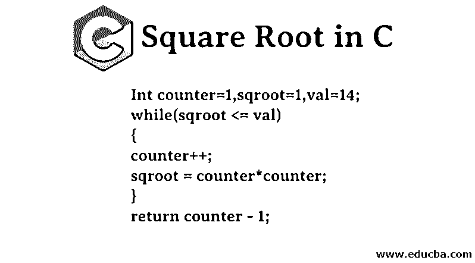
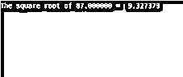

# C 语言中的平方根

> 原文：<https://www.educba.com/square-root-in-c/>




## C 中的平方根概述

为了满足业务需求，有时有必要在应用程序开发中使用数学函数。虽然一些基本操作可以使用简单的表达式来执行，但是如果没有数学函数的帮助，可能无法执行高级表达式。高级数学函数包括用于解决特定类型数学问题的复杂函数。所有的编程语言中都有一些数学函数，C 语言也是如此。在 C 编程语言中，我们有 math.h 头文件，用于利用数学函数。在本节中，我们将学习使用 C 编程语言求平方根。我们将使用 math.h 头文件来计算任意数字的平方根。

### C 语言中的平方根逻辑

*   在理解什么是 C 编程语言中的平方根逻辑之前，我们先来理解平方根到底是什么意思。平方根是一个数学术语。一个数被认为是任何数的数学平方根，用平方根值乘以它本身就得到被认为是平方根的数。
*   例如，9 的平方根是 3，因为 3 乘以 3 等于 9。平方根用符号√表示。所以如果我们写√9，那么结果就是 3。逻辑的工作方式和数学中的事情一样。编程语言中有一些库，用来作为应用程序中的数学函数。
*   在 C 编程语言中，我们将使用 maths.h 头文件，它提供了用于执行数学计算的各种函数。
*   在 C 编程语言中，为了得到任意数的平方根，必须应用的逻辑非常简单，包括简单的数学运算。首先，我们必须验证要求平方根的数不是 0 或 1，如果条件为负，那么数本身就是平方根，因为 0 和 1 的平方根分别是 0 和 1。

但是，如果情况被发现是积极的，我们可以应用以下逻辑。

<small>网页开发、编程语言、软件测试&其他</small>

```
Int counter=1,sqroot=1,val=14;
while(sqroot <= val)  {
counter++;
sqroot = counter*counter;
}
return counter - 1;
```

*   在上面提到的逻辑中，首先，计数器的值被设置为 1，x 存储我们需要求平方根的值，val 存储我们需要求平方根的值。如果 Val 的值小于或等于 sqroot 的值，将执行 while 循环中的语句。计数器将增加 1，并且 sqroot 上的值将由计数器的平方代替。
*   while 循环将继续迭代，直到存储在 sqroot 中的值大于存储在 val 中的值。一旦循环终止，计数器的值将减 1，并作为平方根返回。
*   请注意，按照这种方法，我们可以找到整数数据类型的平方根。我们将无法找到平方根的浮点值。为了找到任何数字的平方根，我们将使用 C 编程语言提供的函数。

### 如何在 C 中求平方根？

c 编程语言为我们提供了一个平台，使用各种方法来找出任何数字的平方根。我们可以起草自己的代码，也可以使用预定义的函数。求平方根。下面的代码可以用来通过一个简单的数学表达式得到平方。使用下面的方法将有助于获得平方根整数值。例如，如果任何值的平方根是 4.965，它将只显示 4 作为平方根。对于平方根是整数的数字，它可以很好地工作。像 25 的平方根是 5，下面的代码将准确地工作，以计算这样的数字的平方根。

#### 示例# 1–不使用内置函数

**代码:**

```
#include <stdio.h>
void main()
{
val=9;
if (val == 0 || val == 1)
printf("The square root is %d", val) ;
exit() ;
int counter = 1, sqroot=1, output;
while (sqroot <= val)
{
counter++;
sqroot = counter*counter;
}
output= counter - 1;
printf("The square root is %d", output) ;
}
```

在这个程序中，用户将得到整数形式的输出，因为所有变量都属于 int 数据类型。对于本例，由于 9 的平方根是 3，因此输出将是 3。如果用户选择寻找 38 的平方根，他们将得到 6 作为输出。

#### 示例 2–使用内置函数

**代码:**

```
#include <stdio.h>
#include <math.h>
int main()
{
double val = 87, sqroot;
sqroot =  sqrt(val);
printf("The square root of %lf =  %lf", val, sqroot);
}
```

在这个程序中，我们使用了被称为 sqrt 的内置函数，该函数用于查找任意数字的平方根。输出存储在 double 数据类型中。用这个程序计算平方根的结果是 9.327。

**输出:**




### 结论

平方根是可以用 C 编程语言实现的数学函数。开发人员可以起草代码来计算平方根，也可以使用内置函数来计算平方根。Sqrt 是 C 提供的函数，让我们快速计算平方根。使用这个功能并不费力。不仅仅是在 C 语言中，在每一种编程语言中都有使开发变得容易的内置函数，可以肯定的是，它们必须有一个计算平方根的函数，使我们能够利用预定义的数学函数。

### 推荐文章

这是一个关于 c 语言中平方根的指南。这里我们讨论了 c 语言中平方根的概述，逻辑以及如何通过一个例子找到平方根。您也可以阅读以下文章，了解更多信息——

1.  [C 指令](https://www.educba.com/c-command/)
2.  [c++中的平方根](https://www.educba.com/square-root-in-c-plus-plus/)
3.  [Java 中的平方根](https://www.educba.com/square-root-in-java/)
4.  [Python 中的平方根](https://www.educba.com/square-root-in-python/)


