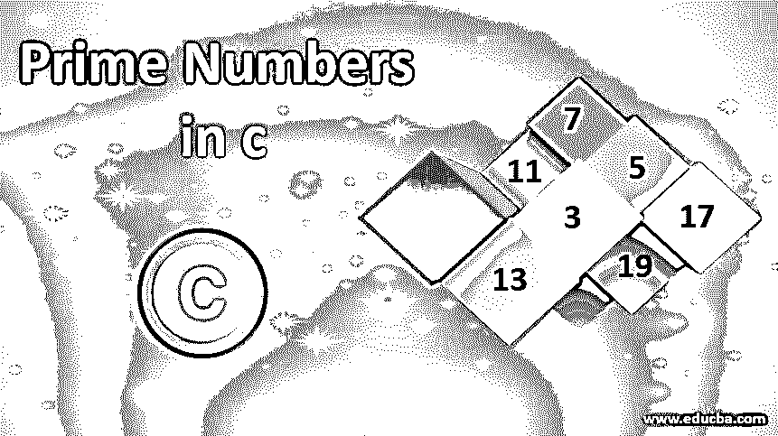
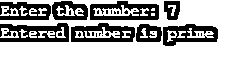
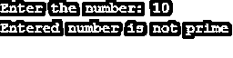
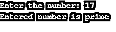
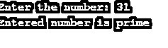

# C 语言中的素数

> 原文：<https://www.educba.com/prime-numbers-in-c/>




## C 语言中质数的介绍

质数是一个大于 1 的有限数值，只能被 1 和它本身整除。几个以升序排列的质数是 2、3、5、7、11、13、17、19、23、29 等。在 C 语言程序设计中，有一些可能的操作涉及质数，如“查找给定的数是否是质数”、“显示给定范围内的所有质数”、“显示低于特定值的质数”和“显示高于特定值的质数”。这些场景可以在 C 编程中使用条件语句和循环语句进行编码，例如 for 循环、if else 条件和 while 循环。

### 用 C 语言实现质数的例子

在这一节中，我们将讨论几个用 C 语言检查质数的程序。

<small>网页开发、编程语言、软件测试&其他</small>

#### 示例#1

使用 for 循环在 C 中检查质数的程序。

**代码:**

```
#include<stdio.h>
#include<conio.h>
int main()
{
int num, i, count = 0, m;
printf("Enter the number: ");
scanf("%d",&num);
m = num / 2;
for(i = 2; i <= m; i++)
{
if(num % i == 0)
{
printf("Entered number is not prime");
printf("\n");
count = 1;
break;
}
}
if(count == 0)
{
printf("Entered number is prime");
printf("\n");
}
return 0;
}
```

**输出:**







**代码解释:**

这里我们写了一个程序，使用 for 循环来检查[质数。我们使用了四个变量，变量 num 用于允许用户输入值。变量 I 用于检查条件，变量 count 用于设置计数器值。变量 m 用于检查数学计算。](https://www.educba.com/prime-number-in-javascript/)

#### 实施例 2

使用 while 循环在 C 中检查质数的程序。

**代码:**

```
#include<stdio.h>
#include<conio.h>
int main()
{
int num, i = 2, count = 0;
printf("Enter the number: ");
scanf("%d",&num);
while(i <= sqrt(num))
{
if(num % i == 0)
{
count = 1;
break;
}
i++;
}
if(count == 0)
{
printf("Entered number is prime");
}
else
{
printf("Entered number is not prime");
printf("\n");
}
return 0;
}
```

**输出:**




**代码解释:**

这里我们写了一个程序，使用 while 循环来检查质数。这里我们使用了三个变量 num，I 和 count。#include <math.h>库用于执行数学函数。在这个程序中，我们利用 sqrt()函数来找出数字的平方根。</math.h>

在这个程序中，首先，它要求用户输入一个数字。然后输入的数字被复制到 num 中。这里 num 用于将结果与原始结果进行比较。while 条件检查该数字是否大于 0。如果数字大于 0，它将执行 while 后面的语句。然后，它将检查条件 num % i == 0。

#### 实施例 3

使用 do while 循环在 C 中检查质数的程序。

**代码:**

```
#include<stdio.h>
#include<conio.h>
#include <math.h>
int main()
{
int num, i = 2, count = 0;
printf("Enter the number: ");
scanf("%d",&num);
do
{
if(num % i == 0)
{
count = 1;
break;
}
i++;
}
while(i <= sqrt(num));
if(count == 0)
{
printf("Entered number is prime");
printf("\n");
}
else
{
printf("Entered number is not prime");
printf("\n");
}
return 0;
}
```

**输出:**




**代码解释:**

这里我们写了一个程序，使用 do-while 循环来检查质数。这里我们写了一个程序，使用 do-while 循环来检查质数。这里我们使用了三个变量 num，I 和 count。#include <math.h>库用于执行数学函数。在这个程序中，我们利用 sqrt()函数来找出数字的平方根。</math.h>

在这个程序中，首先，它要求用户输入一个数字。然后输入的数字被复制到 num 中。这里 num 用于将结果与原始结果进行比较。while 条件检查该数字是否大于 0。如果数字大于 0，它将执行 while 后面的语句。然后，它将检查条件 num % i == 0。上例中唯一的不同是，它首先检查条件，即 i <= sqrt(num ),在本例中，在循环结束时测试相同的条件。

#### 实施例 4

使用 while 循环打印 C 语言中两个区间的质数的程序。

**代码:**

```
#include<stdio.h>
#include<conio.h>
int main()
{
int lower_limit, upper_limit, i, count;
printf("Enter the lower limit: ");
scanf("%d",&lower_limit);
printf("Enter the upper limit: ");
scanf("%d",&upper_limit);
printf("List of prime numbers between " );
printf("%d",lower_limit);
printf(" and ");
printf("%d",upper_limit);
printf("\n");
while(lower_limit < upper_limit)
{
count = 0;
for(i = 2; i <= lower_limit/2; ++i)
{
if(lower_limit % i == 0)
{
count = 1;
break;
}
}
if(count == 0)
printf("%d",lower_limit);
printf("\n");
++lower_limit;
}
return 0;
}
```

**输出:**


### 推荐文章

这是一个 c 语言中的质数指南。这里我们讨论什么是质数，以及使用各种循环来检查该数是否是质数的程序。您也可以看看以下文章，了解更多信息–

1.  [c#中的质数](https://www.educba.com/prime-numbers-in-c-sharp/)
2.  [Python 中的质数](https://www.educba.com/prime-numbers-in-python/)
3.  [Java 中的质数](https://www.educba.com/prime-numbers-in-java/)
4.  [JavaScript 中的质数](https://www.educba.com/prime-number-in-javascript/)


