# C 语言中的转义序列

> 原文：<https://www.educba.com/escape-sequence-in-c/>

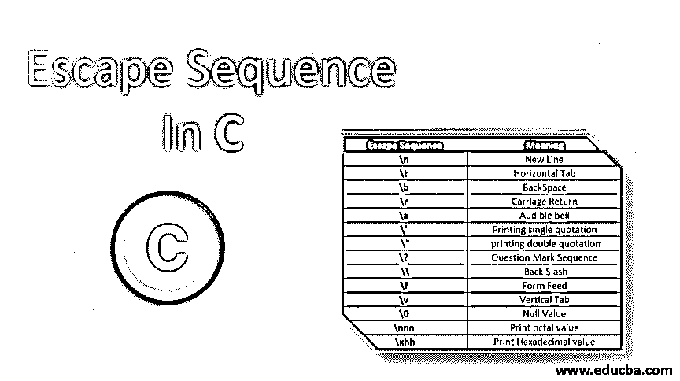


## C 语言中的转义序列介绍

顾名思义，转义序列表示这样一个场景，在该场景中，一个角色经历了从其正常形式的改变，并且表示了与其通常含义不同的东西。通常，转义序列以反斜杠“\”开头，后跟一个或多个字符。c 编译器将后跟“\”的任何字符解释为转义序列。转义序列用于格式化输出文本，通常不会显示在屏幕上。每个转义序列都有自己的预定义函数。

### C 语言中转义序列的例子

以下是转义序列的示例。

<small>网页开发、编程语言、软件测试&其他</small>

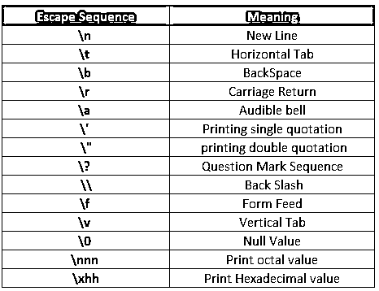


#### 1.\n(新行)

它用于创建一个新行并将光标放在那里。跟在' \n '后面的单词将被推到新的一行。它的 ASCII 值是 010。

##### 例子

**代码:**

```
#include <stdio.h>
int main ()
{
printf("\n new line escape sequence tutorial");
printf("\n first line");
printf ("\n Second line \n");
return 0;
}
```

**输出:**

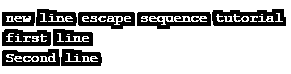


#### 2.\t(水平制表符)

这是水平制表符的转义序列。跟在' t '后面的单词将被压入同一行，留下一些空格。它的 ASCII 值是 009。

##### 例子

**代码:**

```
#include <stdio.h>
int main ()
{
printf("\n horizontal tab escape sequence tutorial");
printf(" \n 34543 \t 345435 ");
printf(" \n 123 \t 678 ");
return 0;
}
```

**输出:**

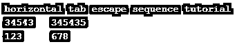


#### 3.\b(退格键)

这是退格键的转义序列。\b '前面的单词将被删除。其 [ASCII 值](https://www.educba.com/ascii-value-in-c/)为 008。

##### 例子

**代码:**

```
#include <stdio.h>
int main ()
{
printf("\n backspace escape sequence tutorial");
printf(" \n watch\b carefully the execution");
return 0;
}
```

**输出:**

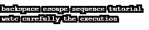


#### 4.\r(回车)

这是将光标定位在行首的转义序列。它的 ASCII 值是 013。

##### 例子

**代码:**

```
#include <stdio.h>
int main ()
{
printf("\n demo code below");
printf(" \r remove");
printf("\n  done with example");
return 0;
}
```

**输出:**

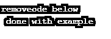


#### 5.\a(可听见的铃声)

这是一个转义序列，用来产生一个铃声来表示程序的执行。它的 ASCII 值是 013。它的 ASCII 值是 007。

##### 例子

**代码:**

```
#include <stdio.h>
int main ()
{
printf("\n here is the demo ");
printf(" \n bell sound\a");
return 0;
}
```

**输出:**

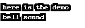


#### 6.\ '(打印单引号)

这个转义序列用于打印单引号。它的 ASCII 值是 039。

##### **例子**

**代码:**

```
#include <stdio.h>
int main ()
{
printf("\n mam maesafm sadsdm ' sdsa asdsadas tutorial");
printf(" \n\tutu tutu du dutut tututu tutut\' ");
return 0;
}
```

**输出:**

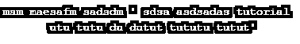


#### 7.\ "(打印双引号)

这个转义序列用于打印单引号。它的 ASCII 值是 034。

##### **例子**

**代码:**

```
#include <stdio.h>
int main ()
{
printf("\n here is a demo  ");
printf(" \n\"baba blacksheep example\" ");
printf(" \n\"double quotes surrounded text\" ");
return 0;
}
```

**输出:**

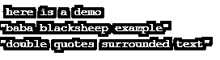


#### 8.\?(问号序列)

这个转义序列用于打印问号(？).它的 ASCII 值是 063。

##### 例子

**代码:**

```
#include <stdio.h>
int main ()
{
printf("\n below is the demo");
printf(" \n what’s the price of one kg of tomatoes \? ");
printf(" \n what’s your father’s name\? ");
return 0;
}
```

**输出:**

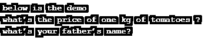


#### 9.\\(反斜杠)

这个转义序列用于打印反斜杠(\)。它的 ASCII 值是 092。

##### 例子

**代码:**

```
#include <stdio.h>
int main ()
{
printf("\n following are  the usage of escape sequence");
printf(" \n C:\\test\\test1\\test2");
printf(" \n D:\\test\\test1\\test2 ");
printf(" \n E:\\test\\test1\\test2 ");
printf(" \n F:\\test\\test1\\test2 ");
return 0;
}
```

**输出:**

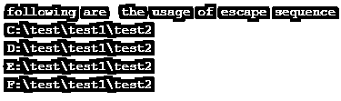


#### 10.\f(换页)

这个转义序列用于换页。它的 ASCII 值是 012。

##### 例子

**代码:**

```
#include <stdio.h>
int main ()
{
printf("\n below is a classic example");
printf(" \n \f ");
return 0;
}
```

**输出:**


#### 11.\v(垂直制表符)

这用于打印垂直标签。它的 ASCII 值是 011。

##### 例子

**代码:**

```
#include <stdio.h>
int main ()
{
printf("\n usgae of vertical tab escape sequence");
printf(" \n \v vignesh \t krishnakumar ");
return 0;
}
```

**输出:**

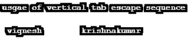


#### 12.\0(空值)

这用于打印空值。它的 ASCII 值是 000。\0 后面的语句将被省略。

##### 例子

**代码:**

```
#include <stdio.h>
int main ()
{
printf("\n learning the null value ");
printf(" \n ooculussss \0 reparo ");
return 0;
}
```

**输出:**

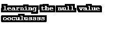


#### 13.\nnn(打印八进制值)

这用于打印八进制值等价字符。

##### 例子

**代码:**

```
#include <stdio.h>
int main ()
{
printf("\n below is the demo of  printing octal value");
char* b = "B\124";
printf(" \n%s", b);
return 0;
}
```

**输出:**

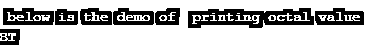


#### 14.\xhh(打印十六进制值)

该序列用于打印十六进制值。

##### 例子

**代码:**

```
#include <stdio.h>
int main ()
{
printf("\n Formatting output for hexadecimal value");
char* s = "B\x5b";
printf("\n %s", s);
return 0;
}
```

**输出:**

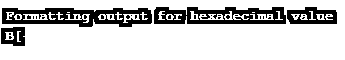


##### 合并示例

**输入:**

```
#include <stdio.h>
int main()
{
printf("vignesh\krishnakumar \n");
printf("new line \n next line \n");
printf("welcome \'to\' concolidated\? \v example \n");
printf("\v");
printf("\"learning is fun\" ");
printf("\r");
printf(" \n\'text surrounded with single quotation\' ");
printf(" \n\"double quotes surrounded text\" ");
printf(" \n whats your fathers name\? ");
printf(" \n E:\\test\\test1\\test2 ");
char* b = "B\124";
printf(" \n%s", b);
char* s = "B\x5b";
printf("\n %s", s);
return 0;
}
```

**输出:**

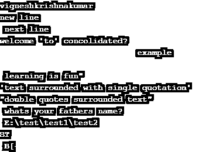


##### 例子

**代码:**

```
int main()
{
printf("Example Program \n");
printf("Welcome To \n new line \n");
printf("have  you\? \v had brekafast \n");
printf("\v");
printf("\"test\" ");
printf("\r");
return 0;
}
```

**输出:**

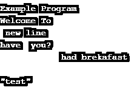


### 结论

因此，本文详细介绍了 c 语言中可用的各种转义序列。此外，本文还通过适当的示例解释了各种转义序列。学习和练习更多的转义序列是明智的，因为输出总是需要格式化的。要深入了解转义序列，建议创建示例程序，并从中获得乐趣。

### 推荐文章

这是一个 C 语言中转义序列的指南。这里我们讨论 C 语言中的引入和转义序列，包括，\n(新行)，\nnn(打印八进制值)等。您也可以阅读以下文章，了解更多信息——

1.  [C 指令](https://www.educba.com/c-command/)
2.  [C 语言中的嵌套结构](https://www.educba.com/nested-structure-in-c/)
3.  [C 语言中的算术运算符](https://www.educba.com/arithmetic-operators-in-c/)
4.  [C 与 C++](https://www.educba.com/c-vs-c-plus-plus/)


