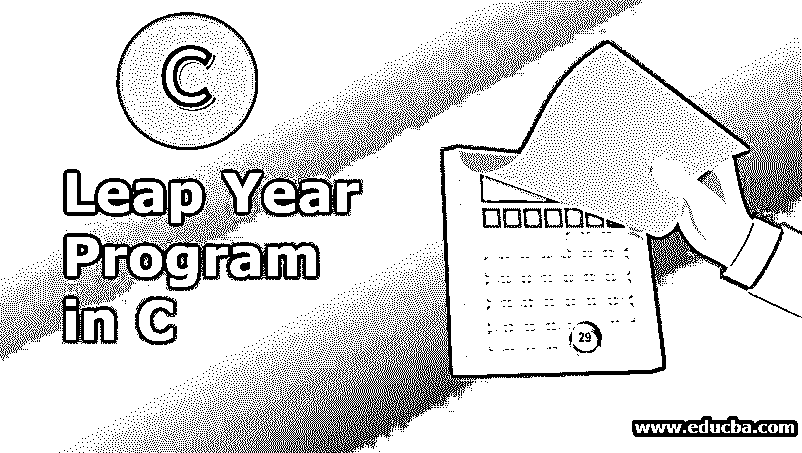
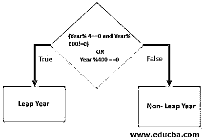
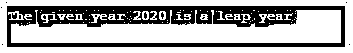
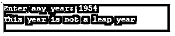

# C 语言中的闰年程序

> 原文：<https://www.educba.com/leap-year-program-in-c/>




## C 语言闰年程序介绍

一般来说，正如我们所知，一年有 365 天，但闰年由 366 天组成。这一天是在二月增加的。这个月通常有 28 天，也是一年中最短的一个月，加上额外的一天，这个月总共有 29 天。它是基于格鲁吉亚日历。在这里，让我们看看如何用 C 语言编写一个程序来检查一个给定的年份是否是闰年。

**逻辑:**

<small>网页开发、编程语言、软件测试&其他</small>

*   任何能被 4 整除，又能被 100 和 400 整除的年份都是闰年。
*   能被 4 整除但不能被 100 整除的年份就是闰年。
*   显然，如果一年能被 4 和 100 整除，但不能被 400 整除，那么这一年就不能被称为闰年。

### 伪代码/算法

让我们以算法书写格式的伪代码的形式拥有上面书写的逻辑:

*   如果一年只能被 400 整除。然后就是闰年了。如果不是，那么就是非闰年。
*   否则如果给出的年份只能被 100 整除，那么它就是一个非闰年。
*   否则，如果同一年是闰年，如果给定的一年完全可以被 4 整除。

### 流程图

下面，让我们通过一个小流程图来看看闰年的编程:




主要条件是年的整除值为 4 和 100，另一个条件是 400。

```
#include <stdio.h>
int main()
{
int r;
printf("Enter any year value: ");
scanf("%d",&r);
if( ( (r%4 == 0) && (r%100 !=0) ) || (r%400 == 0))
{
printf("This year is definitely a leap year");
}
else
{
printf("This year is not at all leap year");
}
}
```

**输出:**


我们也可以有一个非闰年的输出:


在上面，我们通过使用“and”和“or”语句，在一个 if 语句中获得了年份值的所有条件。

### C 语言中的 Leap 程序实例

让我们看看下面的例子:

#### 示例#1

```
#include <stdio.h>
int main()
{
int year=2020;
if(year % 4 == 0)
{
if(year % 100 == 0)
{
if(year % 400 == 0)
{
printf("The given year 2020 is a leap year");
}
else
{
printf("The given year 2020 is not a leap year");
}
}
else
{
printf("The given year 2020 is a leap year");
}
}
else
{
printf("The given year 2020 is not a leap year");
}
}
```

**输出:**




*   这里，主要的和第一个测试是，给定的年份是否能被 4 整除。
*   4 的整除性测试有一个 if-else 条件。
*   如果条件给出的输出为真，那么将会有下一个“如果语句”为真或不为真。
*   如果整除测试 100 的条件为真，则 400 的测试正在进行。
*   如果 100 的整除测试通过了，那么 400 的整除测试也应该成功了。
*   否则，这一年不会被认为是闰年。
*   显然，如果被 4 整除的第一步必须成功，我们可以认为这是非闰年的条件。

#### 实施例 2

```
#include <stdio.h>
int main()
{
int y;
printf("Enter any year: ");
scanf("%d", &y);
if(y % 4 == 0)
{
if(y % 100 == 0)
{
if(y % 400 == 0)
{
printf("The year given is a leap year");
}
else
{
printf("The year given is not a leap year");
}
}
else
{
printf("This year given is a leap year");
}
}
else
{
printf("This year is not a leap year");
}
}
```

**输出:**


另一组输出如下所示:




### 结论

所以，这就是我们如何知道任何一年是否是闰年。我们有 4，100 和 400 的整除测试条件。我们实际上已经分析过，并且我们的编码是使用一个“if 条件”或多个“if 和 else”条件完成的。无论哪种方式，都可以获得相同的输出。这样就可以用 C 编程语言把闰年编程搞定了。

### 推荐文章

这是一个关于 c 语言闰年程序的指南。在这里，我们讨论了 c 语言中闰年程序的介绍、伪代码/算法、流程图和示例。您也可以看看下面的文章来了解更多信息

1.  [c++中的阶乘程序](https://www.educba.com/factorial-program-in-c-plus-plus/)
2.  [C 语言中的地址运算符](https://www.educba.com/address-operator-in-c/)
3.  [Java 中的闰年程序](https://www.educba.com/leap-year-program-in-java/)
4.  [Python 中的闰年程序](https://www.educba.com/leap-year-program-in-python/)


