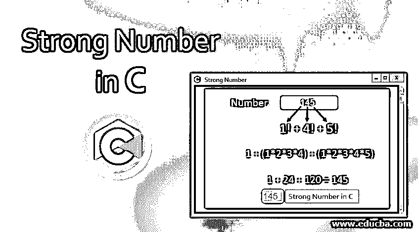
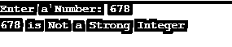
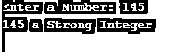
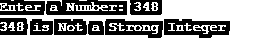
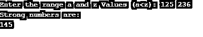
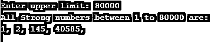

# C 语言中的强数字

> 原文：<https://www.educba.com/strong-number-in-c/>




## C 语言中的强数介绍

在 C 程序设计语言中，当一个数的阶乘和实际数相加时，这个数就是强数。强数是数字的阶乘之和等于原始数的数。

**举例:**

<small>网页开发、编程语言、软件测试&其他</small>

*   取一个输入为 145。
*   求阶乘为 1 的单个数字的和！+ 4!+ 5![阶乘起着重要的作用，因为输出必须计算数字的乘积]。
*   计算出的值应该与原始数字相同。
*   在这种情况下，输出与 145 相同，因此它是 c 语言中一个正确的强数字输入。

### C 语言中强数字背后的逻辑

定义和描述强数背后的逻辑与 c 语言中的介绍或强数定义中所解释的相同。比如说，某人以某个数的和贡献出一个数，该数是原始数，那么它不会被认为是强数。这种假设和逻辑是完全错误的。因此，实际的强数计算除了阶乘之外，还包含或认为阶乘是一个主要的逻辑流程。个别数的和与阶乘都应该定义强数。

以下是一些需要遵循的逻辑步骤:

**1。**接受用户的输入以验证强数字。给数字赋值一个变量，比如 x。把它复制到一个临时变量中，以便进行进一步的操作，比如把它赋值为 y = x。

**2。**考虑并初始化另一个变量，将所有单个数字的和存储为 sum=0。

**3。**搜索得到整数 y 的最后一位【临时变量】。将结果赋给一个新变量，比如 z = y % 10。

**4。**然后，计算数字最后一位的阶乘。将阶乘存储在一个变量中，比如 I，它是一个存储数字阶乘结果的变量。

**5。**将最终阶乘加到 sum 变量上，该变量最初为 0，即 sum = sum + i

**6。**删除表示 x 的最后一个数字，即临时变量。

**7。**直到 y 变得大于 0，即 y > 0 重复从 3 到 6 的所有步骤。

**8。**在强数中应用循环检查条件后，如果 sum 等于原始数或实际数。那么任何给定的数都被认为是强数，否则它就不是强数。

**9。**进一步的例子将阐明强势数字背后的实际和症结逻辑。仅仅坚持个体数字总和或乘积的误解是不够的。由此可以得出这样一个事实，即单个数字的和与积，即单个数字的阶乘，对增强 c 语言中强数字背后的整个逻辑有很大的贡献。

### 如何用各种方法检查 C 中的强数？

检查数字是否为强数字的各种方法如下:

*   使用函数
*   使用 for 循环
*   使用 While 循环

#### 示例 1–使用函数

**代码:**

```
#include<stdio.h>
int fact (int val)
{
int a, b = 1;
for (a = 1; a <= val; a++)
{
b = b * a;
}
return b;
}
int main ()
{
int n, count, final_result, rem, sum = 0, tmp;
printf ("Enter a Number:\t");
scanf ("%d", &n);
tmp = n;
for (tmp = n; n > 0; n = n / 10)
{
count = 1, final_result = 1;
rem = n % 10;
final_result = fact(rem);
sum = sum + final_result;
}
if (sum == tmp)
{
printf ("%d is a Strong Integer\n\n", tmp);
}
else
{
printf ("%d is Not a Strong Integer\n\n", tmp);
}
return 0;
}
```

**输出:**




#### 示例 2–使用 for 循环

**代码:**

```
#include <stdio.h>
#include<stdio.h>
int main ()
{
int n, cnt, fact, rem, sum = 0, tmp;
printf ("Enter a Number:\t");
scanf ("%d", &n);
for (tmp = n; n > 0; n = n / 10)
{
fact = 1;
rem = n % 10;
for (cnt = 1; cnt <= rem; cnt++)
{
fact = fact * cnt;
}
sum = sum + fact;
}
if (sum == tmp)
{
printf ("%d a Strong Integer \n\n", tmp);
}
else
{
printf ("%d Not a Strong Integer \n\n", tmp);
}
return 0;
}
```

**输出:**




#### 示例 3–使用 While 循环

**代码:**

```
#include<stdio.h>
#include<conio.h>
int main ()
{
int n, cnt, fact, rem, sum = 0, tmp;
printf ("Enter a Number:\t");
scanf ("%d", &n);
tmp = n;
while(n)
{
cnt = 1, fact = 1;
rem = n % 10;
while (cnt <= rem)
{
fact = fact * cnt;
cnt++;
}
sum = sum + fact;
n = n / 10;
}
if (sum == tmp)
{
printf ("%d is a Strong Integer\n\n", tmp);
}
else
{
printf ("%d is Not a Strong Integer\n\n", tmp);
}
return 0;
}
```

**输出:**




#### 实施例 4

找出任意给定范围内的一个强数字。

**代码:**

```
#include<stdio.h>
#include<conio.h>
int main ()
{
int a, z, i, n, j, fact, sum;
printf ("Enter the range a and z Values (a<z): ");
scanf ("%d %d", &a, &z);
printf ("Strong numbers are:\n");
for (i=a; i<=z; i++)
{
n = i;
sum = 0;
while(n!=0)
{
fact=1;
for (j=1; j<=(n%10); j++)
{
fact *= j;
}
sum += fact;
n /= 10;
}
if(sum==i)
printf ("%d\n", i);
}
return 0;
}
```

**输出:**




#### 实施例 5

求 1 到 n 之间或 n 以下的强数。

**代码:**

```
#include <stdio.h>
#include <conio.h>
int main ()
{
int k, l, current, lastDigit, tend;
long long fact, sum;
printf ("Enter upper limit: ");
scanf ("%d", &tend);
printf ("All Strong numbers between 1 to %d are:\n", tend);
for (k=1; k<=tend; k++)
{
current = k;
sum = 0;
while (current > 0)
{
fact = 1ll;
lastDigit = current % 10;
for (l=1; l<=lastDigit; l++)
{
fact = fact * l;
}
sum += fact;
current /= 10;
}
if(sum == k)
{
printf ("%d, ", k);
}
}
return 0;
}
```

**输出:**




### 结论

从上面所有的例子和场景中，可以很容易地得出结论，强数必须同时计算和与阶乘，然后只有它会产生原始的或实际的数，即强数。

### 推荐文章

这是一个关于 C 语言中的强数字的指南。在这里，我们讨论如何使用各种方法和例子以及它的代码实现来检查 C 语言中的强数字。您也可以浏览我们推荐的其他文章，了解更多信息——

1.  [C 中的质数](https://www.educba.com/prime-numbers-in-c/)
2.  [反转 C 中的数字](https://www.educba.com/reverse-number-in-c/)
3.  [反转 C 中的字符串](https://www.educba.com/reverse-string-in-c/)
4.  [Java 中的质数](https://www.educba.com/prime-numbers-in-java/)


