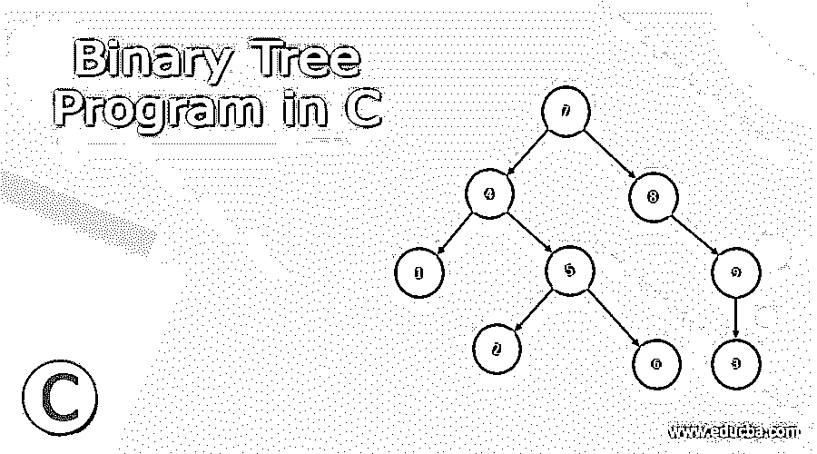
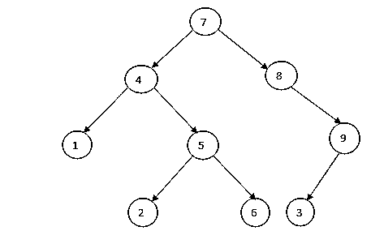
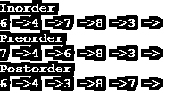

# C 语言中的二叉树程序

> 原文：<https://www.educba.com/binary-tree-program-in-c/>




## C 语言二叉树程序介绍

C 语言中的二叉树程序是一种用于数据搜索和组织的非线性数据结构。二叉树由节点组成，并且这些节点每个都是数据组件，具有左和右子节点。与其他数据结构(如数组、堆栈和队列)不同，链表是线性类型的数据结构，而树是分层类型的数据结构。简称为二叉查找树或 BST，其节点存储的键大于其左侧子节点，小于所有右侧子节点。由于二叉树中的数据是有组织的，它允许像插入、删除、更新和提取这样的操作。让我们更深入地研究与二叉树相关的概念，并用 C 编程语言实现一些例子。

**语法:**

<small>网页开发、编程语言、软件测试&其他</small>

二叉树没有任何特定的语法，但是在实现二叉树时有一个算法可以遵循。

```
struct BT {
int data;
struct BT *rightNode, *leftNode;
};
```

*   节点的左侧子树包含键少于节点键的节点
*   节点的右子树包含键大于节点键的节点
*   左右子树也必须是二叉树，不允许重复。

### 二叉树插图




二叉树的上述属性提供了键之间的排序，使得像搜索、最小和最大这样的操作可以更快地完成。如果在没有顺序的情况下，那么用户必须比较每个键来搜索给定的键。

**二叉树算法:**

1.创建一个新的二叉树并赋值
2。编写一个函数 insert()，使 node 和 key 成为两个参数，并检查以下条件，
a .如果 rootNode == NULL，则将新节点返回给调用函数。
b .如果 rootNode = > data < keyValue，那么用 rootNode = > rightNode 调用 insert()，并在 rootNode = > rightNode 中赋值返回值。
c .如果 rootNode = > data > keyValue，那么用 rootNode = > leftNode 调用 insert()，并在 rootNode = > leftNode
3 中赋值返回值。最后，我们可以将原始的根节点指针返回给调用函数。

### C 语言中二叉树程序的例子

下面是 C 语言中二叉树程序的不同例子:

#### 示例#1:在二叉树中插入

**代码:**

```
#include<stdio.h>
#include<stdlib.h>
struct BTnode
{
int keyVal;
struct BTnode *leftNode;
struct BTnode *rightNode;
};
struct BTnode *getNode(int value)
{
struct BTnode *newNode = malloc(sizeof(struct BTnode));
newNode->keyVal = value;
newNode->leftNode = NULL;
newNode->rightNode = NULL;
return newNode;
}
struct BTnode *insert(struct BTnode *rootNode, int value)
{
if(rootNode == NULL)
return getNode(value);
if(rootNode->keyVal < value)
rootNode->rightNode = insert(rootNode->rightNode,value);
else if(rootNode->keyVal > value)
rootNode->leftNode = insert(rootNode->leftNode,value);
return rootNode;
}
void insertorder(struct BTnode *rootNode)
{
if(rootNode == NULL)
return;
insertorder(rootNode->leftNode);
printf("%d ",rootNode->keyVal);
insertorder(rootNode->rightNode);
}
int main()
{
struct BTnode *rootNode = NULL;
rootNode = insert(rootNode,7);
rootNode = insert(rootNode,4);
rootNode = insert(rootNode,8);
rootNode = insert(rootNode,1);
rootNode = insert(rootNode,5);
rootNode = insert(rootNode,2);
rootNode = insert(rootNode,9);
rootNode = insert(rootNode,3);
insertorder(rootNode);
return 0;
}
```

**输出:**


因此，我们在这里创建一个二叉树，然后插入节点值。

#### 例子#2:二叉树，有序，前序和后序遍历

**代码:**

```
#include <stdio.h>
#include <stdlib.h>
struct BTnode {
int data;
struct BTnode* leftNode;
struct BTnode* rightNode;
};
void inorder(struct BTnode* rootNode) {
if (rootNode == NULL) return;
inorder(rootNode->leftNode);
printf("%d ->", rootNode->data);
inorder(rootNode->rightNode);
}
void preorder(struct BTnode* rootNode) {
if (rootNode == NULL) return;
printf("%d ->", rootNode->data);
preorder(rootNode->leftNode);
preorder(rootNode->rightNode);
}
void postorder(struct BTnode* rootNode) {
if (rootNode == NULL) return;
postorder(rootNode->leftNode);
postorder(rootNode->rightNode);
printf("%d ->", rootNode->data);
}
struct BTnode* createNode(value) {
struct BTnode* newNode = malloc(sizeof(struct BTnode));
newNode->data = value;
newNode->leftNode = NULL;
newNode->rightNode = NULL;
return newNode;
}
struct BTnode* insertLeftNode(struct BTnode* rootNode, int value) {
rootNode->leftNode = createNode(value);
return rootNode->leftNode;
}
struct BTnode* insertRightNode(struct BTnode* rootNode, int value) {
rootNode->rightNode = createNode(value);
return rootNode->rightNode;
}
int main() {
struct BTnode* rootNode = createNode(7);
insertLeftNode(rootNode, 4);
insertRightNode(rootNode, 8);
insertLeftNode(rootNode->leftNode, 1);
insertRightNode(rootNode->rightNode, 5);
insertLeftNode(rootNode->leftNode, 6);
insertRightNode(rootNode->rightNode, 3);
printf("Inorder \n");
inorder(rootNode);
printf("\nPreorder \n");
preorder(rootNode);
printf("\nPostorder \n");
postorder(rootNode);
}
```

**输出:**




所以在这里，我们通过插入节点对二叉树进行了有序、前序和后序遍历。
在二叉树中搜索一个值时，从左到右遍历节点。

### 二叉树的类型

下面是不同类型的二叉树:

1.  **完全二叉树:**特殊类型的二叉树，其中每个父节点或内部节点有 2 个或没有子节点。
2.  **完美二叉树:**一种二叉树，其中每个内部节点恰好有两个子节点，所有叶节点都在同一层。
3.  **完全二叉树:**与完全二叉树相同，但所有叶节点必须在左边，每一层必须有左右两个子节点。最后一个叶节点不应该有正确的子节点。
4.  **病理树:**是只有一个子节点的二叉树，即左节点或右节点。
5.  **偏斜二叉树:**类似于二叉树要么以左节点为主要么以右节点为主的病理树。它有两种类型:左斜二叉树和右斜二叉树。
6.  **平衡二叉树:**二叉树的类型，其中每个子节点的左右子树的高度之差为 0 或 1

### 结论

至此，我们将结束我们的主题“C 语言中的二叉树程序”。我们已经看到了什么是二叉树及其算法。很少看到二叉树是如何创建的，插入是如何完成的，以及我们如何搜索二叉树节点并显示的例子。还有我们上面解释过的二叉树的类型。还有其他的运算，可以帮助我们完全理解二叉树的概念。

### 推荐文章

这是一个用 c 语言编写的二叉树程序的指南。在这里我们讨论二叉树的介绍，语法，类型以及代码实现的例子。您也可以看看以下文章，了解更多信息–

1.  [在数据结构中展开树](https://www.educba.com/splay-tree-in-data-structure/)
2.  [生成树算法](https://www.educba.com/spanning-tree-algorithm/)
3.  [树遍历技术](https://www.educba.com/tree-traversal-techniques/)
4.  [二叉树面试问题](https://www.educba.com/binary-tree-interview-questions/)


