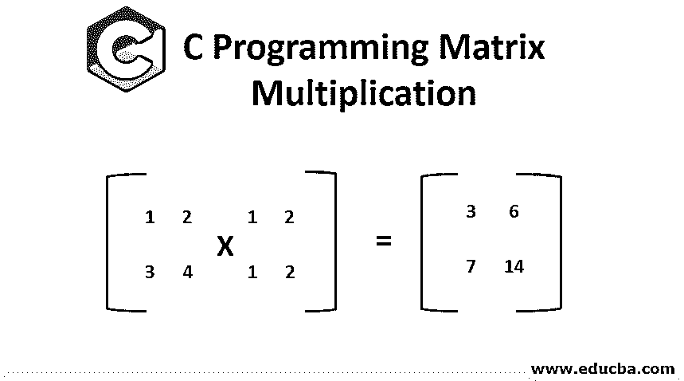
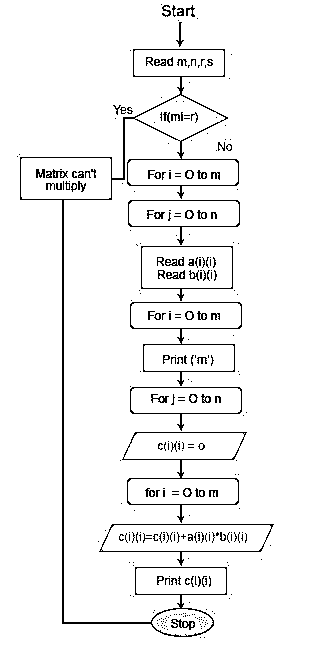
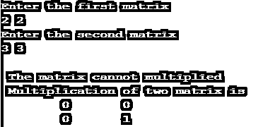
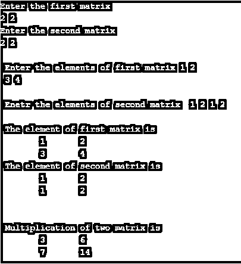

# c 编程矩阵乘法

> 原文：<https://www.educba.com/c-programming-matrix-multiplication/>




## C 程序设计中矩阵乘法的介绍

在 C #文章矩阵乘法编程中，矩阵是一个网格，用于以结构化格式存储数据。它通常与表格一起使用，表格中的数据以水平行和垂直列表示。矩阵经常在[编程语言](https://www.educba.com/what-is-a-programming-language/)中使用，用于以图形结构表示数据。在编程中，如果用户想对两个矩阵进行乘、加、减、除运算，那么应该首先声明矩阵的阶。一旦为第一个和第二个矩阵声明了矩阵的顺序，则需要用户输入矩阵的元素(输入)。如果矩阵的顺序彼此不成比例，则将显示由程序员植入条件语句中的错误消息。如果一个矩阵只包含一行，那么它被称为行向量，如果它只包含一列，那么它被称为[列向量](https://www.educba.com/column-vector-matlab/)。

包含相同行数和列数的矩阵称为方阵。矩阵用来存储一组相关的数据。一些编程语言用于支持矩阵作为一种数据类型，这种数据类型比静态数组提供了更多的灵活性。可以将值存储为单独的变量，而不是存储在矩阵中，这样程序可以更有效地访问数据并对数据执行操作。在 C 编程中，矩阵乘法是通过使用数组、函数、指针来完成的。因此，我们将讨论矩阵乘法的算法[以及流程图，该算法可用于用高级语言编写 3×3 矩阵乘法的编程代码。这种详细的解释有助于你分析矩阵乘法的工作机制，有助于理解如何编写代码。](https://www.educba.com/matrix-multiplication-in-java/)

<small>网页开发、编程语言、软件测试&其他</small>

### C 程序设计矩阵乘法的算法

以下是步骤:

**第一步:**启动程序。

**第二步:**输入第一个(a)矩阵的行和列。

**第三步:**输入第二个(b)矩阵的行和列。

**第四步:**输入第一个(a)矩阵的元素。

**第五步:**输入第二个(b)矩阵的元素。

**第六步:**以矩阵形式打印第一个(a)矩阵的元素。

**第七步:**以矩阵形式打印第二个(b)矩阵的元素。

**第八步:**设置一个循环到 row。

**第 9 步:**设置一个内循环到色谱柱。

**步骤 10:** 将另一个内环设置到柱上。

**步骤 11:** 将第一(a)和第二(b)矩阵相乘，并将元素存储在第三矩阵(c)中

**第十二步:**打印最终矩阵。

**第十三步:**停止程序。

### 矩阵乘法流程图




### C 语言编程矩阵乘法示例

c 程序执行矩阵乘法，我们来看几个例子。

**代码:**

```
#include <stdio.h>
void main()
{
int a[25][25],b[25][25],c[25][25],i,j,k,r,s;
int m,n;
printf("Enter the first matrix\n");
scanf("%d%d",&m,&n);
printf("Enter the second matrix\n");
scanf("%d%d",&r,&s);
if(m!=r)
printf("\n The matrix cannot multiplied");
else
{
printf("\n Enter the elements of first matrix ");
for(i= 0;i<m;i++)
{
for(j=0;j<n;j++)
scanf("\t%d",&a[i][j]);
}
printf("\n Enetr the elements of second matrix ");
for(i=0;i<m;i++)
{
for(j=0;j<n;j++)
scanf("\t%d",&b[i][j]);
}
printf("\n The element of first matrix is");
for(i=0;i<m;i++)
{
printf("\n");
for(j=0;j<n;j++)
printf("\t%d",a[i][j]);
}
printf("\n The element of second matrix is");
for(i=0;i<m;i++)
{
printf("\n");
for(j=0;j<n;j++)
printf("\t%d",b[i][j]);
}
for(i=0;i<m;i++)
{
printf("\n");
for(j=0;j<n;j++)
{
c[i][j]=0;
for(k=0;k<m;k++)
c[i][j]=c[i][j]+a[i][k]*b[k][j];
}
}
}
printf("\n Multiplication of two matrix is");
for(i=0;i<m;i++)
{
printf("\n");
for(j=0;j<n;j++)
printf("\t%d",c[i][j]);
}
}
```

**输出:**







### C 语言编程中矩阵乘法的运用

*   在上面的程序中，我们已经将 main 方法中的变量和数组初始化为 integer (int)数据类型。
*   在初始化部分之后，我们从用户那里得到第一个矩阵的顺序，然后同时用户必须声明第二个矩阵的顺序。
*   一旦矩阵的顺序被声明，那么条件部分将被执行，程序将继续运行，只有当顺序满足条件，否则程序将被终止或停止在该部分本身。
*   一旦满足条件，用户必须在运行时输入矩阵元素作为输入。
*   根据[计算用户输入的](https://www.educba.com/java-user-input/)矩阵乘法。
*   上面的矩阵程序很简单，可以计算更新 25×25，所以我们可以简单地在数组中编辑到所需的数字。

### C 语言编程矩阵乘法的优势

*   c 编程语言支持矩阵作为一种数据类型，并提供更多的灵活性。并且它在处理时消耗更少的内存。
*   通过将值存储在矩阵中而不是作为单个变量，C 程序可以更有效地访问数据并对其执行操作。
*   它更容易提取关于对象旋转的信息，也容易在 C 程序中操作。

### 结论

矩阵乘法在程序中反复使用来表示图形数据结构，它用于存储多个向量，也用于许多应用中，如解线性方程等。对于使用最少次数的运算来乘矩阵已经做了大量的研究。

### 推荐文章

这是一个 C 编程矩阵乘法的指南。在这里，我们讨论了矩阵操作的工作原理、算法、流程图和例子，以及在 c 语言编程中的不同优势。您也可以浏览我们推荐的其他文章，了解更多信息——

1.  [NumPy 中的矩阵乘法](https://www.educba.com/matrix-multiplication-in-numpy/)
2.  [Matlab 中的矩阵乘法](https://www.educba.com/matrix-multiplication-in-matlab/)
3.  [c++中的矩阵乘法](https://www.educba.com/matrix-multiplication-in-c-plus-plus/)


