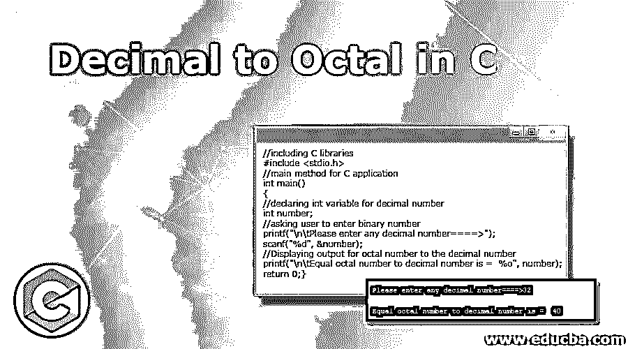
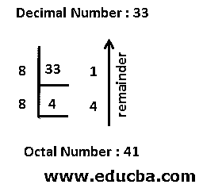
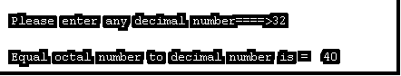
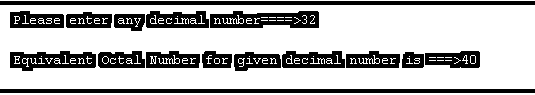
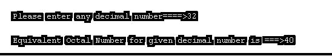
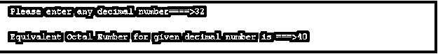

# C 语言中的十进制到八进制

> 原文：<https://www.educba.com/decimal-to-octal-in-c/>




## C 语言中十进制到八进制的介绍

十进制数是指我们日常使用的数字，如计数、数钱、计算能量、计算过程等。这些十进制数的范围可以是 0 到 9。0 到 9 有 10 个数字，所以十进制数的基数是 10。八进制数是指汇编语言设备或嵌入式设备(如个人电脑、计算设备)理解的数，用于 UNIVAC 1050、PDP-8、ICL 1900 和 IBM 大型机等系统。为什么呢？因为存储在这些设备中的数据每次都是用 3 位数来表示的，所以这可以由八进制系统来完成。这个八进制数的范围是从 0 到 7。从 0 到 7 有 8 个数字，所以八进制的基数是 8。在这个主题中，我们将学习 c 语言中的十进制到八进制。

它向 UNIVAC 1050、PDP-8、ICL 9000、IBM 大型机等设备传递可理解的指令。

<small>网页开发、编程语言、软件测试&其他</small>

### 为什么八进制每个用 3 个二进制数字表示？

我们知道，从 0 到 7 的最大八进制数是 7。这个 7 可以表示为 111，所以所有的八进制数字都在这些范围之间，所以它们总是用 3 个二进制数字表示每个八进制数字。

**余数如何取八进制？**




### C 语言中二进制到八进制的转换是如何完成的？

**二进制转八进制的算法:**

*   存储二进制数的余数，如果它能被数组中的 8 整除。
*   现在把二进制数除以 8。
*   重复上述 2 个步骤，直到二进制数等于 0。
*   之后，显示数组以相反的顺序显示实际的八进制数。

**例子:**

让我们取十进制数为 32。

1.  **第一步:**我们除以 8 得到余数为 0。所以 array[0]=0。
2.  第二步:现在将 32 除以 8，然后 32/8=4，我们得到数字 4。
3.  第三步:现在我们得到 4 除以 8 的余数是 4。所以 array[1]=4。
4.  **第四步:**现在把新数组[1]除以 8，然后 4/8=0，我们得到下一个新数是 0。
5.  **步骤 5:** 由于给定的数字 32 变成了“0”，所以停止重复步骤，像 array[1]array[0]一样以相反的顺序显示数组。所以 32 的等价八进制数是 40。

**语法:**

```
// binary number
int n=32;
//octal array
intoctalArray[50];
//counter for increment the variables for index values
int count = 0;
//while loop for given binary number
while (n != 0) {
//Store the octal array elements
octalArray[count] = n % 8;
n = n / 8;
count++;
}
// display octal array numbers in reverse order
for (int m= m - 1; m >= 0; m--)
cout<<octalArray[m];
```

### C 语言中十进制到八进制的例子

以下是提到的例子:

#### 示例# 1–十进制到八进制

**C 代码:DecBin.c**

```
//including C libraries
#include <stdio.h>
//main method for C application
int main()
{
//declaring int variable for decimal number
int number;
//asking user to enter binary number
printf("\n\tPlease enter any decimal number====>");
scanf("%d", &number);
//Displaying output for octal number to the decimal number
printf("\n\tEqual octal number to decimal number is =  %o", number);
return 0;
}
```

**输出:**




#### 示例 2–使用 for 循环将十进制转换为八进制

**C 代码:DecBin.c**

```
//including C libraries
#include <stdio.h>
//main method for C application
int main()
{
//declaring int variable for decimal number, and octal array
int octalArray[50], number, var1,j;
//asking user to enter binary number
printf("\n\tPlease enter any decimal number====>");
scanf("%d", &number);
for(var1 = 0; number> 0; var1++)
{
octalArray[var1] = number % 8;
number = number / 8;
}
printf("\n\tEquivalent Octal Number for given decimal number is ===>");
for(j = var1 - 1; j >= 0; j--)
{
printf("%d", octalArray[j]);
}
return 0;
}
```

**输出:**




#### 示例# 3–使用 while 循环将十进制转换为八进制

**C 代码:DecBin.c**

```
//including C libraries
#include <stdio.h>
//main method for C application
int main()
{
//declaring int variable for decimal number, and octal array
int octalArray[50], number, var1,j;
//asking user to enter binary number
printf("\n\tPlease enter any decimal number====>");
scanf("%d", &number);
//while loop for decimal number to octal
while(number!=0)
{
octalArray[var1] = number % 8;//remainder
number = number / 8;//interger part
var1++;//incrementing var1
}
printf("\n\tEquivalent Octal Number for given decimal number is ===>");
for(j = var1 - 1; j >= 0; j--)
{
printf("%d", octalArray[j]);//display octal array in reverse order
}
return 0;
}
```

**输出:**




#### 示例# 4–十进制到八进制的函数

**C 代码:DecBin.c**

```
//including C libraries
#include <stdio.h>
int getDecimalToOctal(int number);
//main method for C application
int main()
{
int number;
//asking user to enter binary number
printf("\n\tPlease enter any decimal number====>");
scanf("%d", &number);
//calling getDecimalToOctal method for display octal number to the given decimal number
int oct  = getDecimalToOctal(number);
printf("\n\tEquivalent Octal Number for given decimal number is ===>%d", oct);
return 0;
}
int getDecimalToOctal(int number)
{
//declaring int variable for decimal number, and octal array
int octal=0,rem, var1=1;
//while loop for decimal number to octal
while(number != 0)
{
rem = number % 8;//finding remainder
number = number / 8;//finding inter part
octal = octal + (rem * var1);//getting octal number
var1 = var1 * 10;
}
return octal;
}
```

**输出:**




### 结论

十进制到二进制的转换适用于八进制函数系统，如计算设备、IBM 框架等。一个八进制数只有 0 到 7 个数字，八进制基数是 8，因为它有 8 个数字。对于循环功能，我们可以使用 C 预定义的% o 和 while 循环将十进制转换为二进制。

### 推荐文章

这是一个在 C 语言中十进制到八进制的指南。这里我们讨论了在 C 语言中二进制到八进制的转换是如何完成的，并提供了一些例子来帮助理解。您也可以阅读以下文章，了解更多信息——

1.  [C 文字量](https://www.educba.com/c-literals/)
2.  [c#中的静态关键字](https://www.educba.com/static-keyword-in-c-sharp/)
3.  [c++中的存储类](https://www.educba.com/storage-class-in-c-plus-plus/)
4.  [C 语言中的无限循环](https://www.educba.com/infinite-loop-in-c/)


