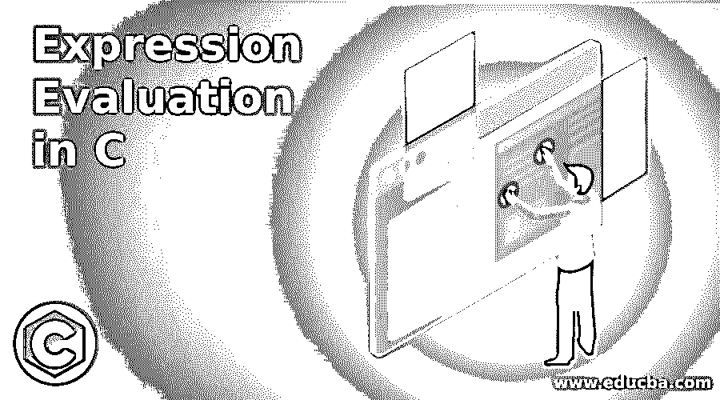
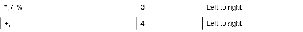
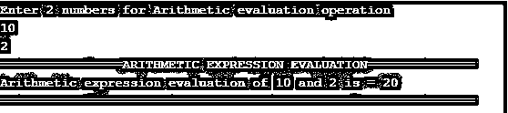
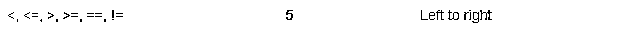
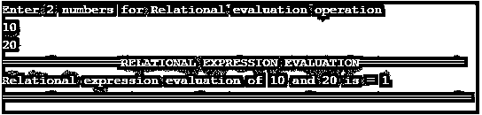
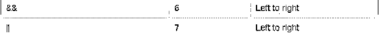
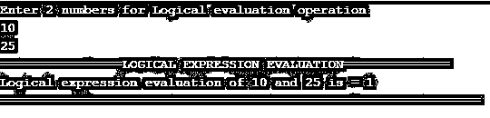
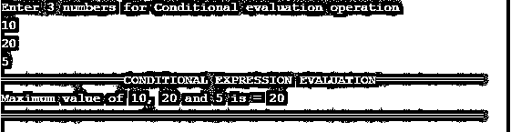

# C 语言中的表达式求值

> 原文：<https://www.educba.com/expression-evaluation-in-c/>




## C 语言中的表达式求值简介

在了解表达式求值的同时，我们必须了解什么是 C 语言中的表达式，以及表达式意味着什么。C 语言中的表达式被定义为两个或更多的操作数由一个运算符连接起来，也可以说是一个执行任何运算的公式。操作数是函数引用、数组元素、变量或任何常量。运算符是像“+”、“-”、“/”、“*”等符号。现在表达式求值只不过是运算符优先级和结合性。C #中的表达式优先级告诉您，在一个包含多个优先级不同的运算符的表达式中，先执行哪个运算符，然后再执行哪个运算符。这在我们进行日常算术运算时起着至关重要的作用。如果在一个表达式中出现两个相同的优先级，则称之为“结合性”。在这种情况下，我们可以从左到右或者从右到左来计算这个语句，因为这两者的优先级相同。

### C #中表达式求值的类型

在 C 语言中，有 4 种类型的表达式求值

<small>网页开发、编程语言、软件测试&其他</small>

1.  算术表达式求值
2.  关系表达式求值
3.  逻辑表达式求值
4.  条件表达式求值

这 4 种类型的每个表达式求值都采用特定类型的操作数，并使用特定类型的运算符。该表达式求值运算的结果产生一个特定值。

### 用 C 语言实现表达式求值的示例

下面是提到的一些例子:

#### 1.算术表达式求值

加法(+)、减法(-)、乘法(*)、除法(/)、模数(%)、增量(++)和减量(–)运算符被称为“算术表达式”。这些运算符在操作数之间工作。像 A+B，A-B，A –, a++等等。而我们根据指定的优先顺序用这些运算符执行运算，如下图所示。

**A+B*C/D-E%F**

算术表达式求值顺序:




**代码:**

```
//used to include basic C libraries
#include <stdio.h>
//main method for run c application
int main()
{
//declaring variables
int a,b,result_art_eval;
//Asking the user to enter 2 numbers
printf("Enter 2 numbers for Arithmetic evaluation operation\n");
//Storing 2 numbers in varaibles a and b
scanf("%d\n%d",&a,&b);
//Arithmetic evaluation operations and its result displaying
result_art_eval = a+b*a/b-a%b;
printf("================ARITHMETIC EXPRESSION EVALUATION==============\n");
printf("Arithmetic expression evaluation of %d and %d is = %d \n",a,b,result_art_eval);
printf("==============================================================");
return 0;
}
```

**输出:**




**解释:**正如你在上面的例子中所看到的，基于优先级计算的算术表达式值作为第一个*，后面是/、%、+和-。

#### 2.关系表达式求值

==(等于)，！=(不等于)，>(大于)，< (less than), > =(大于等于)，<= (less than or equal to) operators are said to “Relational expressions”. This operator works in between operands. Used for comparing purpose. Like A==B, A!=B, A> B，A

 ****A==B || A！= B | | A<B | | A>B；**

关系表达式求值顺序:




**代码:**

```
//used to include basic C libraries
#include <stdio.h>
//main method for run c application
int main()
{
//declaring variables
int a,b;
int result_rel_eval;
//Asking the user to enter 2 numbers
printf("Enter 2 numbers for Relational evaluation operation\n");
//Storing 2 numbers in varaibles a and b
scanf("%d\n%d",&a,&b);
//Relational evaluation operations and its result displaying
//If we get result as 1 means the value is true and if it is 0 then value is false in C
result_rel_eval = (a<b||a<=b||a>=b||a>b||a!=b);
printf("================RELATIONAL EXPRESSION EVALUATION==============\n");
if(result_rel_eval==1)
{
printf("Relational expression evaluation of %d and %d is = %d \n",a,b,result_rel_eval);
}
else
{
printf("Relational expression evaluation of %d and %d is = %d \n",a,b,result_rel_eval);
}
printf("===============================================================");
return 0;
}
```

**输出:**




**解释:**正如你在上面的例子中所看到的，基于优先顺序计算的关系表达式值首先是<，然后是< =、>、> =、==、！=.

#### 3.逻辑表达式求值

&&(逻辑 and)，||(逻辑 or) and！(逻辑非)运算符被称为“逻辑表达式”。用于执行逻辑运算。这些运算符在操作数之间工作。比如 A&&B，A||B，A！b 等。而我们根据指定的优先顺序用这些运算符执行运算，如下图所示。

**A&B | B | T3！a；**

逻辑表达式求值顺序:




**代码:**

```
//used to include basic C libraries
#include <stdio.h>
//main method for run c application
int main()
{
//declaring variables
int a,b;
int result_log_eval;
//Asking the user to enter 2 numbers
printf("Enter 2 numbers for Logical evaluation operation\n");
//Storing 2 numbers in varaibles a and b
scanf("%d\n%d",&a,&b);
//Logical evaluation operations and its result displaying
//If we get result as 1 means the value is true and if it is 0 then value is false in C
result_log_eval = (a||b&&a);
printf("================LOGICAL EXPRESSION EVALUATION==============\n");
if(result_log_eval==1)
{
printf("Logical expression evaluation of %d and %d is = %d \n",a,b,result_log_eval);
}
else
{
printf("Logical expression evaluation of %d and %d is = %d \n",a,b,result_log_eval);
}
printf("===============================================================");
return 0;
}
```

**输出:**




**解释:**正如你在上面的例子中看到的，根据优先顺序计算的逻辑表达式值作为第一个& &，后面是|| and！.

#### 4.条件表达式求值

?(问号)和:(冒号)被说成“条件表达式”。用于执行条件检查。它有三个表达式，第一个表达式是条件。如果为真，则执行表达式 2，如果为假，则执行表达式 3。喜欢(A>B)？“甲大”:“乙大”。而我们根据指定的优先顺序用这些运算符执行运算，如下图所示。

**(X+2=10)？“真”:“假”；**

条件表达式求值顺序:


**代码:**

```
//used to include basic C libraries
#include <stdio.h>
//main method for run c application
int main()
{
//declaring variables
int a,b,c;
int result_con_eval;
//Asking the user to enter 3 numbers
printf("Enter 3 numbers for Conditional evaluation operation\n");
//Storing 3 numbers in varaibles a, b and c
scanf("%d\n%d\n%d",&a,&b,&c);
//Conditional evaluation operations and its result displaying
result_con_eval=(a>b && a>b)? a: (b>a && b>c)? b:c;
printf("================CONDITIONAL EXPRESSION EVALUATION==============\n");
printf("Maximum value of %d, %d and %d is = %d \n",a,b,c,result_con_eval);
printf("===============================================================");
return 0;
}
```

**输出:**




**解释:**正如你在上面的例子中所看到的，条件表达式的值首先根据优先顺序进行求值？还有:。

### 结论

C 中的表达式求值用于确定运算符的顺序，以计算准确的输出。算术、关系、逻辑和条件是 c 语言中的表达式求值。

### 推荐文章

这是一个 C 语言中表达式求值的指南。这里我们讨论 C 语言中表达式求值的介绍，用类型和各自的例子来更好地理解。您也可以浏览我们的其他相关文章，了解更多信息——

1.  [c++中的运算符优先级](https://www.educba.com/operator-precedence-in-c-plus-plus/)
2.  [C 编程中的模式](https://www.educba.com/patterns-in-c-programming/)
3.  [C 编程中的数组](https://www.educba.com/arrays-in-c-programming/)
4.  [Java 中的函数式编程](https://www.educba.com/functional-programming-in-java/)


**