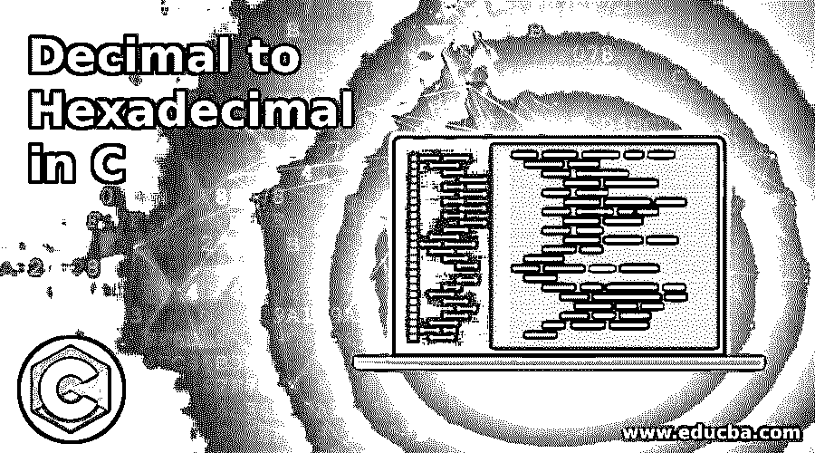

# C 语言中的十进制到十六进制

> 原文：<https://www.educba.com/decimal-to-hexadecimal-in-c/>




## C 语言中十进制到十六进制的介绍

有时在编程中有一个数学计算，为了进行这个计算，我们需要把十进制转换成十六进制，这在 C 语言中可以很容易地用各种方法实现。十进制数包括从 0 到 9 的数，基数是 10，而十六进制数包括从 0 到 9 的数，同时包括 A、B、C、D、E、F，基数是 16。因此，每当用户输入一个十进制数时，我们需要将它转换成从 10 进制到 16 进制的十六进制数。

### 句法

让我们看一下语法，同时我们将看到将一个数从十进制转换为十六进制的步骤:

<small>网页开发、编程语言、软件测试&其他</small>

**第一步:**我们要把给定的数除以 16，因为我们要把数转换成十六进制数。

第二步:之后，我们必须再次将剩余的商除以 16。

**第三步:**我们要一直除剩下的商，直到我们的商变为零。

为了实际解释上述步骤，让我们取一个数并将其转换成十六进制数。

#### 将数字 800 转换成十六进制

**第一步:**将数字除以 16。因此，800 / 16，余数:0，商:50

**第二步:**将商除以 16。因此，50 / 16，余数:2，商:3

**第三步:**将商除以 16。因此，3 / 16，余数:3，商:0

最终结果，十进制数转换成十六进制数是:320

( 800 ) 10 = ( 320 ) 16

我们已经理解了将十进制数转换为十六进制数的数学过程，现在我们将看到以编程方式实现转换数的算法。

### 用 C 语言实现十进制到十六进制的例子

下面是提到的例子:

#### 示例#1

**代码:**

```
#include<stdio.h>
int main() {
long int num_decimal , remainder , quotient ;
int a = 1 , b , var ;
char hexanum_decimal[ 100 ] ;
printf( " Please enter decimal number here : " ) ;
scanf( "%ld" , &num_decimal ) ;
quotient = num_decimal ;
while( quotient != 0 ) {
var = quotient % 16 ;
if( var < 10 )
var = var + 48 ;
else
var = var + 55 ;
hexanum_decimal[ a++ ]= var ;
quotient = quotient / 16;
}
printf( " The equivalent hexadecimal value of decimal number is %ld : " , num_decimal ) ;
for ( b = a -1 ; b > 0 ; b-- )
printf( "%c" , hexanum_decimal[ b ] ) ;
return 0 ;
}
```

**输出:**


**解释:**在上面的代码中可以看到，我们定义了三个长整型变量，分别命名为“num_decimal”、“remainder”、“quotient”。然后我们声明了整型变量 a，b 和 var，其中整型变量 a 的值被赋值为等于 1。对于十六进制数，我们必须声明它是一个字符，因为它也包含字符值。之后，printf 和 scanf 用于从用户那里获取值并显示在屏幕上。

那么商值将被设置为等于十进制数，如我们在上面研究的步骤 1。我们正在添加 while 条件，在该条件下，它将执行步骤 2 和步骤 3，直到商值变为零。如果条件用于将给定的整数转换为字符。最后，一旦商变为 0，它将打印给定十进制数的十六进制值。

#### 实施例 2

**代码:**

```
#include <stdio.h>
int main()
{
int num_decimal , temp , a ;
char hex [ 32 ] ;
printf( " Please enter the decimal number ( num_decimal ) here : " ) ;
scanf( "%d", &num_decimal ) ;
temp = 0 ;
while( num_decimal > 0 )
{
switch( num_decimal % 16 )
{
case 10 :
hex [ temp ] = 'A' ; break ;
case 11 :
hex [ temp ] = 'B'; break ;
case 12 :
hex [ temp ] = 'C' ; break ;
case 13 :
hex [ temp ] = 'D'; break ;
case 14 :
hex [ temp ] = 'E' ; break ;
case 15 :
hex [ temp ] = 'F'; break ;
default :
hex [ temp ] = ( num_decimal%16 ) + 0x30 ;
}
num_decimal = num_decimal / 16 ;
temp ++ ;
}
printf( " The Hexadecimal value of the decimal number is: " ) ;
for( a= ( temp-1 ) ; a >= 0 ; a--)
printf( "%c" , hex[ a ] ) ;
return 0;
}
```

**输出:**


**解释:**如你所见，上面的代码将执行相同的一组操作，但是以 switch 和 break 语句的方式。我们将相同的值作为输入，您可以在输出屏幕中看到。我们定义了三个整型变量，命名为" num_decimal "，" temp "，" a "。然后对于十六进制数，我们必须将其声明为一个字符，因为它也包括从 A 到 f 的字符值。之后，printf 和 scanf 用于从用户处获取值并显示在屏幕上。我们正在添加 while 条件，在该条件下，每当我们获得 temp 值时，它将根据应用于 switch 的条件来执行 switch 语句。如果条件用于将给定的整数转换为字符。之后，我们将把该值转换成十六进制值。

### 结论

使用上述步骤将十进制数转换成十六进制数可以节省大量的编程时间，因为可以在最短的时间内得到快速而正确的结果。在大十进制数的情况下，这种逻辑在计算机编程的许多规范中被证明是有效的。

### 推荐文章

这是一个 C 语言中十进制到十六进制的指南。这里我们讨论 C 语言中十进制到十六进制的介绍，有适当的语法和相应的例子。您也可以浏览我们的其他相关文章，了解更多信息——

1.  [C 语言中的十六进制](https://www.educba.com/hexadecimal-in-c/)
2.  [C 编程中的数组](https://www.educba.com/arrays-in-c-programming/)
3.  [Java 中的函数式编程](https://www.educba.com/functional-programming-in-java/)
4.  [C 语言中的编程错误](https://www.educba.com/programming-errors-in-c/)


