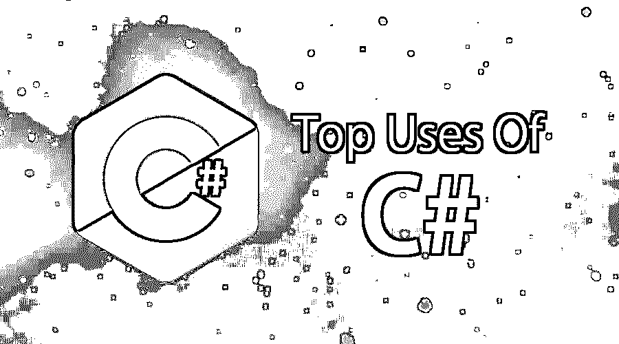

# C#的使用

> 原文：<https://www.educba.com/uses-of-c-sharp/>




## C#用法介绍

让我们看看技术大师是怎么说的:

1.  Microsoft Docs:C # works on.Net 框架是一个类型安全的优雅的 O-O 级 PL。非常适合安全可靠的应用需求。这种语言使它的开发者能够在

*   Windows 操作系统
*   可扩展标记语言
*   客户端-服务器
*   数据库ˌ资料库
*   各种工具的可用性

Techopedia:一种面向 Web 开发和网络相关需求的 OOPS 语言。

<small>网页开发、编程语言、软件测试&其他</small>

Wikipedia:一个通用的多范例 PL，方便开发者创建功能性的、面向类的、打字的和其他一些相关的应用程序。

为了引起读者的注意，我想说的是，我希望你对上一节中使用的术语有所了解。

### C#比其他语言更胜一筹

报道称，在排名前十的 PL 排行榜中，C#排名第 5 <sup>位</sup>(截至 2018 年)。让我们来看看为什么 C#的使用有如此巨大的用户基础，为什么它在各种开发方法中是首选，以及它的接受度。

#### 1.起源

一种更加真正的面向对象的语言，允许用户用可重用的代码创建模块化的应用程序。C++中没有这种功能行为。它不会在系统中创建网格，而是通过一个高效的内置功能来清除所有存在的垃圾。内存备份(以块为单位，以说明其相对于其他语言的优势)是 C#的一个重要优势。它的影响(对全世界的开发者社区)是因为有丰富的可用类库和函数，组合成功地创造了历史。

#### 2.班级

使用 C#的主要优势是它运行在 CLR 上，这使得它更容易集成、标准化。.NET Framework 类库非常广泛，并且比 Java 更好地支持特定的功能集。C#的使用有各种各样的语言结构，这再次超过了 Java。语言结构意味着函数指针和操作符。C#技术应用的最新版本启用了扩展方法、lambda 和查询表达式等功能。

#### 3.不仅仅是微软

就微软？不再是了……ECMA 和 MONO 项目就是支持 C#应用的证据。ECMA 是一个标准出版商。MONO 是开发者的跨平台应用开发选择。参考单声道项目了解更多详情。

#### 4.类型安全

让我们来见证一个根本的区别。内存操作，这意味着为当前正在运行的特定应用程序分配和释放内存。这将有助于开发人员节省时间，因为他们必须编写代码来执行内存操作任务活动。C#会自动为您完成这项工作；这种行为对内存泄漏和内存访问很有帮助。所以，回到我们讨论类型安全的地方，不安全的关键字可以用来标记代码块。这将很容易绕过框架类型的类型安全检查。C#的这种行为明显优于 VB.NET

#### 5.学问

与其他编程语言(PL)相比，学习 C #绝对是小菜一碟。容易学会和别人比。有一点是肯定的，任何 PL 都需要足够的时间来学习，同样也需要足够的时间来掌握，但关注点是学习语言的复杂性。C#的用法在语法上类似于 Java。看看下面提到的场景

在 Java 中，然后在 C#中

**代码:**

```
Public class Hello {
public static void main (String args[]) {
System.out.println ("Hello World");
}
}
{
static void Main()
{
System.Console.WriteLine("Hello World");
}
}
```

#### 6.语言集成查询(LINQ)

这是在 2007 年引入 C#的。其目的是帮助不断增长的开发者社区从各种来源查询数据。不需要担心语法(特定于数据库)。LINQ 提供者(LINQ 的一个组件)帮助将查询转换成易于理解和阅读的格式。例:这个例子将消除一些困惑，并支持 C#的广泛适用性——如果 A 先生(开发人员)想从 SQL 数据库中查询一个特定的数据，LINQ 提供者将很容易地把 LINQ 查询转换成 T SQL，帮助数据库理解。

#### 7.其他语言缺乏的关键字

1.  C#中的 as 关键字试图将一个对象安全转换为一种类型，如果不能，它将返回 null。
2.  yield–*Y*yield 和 return yield 在 C#中用于执行自定义和有状态迭代，不需要显式的额外类，也不需要创建任何临时集合。
3.  var–V*ar*是隐式类型。它通常由编译器决定，并且在功能上是等效的。V *ar* 同意 LINQ 查询中最常用的匿名类型。
4.  checked——在 C#中，我们可以使用 *checked* 关键字显式地为整型表达式启用溢出检查。如果某个表达式的结果值超出了目标类型的范围，我们可以使用 *checked* 来强制运行时抛出 OverflowException。这很有帮助，因为默认情况下，常量表达式在编译时有溢出检查，而非常量表达式没有。

### 结论

最后的想法是结果驱动的，因为读者会期待一些结论行。关于 C#的广泛用户基础的各种因素的长时间讨论引导我们得出一个结论。这是一个永无止境的讨论，总是在开发者社区中进行。到目前为止，我们已经见证了 C#广泛的平台范围。它是如何从仅仅是一个微软 PL 语言标签。这是世界排名中的优先位置。为什么更喜欢使用 C#而不是其他语言。它具有代码长度和代码清晰的优点。这带来了我们的决策，它让我们理解为底层产品开发选择正确的语言和平台。没有语言是好是坏，这完全取决于确切的需要和目的。在开发真正开始之前，有无数的事情要考虑，FACEBOOK(非常常见)被 PHP(用 PHP 编写)卡住了，他们没有选择的余地。即使他们想搬到或转到 ASP.NET，他们也不能。

### 推荐文章:

这是在现实世界中使用 C#的指南。这里我们讨论了 C#的不同应用，比如起源、类，不仅仅是微软、学习、其他语言缺乏的关键字等等。您也可以阅读以下文章，了解更多信息——

1.  [CSS 的用途](https://www.educba.com/uses-of-css/)
2.  [C#面试问题](https://www.educba.com/c-sharp-interview-questions-and-answers/)
3.  [Scala 的用途](https://www.educba.com/uses-of-scala/)
4.  [node . js 的用途](https://www.educba.com/uses-of-node-dot-js/)


