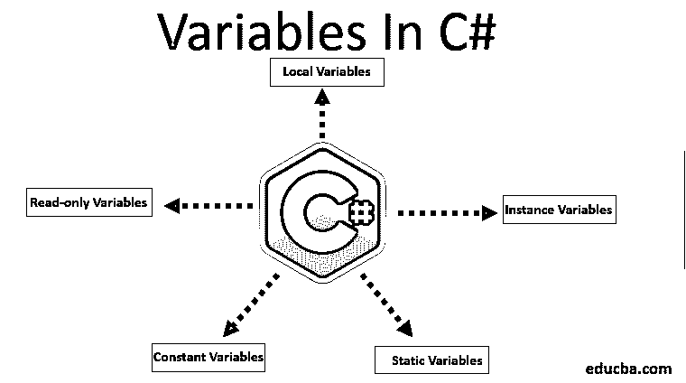
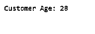
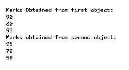
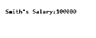
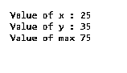
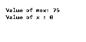

# C#中的变量

> 原文：<https://www.educba.com/variables-in-c-sharp/>




## C#中的变量介绍

在 C#中，变量是我们给内存位置起的名字，每个变量都有一个指定的类型，它指定了可以存储在变量中的值的类型。所有变量都应该在使用前声明；每个变量都有一个特定的类型，它决定了变量的大小和范围。要对变量执行任何操作，必须定义一个具有特定数据类型的变量，以指定该变量在我们的应用程序中可以保存的数据类型。让我们来看一些关于变量的基本知识，

*   变量只是赋予数据值的一个名称。
*   变量可以保存特定数据类型的值，例如，int、string、float 等。
*   变量的声明和初始化在不同的语句中。
*   变量可以由逗号分隔的多个定义，也可以在单行和多行中直到分号结束。
*   在我们使用变量之前，必须给它赋值；否则，它将显示一个编译时错误。
*   变量的值可以随时改变，直到程序可访问。

### 如何在 C#中声明变量？

声明 C#变量有一些规则:

<small>网页开发、编程语言、软件测试&其他</small>

*   我们必须用数字、字母和下划线的组合来定义变量名。
*   每个变量名应该以字母或下划线开头。
*   变量名之间不应有任何空格。
*   变量名不应包含任何保留关键字，如 int、char、float 等。

C#中变量定义的语法

```
<data_type> <variable_name>;
<data_type> <variable_name>=value;
<access_specifier><data_type> <variable_name>=value;
```

这里的 **< data_type >** 是一种数据类型，其中变量可以保存的类型有整数、Sting、float 等**。< variable_name >** 是在我们的应用程序中保存值的变量的名称，而 **< value >** 是给变量分配一个特定的值，最后**<access _ specifier>**用于给变量授予访问权限。它们是 c#编程语言中描述变量名的一些合适的方法。

```
int name;
float value;
char _firstname;
```

您也可以在定义时初始化变量，如下所示:

```
int value = 100;
```

### 如何在 C#中初始化变量？

给一个变量赋值叫做初始化，变量可以通过常量表达式用等号初始化，变量也可以在声明时初始化。

**语法**:

```
<data_type> <variable_name> = value;
```

或者

```
variable_name = value;
```

举个例子，

```
int value1=5, value2= 7;
double pi= 3.1416;
char name='Rock';
```

### C#中的变量类型及示例

有几种类型的变量，例如

1.  局部变量
2.  实例变量或非静态变量
3.  静态变量或类变量
4.  常量变量
5.  只读变量

#### 1.局部变量

在方法、块或构造函数中定义的局部变量。一旦变量被声明，这些变量只存在于块中，我们只能在块中访问这些变量。该变量是在调用函数或进入块时创建的，它将在从块中退出后或调用从函数返回时被删除一次。

在示例程序中，变量“customer_age”是函数 GetAge()的局部变量。一旦我们在 GetAge()函数之外应用了变量 customer_age，编译器就会产生一个错误。

**样本程序–局部变量**

```
using System;
class CustomerEntry
{
public void GetAge()
{
int customer_age=0;         // local variable
customer_age= customer_age+28;
Console. WriteLine("Customer Age: "+ customer_age);
}
public static void Main(String[] args)
{
CustomerEntry _customerObj=new CustomerEntry();
_customerObj.GetAge();
}
}
```

**输出:**




#### 2.实例变量或非静态变量

实例变量被称为非静态变量；实例变量在类中声明，但在任何方法、块或构造函数之外声明。一旦一个类的对象被创建，这些变量就会被创建，当对象被销毁时，它也会被销毁。对于实例变量，我们可以[使用访问说明符](https://www.educba.com/access-specifiers-in-c-plus-plus/)。

在程序中，实例变量是 markEnglish，markMaths。我们可以创建多个对象，每个对象都有其实例变量的副本。

**样本程序–实例变量**

```
using System;
class StudentMarks {
// instance variables
int markEnglish;
int markMaths;
int markPhysics;
public static void Main(String[] args) // Main Method
{
StudentMarks obj1 = new StudentMarks ();  //Object creation 1
obj1\. markEnglish = 90;
obj1\. markMaths = 80;
obj1\. markPhysics = 93;
StudentMarks obj2 = new StudentMarks (); //Object creation 1
obj2\. markEnglish = 95;
obj2\. markMaths = 70;
obj2\. markPhysics = 90;
Console.WriteLine("Marks Obtained from first object:");
Console.WriteLine(obj1\. markEnglish);
Console.WriteLine(obj1\. markMaths);
Console.WriteLine(obj1\. markPhysics);
Console.WriteLine("Marks obtained from second object:");
Console.WriteLine(obj2\. markEnglish);
Console.WriteLine(obj2\. markMaths);
Console.WriteLine(obj2\. markPhysics);
}
}
```

**输出:**




#### 3.静态变量或类变量

静态变量在程序执行开始时创建，在执行结束时销毁。静态变量也称为类变量。对于访问静态变量，我们不需要创建一个对象的类；我们可以简单地访问这个变量，

```
Class_name.variable_name;
```

静态变量是在类内或任何方法或构造函数外使用关键字 static 声明的。

**样本程序–静态变量**

```
using System;
class Employee
{
static double empSalary;
static string empName="Smith";
public static void Main(String[] args)
{
Employee.empSalary=100000;  // accessing the static variable
Console. WriteLine(Employee.empName+ "'s Salary:" + Employee.empSalary);
}
}
```

**输出:**




#### 4.常量变量

常量变量类似于静态变量，一次初始化和类的一次性生命周期，它不需要类的实例来初始化或访问。常量变量是通过使用“const”关键字声明的，这些变量一旦声明就不能更改，并且只应在声明部分初始化。

**样本程序–常量变量**

```
using System;
class Program_A
{
int x= 25; // instance variable
static int y= 35; // static variable
const float maxValue =75; // constant variable
public static void Main()
{
Program_A classObject= new Program_A(); // object creation
Console.WriteLine("Value of x : " + classObject.x);
Console.WriteLine("Value of y : " + Program_A.y);
Console.WriteLine("Value of max " + Program_A. maxValue);
}
}
```

**输出:**




#### 5.只读变量

使用关键字' **read-only** '声明只读变量，这些变量不能像常量变量一样改变。常量变量是整个类的不变值，而只读变量是一个类的特定实例的永久值。没有必要在声明时初始化只读变量，它可以在构造函数下初始化。该变量的默认值设置为 0。

**示例程序–只读**

```
using System;
class Program_B
{
const float maxValue =75; // constant variable
readonly int x; // read-only variable
public static void Main()
{
Program_B classObject= new Program_B(); // object creation
Console.WriteLine("Value of max: " + Program_B. maxValue);
Console.WriteLine("Value of x : " + classObject.x);
}
}
```

**输出:**




### 结论

最后，您已经了解了变量如何允许您以不同的方式存储数据。在本文中，我们学习了如何声明和初始化变量，以及如何使用它。我希望这篇文章能帮助你了解变量的工作过程。

### 推荐文章

这是 C#中的变量指南。这里我们讨论什么是 C#中的变量，我们如何声明变量，我们如何初始化变量，最后是什么是 C#中不同类型的变量及其例子。您也可以阅读以下文章，了解更多信息——

1.  [PHP 中的变量](https://www.educba.com/variables-in-php/)
2.  [C#函数](https://www.educba.com/csharp-functions/)
3.  [JavaScript 中的变量](https://www.educba.com/variables-in-javascript/)
4.  [外壳脚本中的变量](https://www.educba.com/variables-in-shell-scripting/)


