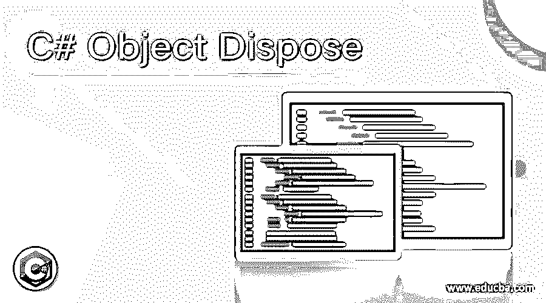

# C#对象处置

> 原文：<https://www.educba.com/c-sharp-object-dispose/>




## C#对象处置简介

释放和重置未被管理的资源，如数据库、文件等的连接。，为了清理内存，我们使用了 C#中的 dispose()函数。它必须实现 IDisposable 接口，并且必须由用户显式调用，而不是由垃圾收集器调用。使用 dispose()方法时的性能开销为零，因为 dispose()方法会立即清理内存，从而优化内存，因此强烈建议使用此函数清理非托管资源，如文件和数据库连接。

**语法:**

<small>网页开发、编程语言、软件测试&其他</small>

```
dispose();
```

### dispose()函数的工作原理

dispose()函数的工作原理如下:

*   释放和重置未被管理的资源，如数据库、文件等的连接。，为了清理内存，我们使用了 C#中的 dispose()函数。
*   C#中的 dispose()函数必须实现 IDisposable 接口。
*   C#中的 dispose()函数必须由用户显式调用，而不是由垃圾收集器调用。
*   使用 dispose()方法时的性能开销为零，因为 dispose()方法会立即清理内存，从而优化内存，因此强烈建议使用此函数清理非托管资源，如文件和数据库连接。

### C#对象处置的示例

让我们讨论 C#对象处理的例子。

#### 示例#1

C#程序，通过实现 IDisposable 接口并显式调用 dispose()函数来演示 dispose()函数的用法，该函数显示相应的消息:

**代码:**

```
using System;
using System.IO;
using System;
//a class called demonstratingclass is defined and it implements the IDidposable interface
public class demonstratingclass : IDisposable
{
//the dispose() method is defined to to perform the release of the required resources
public void Dispose()
{
Console.WriteLine("The dispose() function has been called and the resources have been released!");
}
}
//another class called demofordispose is defined
public class demofordispose
{
//main method is called
public static void Main()
{
//an instance of the demonstratingclass is created
var result = new demonstratingclass();
//the dispose() method is called on the instance of the demonstratingclass to release it from the memory
result.Dispose();
}
}
```

**输出:**


在上面的程序中，定义了一个名为演示类的类，它实现了 IDidposable 接口。然后在演示类中定义 dispose()方法，该类实现 IDisposable 接口来执行所需资源的释放。然后定义另一个名为 demofordispose 的类，在该类中调用 main 方法。在 main 方法中，创建了演示类的一个实例。然后在演示类的实例上调用 dispose()函数，将它从内存中释放出来，并显示相应的消息。

#### 实施例 2

C#程序，通过实现 IDisposable 接口并显式调用 dispose of()函数来演示 dispose of()函数的用法，该函数显示相应的消息:

**代码:**

```
using System;
//a class called demonstratingclass is defined and it implements the IDidposable interface
public class demonstratingclass : IDisposable
{
//the dispose() method is defined to to perform the release of the required resources
public void Dispose()
{
Console.WriteLine( "The resources have been released because the dispose function is called upon them");
}
}
//another class called demofordispose is defined
public class demofordispose
{
//main method is called
public static void Main()
{
//an instance of the demonstratingclass is created
var check = new demonstratingclass();
//the dispose() method is called on the instance of the demonstratingclass to release it from the memory
check.Dispose();
}
}
```

**输出:**


在上面的程序中，定义了一个名为演示类的类，它实现了 IDidposable 接口。然后在演示类中定义 dispose()方法，该类实现 IDisposable 接口来执行所需资源的释放。然后定义另一个名为 demofordispose 的类，在该类中调用 main 方法。在 main 方法中，创建了一个演示类的实例。然后，在演示类的实例上调用 dispose of()函数，将它从内存中释放出来，并显示相应的消息。

#### 示例 3

C#程序，通过实现 IDisposable 接口并显式调用 dispose()函数来演示 dispose()函数的用法，该函数显示相应的消息:

**代码:**

```
using System;
//a class called demonstratingclass is defined and it implements the IDidposable interface
public class demonstratingclass : IDisposable
{
//the dispose() method is defined to to perform the release of the required resources
public void Dispose()
{
Console.WriteLine("The dispose() function is releasing the specified resources freeing them from the memory.");
}
}
//another class called demofordispose is defined
public class demofordispose
{
//main method is called
public static void Main()
{
//an instance of the demonstratingclass is created
var check1 = new demonstratingclass();
//the dispose() method is called on the instance of the demonstratingclass to release it from the memory
check1.Dispose();
}
}
```

**输出:**


在上面的程序中，定义了一个名为演示类的类，它实现了 IDidposable 接口。然后在演示类中定义 dispose()方法，该类实现 IDisposable 接口来执行所需资源的释放。然后定义另一个名为 demofordispose 的类，在该类中调用 main 方法。在 main 方法中，创建了演示类的一个实例。然后在演示类的实例上调用 dispose()函数，将它从内存中释放出来，并显示相应的消息。

### 结论

在本文中，我们通过编程实例及其输出，学习了 C#中 dispose()函数的定义、语法和工作原理。

### 推荐文章

这是一个 C#对象处理指南。这里我们也讨论了 C#对象 dispose 的介绍，Dispose()函数的工作原理以及不同的例子。您也可以看看以下文章，了解更多信息–

1.  [C#目录信息](https://www.educba.com/c-sharp-directoryinfo/)
2.  [C#秒表](https://www.educba.com/c-sharp-stopwatch/)
3.  [C# SOAP](https://www.educba.com/c-sharp-soap/)
4.  [C#基础](https://www.educba.com/c-sharp-base/)


