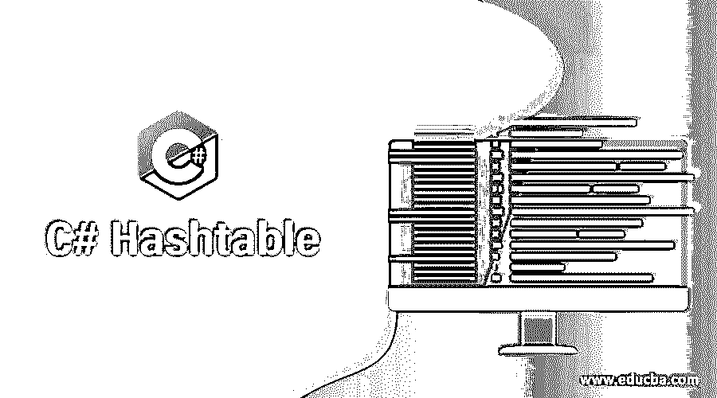
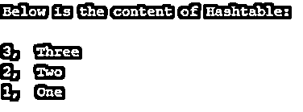
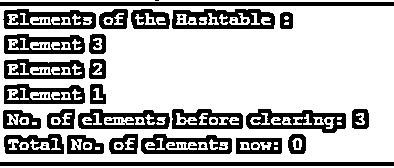
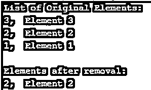

# C#哈希表

> 原文：<https://www.educba.com/c-sharp-hashtable/>




## C#哈希表简介

C#中的 Hashtable 是键值对形式的数据集合，键值对基于键的哈希代码，使用键是为了访问集合中的元素或数据。它从 Objects 类继承到 Hashtable。因此，基本上，C#或任何编程语言中的 hashtable 都是键和值对的简单表示，它们以哈希代码格式正确组织。

**语法:**

<small>网页开发、编程语言、软件测试&其他</small>

现在我们知道了什么是 C#哈希表，让我们继续理解正确实现哈希表的标准语法。下面是在程序中使用 hashtable 的标准语法和所需的系统文件。

```
using System.Collections;
Hashtableht = new Hashtable();
```

包含集合的系统文件负责导入哈希表使用的必要函数和方法。然后 hashtable 是这里的主要关键字，我们创建了一个实例作为 ht，我们的操作将在新创建的 ht 上执行。现在我们知道了实现哈希表的正确语法，让我们理解它是如何工作的。

### Hashtable 在 C#中是如何工作的？

如前所述，我们知道哈希表是键值对形式的数据或信息的集合。键值对的一个简单例子是“Name: Sulaksh”，这里的键是 Name，值是 Sulaksh，键保持不变，而值可以不同。Hashtable 由键和值组成，用花括号表示，使用哈希函数计算。

现在让我们转向哈希表的正确实现，并理解例子的工作。

### C#哈希表的例子

我们的第一个例子是一个哈希表的简单实现，其中我们有一个简单的哈希表，有一个数字键和值，我们将打印哈希表中元素的总数，代码如下:

#### 示例#1

**代码:**

```
using System;
using System.Collections;
class sampleht {
static public void Main() {
Hashtableexampleht = new Hashtable();
exampleht.Add(1, " Element 1");
exampleht.Add(2, " Element 2");
exampleht.Add(3, " Element 3");
Console.WriteLine("\n The Total No. of elements: {0}", exampleht.Count);
}
}
```

**代码解释:**从系统文件开始，这里集合是最重要的，然后是我们的类，在类中是我们的 main 方法。在 main 方法中，是我们的哈希表声明，后面是三个键值对。我们实现了 add 函数来插入元素。所以我们的哈希表由三个键值对组成，最后，我们有一个 print 语句，它将打印哈希表中的元素总数，也就是三个。我们在这里使用一个简单的计数函数，参考下面的输出截图:


正如预期的那样，输出告诉我们哈希表中有四个元素，现在继续下一个例子，我们将尝试显示哈希表的键和值。

#### 实施例 2

**代码:**

```
using System;
using System.Collections;
class exampleHT {
static publicvoid Main() {
HashtablesampleHT = new Hashtable();
sampleHT.Add(1, " One");
sampleHT.Add(2, " Two");
sampleHT.Add(3, " Three");
Console.WriteLine("\n Below is the content of Hashtable: \n");
foreach (DictionaryEntry entry in sampleHT) {
Console.WriteLine(" {0}, {1}", entry.Key, entry.Value);
}
}
}
```

**代码解释:**与前面的例子类似，我们有系统文件和包含 main 方法的类。然后是哈希表，接着是键值对，然后是打印语句。然后我们有我们的 foreach 语句，它将一次选择一个元素，并在下一行将其打印为输出。我们的输出应该是一个以键和值的形式的元素列表，请参考下面的截图。




正如预期的那样，输出是打印哈希表的元素，现在对于我们的下一个例子，我们将使用 outhashtable 实现 clear 函数，代码如下。

#### 实施例 3

**代码:**

```
using System;
using System.Collections;
class sampleht {
static public void Main()  {
Hashtableexampleht = new Hashtable();
exampleht.Add(1, " Element 1");
exampleht.Add(2, " Element 2");
exampleht.Add(3, " Element 3");
Console.WriteLine("\n Elements of the Hashtable :");
foreach(DictionaryEntry ele1 in exampleht) {
Console.WriteLine(ele1.Value);
}
Console.WriteLine(" No. of elements before clearing: {0} ", exampleht.Count);
exampleht.Clear();
Console.WriteLine(" Total No. of elements now: {0} ", exampleht.Count);
}
}
```

**代码解释:**有了我们需要的系统文件和方法，我们就有了哈希表和三个定义在其中的键值对。我们已经实现了 add 函数来将元素添加到哈希表中，然后我们使用 print 语句，它将简单地打印哈希表中的所有元素，也就是三个元素。在清除哈希表之前，我们已经打印了列表中存在的元素总数，然后我们有了 clear 函数，它将清除整个哈希表，这意味着每个元素都将从列表中清除，最后的 print 语句将打印现在存在的元素数，这将是零。




如前所述，clear 函数完成了它的工作，列表被清除，现在，继续下一个例子，我们将实现 remove 函数。

#### 实施例 4

**代码:**

```
using System;
using System.Collections;
class sampleht {
static public void Main() {
Hashtableexampleht = new Hashtable();
exampleht.Add(1, " Element 1");
exampleht.Add(2, " Element 2");
exampleht.Add(3, " Element 3");
Console.WriteLine("\n List of Original Elements:");
foreach (var key in exampleht.Keys )
Console.WriteLine(" {0}, {1}",key , exampleht[key]);
exampleht.Remove(3);
exampleht.Remove(1);
Console.WriteLine("\n Elements after removal:");
foreach (var key in exampleht.Keys )
Console.WriteLine(" {0}, {1}",key , exampleht[key]);
}
}
```

代码解释:正如我们前面的例子一样，我们有我们的系统文件、类和 main 方法。然后我们有一个哈希表，总共有三个键值。然后我们有了 print 语句，它将使用 foreach 打印出原始列表以及键和值。然后我们有两个键的 remove 函数，它将删除我们传递的键，然后我们有 print 语句，它将使用 foreach 并在删除后打印哈希表中的每个元素。




### 优势

任何函数或方法的优点对于理解它的实时应用程序都很重要，hashtable 最广为人知的优点是它允许开发人员进行同步。Hashtable 具有优于搜索树的优点，这使得它们在实时计算机应用程序和数据库索引中的使用更加实际。与其他表类型的数据结构相比，速度最好由哈希表来实现。有了键值对，就很容易预测数据的格式，重构也很容易。

### 结论

C#中的 Hashtable 是元素的集合，以键值对格式表示。当值不同时，键可以相同；当值可以为空时，键不能为空。我们实现了一个函数的例子，比如删除、清除和打印。Hashtable 比其他数据结构有速度优势。

### 推荐文章

这是一个 C#散列表的指南。这里我们还讨论了 C# Hashtable 的介绍，Hashtable 是如何工作的，以及不同的例子。您也可以看看以下文章，了解更多信息–

1.  [C#排序集](https://www.educba.com/c-sharp-sortedset/)
2.  [C#堆栈](https://www.educba.com/c-sharp-stack/)
3.  [将 int 转换成字符串 C#](https://www.educba.com/convert-int-to-string-c-sharp/)
4.  [C# FileInfo](https://www.educba.com/c-sharp-fileinfo/)


