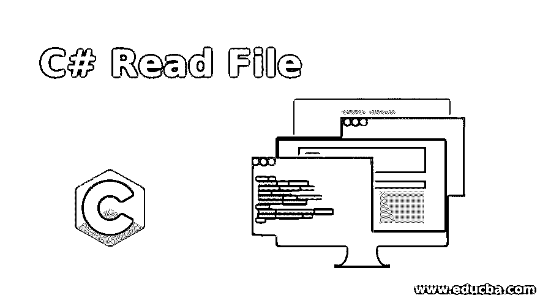
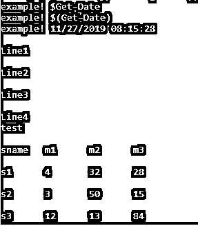
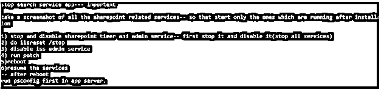
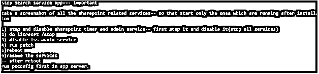

# C#读取文件

> 原文：<https://www.educba.com/c-sharp-read-file/>




## C#读取文件简介

执行文件操作是程序员生活中不可或缺的一部分，所有的编程语言都提供了不同的库或函数来实现同样的功能。在 C#中，使用 File 类提供程序中可用的方法也可以做到这一点。通常，从文件中读取是使用两种方法 ReadAllText(file)和 ReadAllLines(file)来执行的，其中 file 表示需要读取的文件。也可以使用 Streamreader 以字节形式读取文件。本文将详细介绍 C#中读取文件的各种方法，并给出适当的例子。

**语法:**

<small>网页开发、编程语言、软件测试&其他</small>

ReadAllText()的语法如下

```
public static string ReadAllText (String Path, System.Text.Encoding encoding)
```

ReadAllLines()的语法如下

```
public static string ReadAllLines(String, Encoding)
```

该方法读取文件中存在的所有行，然后将它们存储在一个字符串中，然后关闭文件。

### C#读取文件的参数

*   **路径:**路径包含文件的位置。这个文件必须被读取。
*   **编码:**表示文件的编码类型，可选。

这个方法的返回类型是一个包含文件中所有内容的字符串。该方法在系统中可用。IO 命名空间，与此方法关联的程序集是 mscorlib.dll。

**与 ReadAllLines()方法的 ReadAllText()相关的异常:**

*   **参数异常:**当路径包含零个字符、空格或无效字符时，会出现这种情况。
*   **参数为空异常:**当路径为空时会出现这种情况。
*   **路径过长异常:**当路径超出实际系统定义的限制时，会出现这种情况。
*   **IO 异常:**当打开文件时如果出现任何错误，就会出现此异常。
*   **未授权访问异常:**当指定文件为只读时，会出现这种情况
*   **文件未找到异常:**当文件不在指定位置时会出现这种情况。
*   **不支持异常:**当指定路径的格式无效时，抛出此异常。
*   **安全异常:**当用户无权访问文件时，抛出该异常。

### C#读取文件的示例

以下是下面提到的例子。

#### 示例# 1–使用 ReadAllText()读取文件

**代码:**

```
using System;
using System.IO;
using System.Text;
namespace ReadAllText
{
class Test
{
static void Main(string[] args)
{
var Fpath= @"C:\Vignesh\KB.txt";
string content = File.ReadAllText(Fpath, Encoding.UTF8);
Console.WriteLine(content);
}
}
}
```

**输出:**


#### 示例 2–使用 ReadAllLines()读取文件

**代码:**

```
using System;
using System.IO;
using System.Text;
namespace ReadAllLines
{
class Test
{
static void Main(string[] args)
{
var inputfile = @"C:\Vignesh\append.txt";
string[] output = File.ReadAllLines(inputfile, Encoding.UTF8);
foreach (string op in output)
{
Console.WriteLine(op);
}
}
}
}
```

**输出:**




#### 示例# 3–使用 streamreader 类读取文件

**1。StreamReader。ReadToEnd():** 这个方法用于从当前位置到流的末尾读取文件。此方法的对应命名空间是 System。木卫一和大会是 mscorblib.dll。

**语法:**

```
public override string ReadToEnd ();
```

**输入参数:**该方法不需要任何输入参数。

**Returns:** 该方法将文件内容输出为流，如果当前位置设置为文件的最后一个字符，则返回一个空字符串。

**2。StreamReader。ReadLine():** 该方法从当前流中读取字符，并将数据作为字符串发送到输出。此方法的对应命名空间是 System。木卫一和大会是 mscorblib.dll。

**语法:**

```
public override string ReadLine();
```

**输入参数:**该方法不需要任何输入参数。

**Returns:** 返回当前流的下一行，如果当前流在最后一行位置，则返回 null。

**代码:**

```
using System;
using System.IO;
using System.Text;
class Program
{
static void Main(string[] args)
{
var FP = @"C:\Vignesh\Names.txt";
using var fstre = new FileStream(FP, FileMode.Open, FileAccess.Read);
using var sree = new StreamReader(fstre, Encoding.UTF8);
string Fcontent = sree.ReadToEnd();
Console.WriteLine(Fcontent);
}
}
```

**输出:**


**代码:**

```
using System;
using System.IO;
using System.Text;
class Program
{
static void Main(string[] args)
{
var filpath = @"C:\Vignesh\TimerJob-2019-08-09.txt";
using var fstre = new FileStream(filpath, FileMode.Open, FileAccess.Read);
using var sreee = new StreamReader(fstre, Encoding.UTF8);
string cline = String.Empty;
while ((cline = sreee.ReadLine()) != null)
{
Console.WriteLine(cline);
}
}
}
```

**输出:**


**代码:**

```
using System;
using System.IO;
namespace testclass {
class Test {
string FPath = @ "C:\Vignesh\Script to 0365 connection.txt";
static void Main(string[] args)
{
//Check if file is there at the path
//ReadallOutput()
if (File.Exists(FPath)) {
string output = File.ReadAlloutput(FPath);
Console.WriteLine(output);
}
//Check if file is there at the path
if (File.Exists(FPath)) {
//ReadallLines()
string[] Flines = File.ReadAllFlines(FPath);
foreach(string line in Flines)
Console.WriteLine(line);
}
//Check if file is there at the path
if (File.Exists(FPath)) {
//using streamreader
using(StreamReader file = new StreamReader(FPath)) {
int counter = 0;
string lgth;
while ((lgth = file.ReadLine()) != null) {
Console.WriteLine(lgth);
counter++;
}
file.Close();
}
}
Console.ReadKey();
}
}
}
```

**输出:**




#### 示例 4–使用 streamreader 异步读取文件

**代码:**

```
using System;
using System.IO;
using System.Text;
using System.Threading.Tasks;
class TestProgram
{
static async Task Main(string[] args)
{
var ip = @" C:\Vignesh\Patching\Patching Steps.txt";
using var fssss = new FileStream(ip, FileMode.Open, FileAccess.Read);
using var srrr = new StreamReader(fssss, Encoding.UTF8);
//Reading asynchronously
string op = await srrr.ReadToEndAsync();
Console.WriteLine(op);
}
}
```

**输出:**




### 结论

因此，本文详细介绍了 c#中的读文件功能。它解释了可用于执行该操作的各种方法。它还介绍了与每种方法相关的各种参数和异常，并通过示例程序进行了详细解释。为了涵盖更多细节，建议编写示例程序并实践它们。

### 推荐文章

这是一个 C#读取文件的指南。在这里，我们讨论了 C#中读取文件的各种方法以及相应的例子。您也可以看看以下文章，了解更多信息–

1.  [C#螺纹连接](https://www.educba.com/c-sharp-thread-join/)
2.  [C#三元运算符](https://www.educba.com/c-sharp-ternary-operators/)
3.  [C#二进制阅读器](https://www.educba.com/c-sharp-binaryreader/)
4.  [在 C#中反转字符串](https://www.educba.com/reverse-string-in-c-sharp/)


