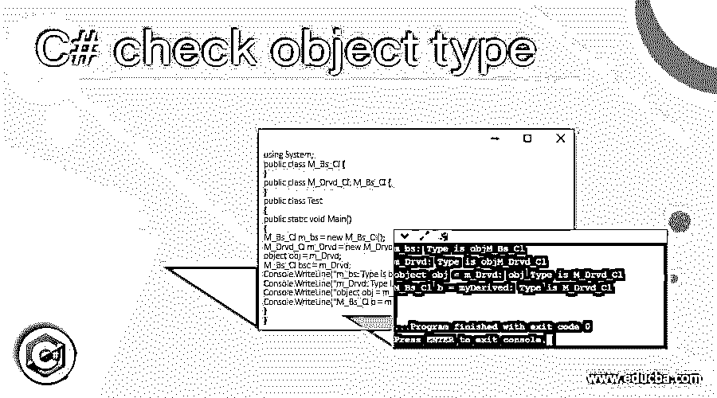
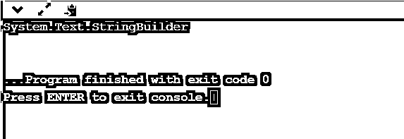
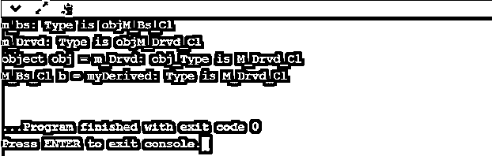
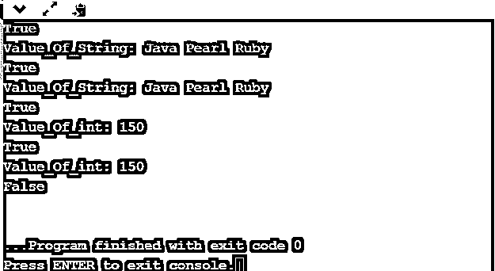
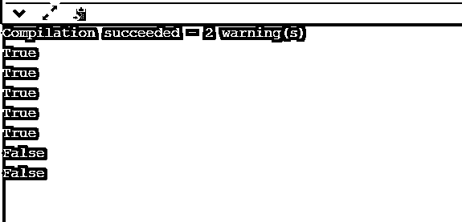

# C#检查对象类型

> 原文：<https://www.educba.com/c-sharp-check-object-type/>




## C#检查对象类型简介

C#是一种编程语言，它将 object 视为程序中所有派生类的基类。所有类型都是从对象继承的，这些对象通过扩展派生类的属性来执行某些功能。被派生的 C#对象有一些方法和能力来引用和取消引用任何基本类型的对象。在派生类和基类的情况下，对象的引用对于检查正在创建的对象类型起着重要的作用。强制使用基类对象进行强制转换，以使其与检查对象类型兼容。

**语法:**

<small>网页开发、编程语言、软件测试&其他</small>

C#中检查对象类型的语法流程是获取对象的类型及其关联的对象性质。

```
public Type GetType ();
```

如果已经识别了对象的类型，则使用 typeof()来识别 C#对象

typeof()

### C#中如何检查对象类型？

C#中的对象类型检查在确定与实现相关的对象的类型和细节方面起着关键作用。就实现和满足需求而言，这些细节对程序员来说非常重要。因此，可以使用某些方法来检查 C#中的对象，如下所示:

*   GetType()是一种在 C#中经常用来检查对象类型的方法。该方法用于在运行时工作，主要用于在执行时将单个对象作为一个实体调用。
*   Get type()方法是 object 类中的一个方法，用于对该类的实例进行引用。
*   类型用于将对象类型编译成一个类型，然后用于在编译时进行全局化以获得对象的类型及其描述，这使得其类型的操作数是由用户给定的还是由系统提供的。
*   对于已知类型的实参或形参，我们是使用 Get type()方法还是 type 0f，这完全取决于系统和它的返回类型，即我们如何返回其中的值，以便进行检查和修改。
*   最后，在使用了这两种方法之后，它创建了信息的元数据，或者说是整个类的元数据，用于在 C#程序中创建对象时以某种方式存储结果。
*   此外，要记住非常重要的一点，比如说，C#中的对象类型是在执行之前声明的，那么在这种情况下，get type()方法将有助于获取，如果要在 C#中创建的对象类型没有声明，并且依赖于已经作为元数据存在的类型，那么在这种情况下，可以在运行时使用类型。
*   Is 运算符也用于获取值，当一个实例返回值 true 或 false(表示该实例采用继承树的形式)时，通常会用到这个值。

### 例子

让我们讨论 C#检查对象类型的例子。

#### 示例#1

这个程序演示了 object 在 C#中的用法，以及系统中已经内置的 object，如输出所示。

**代码:**

```
using System;
using System.Text;
class Demo_Prog
{
static void Main()
{
object vl_1 = new StringBuilder();
Console.WriteLine(vl_1.GetType());
}
}
```

**输出:**




#### 实施例 2

这个程序演示了 GetType()方法的使用，该方法经常用于检查 C#的对象类型，在运行时执行时需要时也可以使用，如输出所示。

**代码:**

```
using System;
namespace Consl_App1
{
class Fruit { }
class Kiwi : Fruit { }
class Pro_g
{
static Fruit newFruit()
{
return new Kiwi();
}
static void Main(string[] args)
{
Fruit f = newFruit();
Console.WriteLine(typeof(Fruit));
Console.WriteLine(f.GetType());
Console.ReadKey();
}
}
}
```

**输出:**


#### 实施例 3

这个程序演示了类中从输出中所示的基对象派生的对象，以识别 C#中的类中的对象类型。

**代码:**

```
using System;
public class M_Bs_Cl {
}
public class M_Drvd_Cl: M_Bs_Cl {
}
public class Test
{
public static void Main()
{
M_Bs_Cl m_bs = new M_Bs_Cl();
M_Drvd_Cl m_Drvd = new M_Drvd_Cl();
object obj = m_Drvd;
M_Bs_Cl bsc = m_Drvd;
Console.WriteLine("m_bs: Type is obj{0}", m_bs.GetType());
Console.WriteLine("m_Drvd: Type is obj{0}", m_Drvd.GetType());
Console.WriteLine("object obj = m_Drvd: obj_Type is {0}", obj.GetType());
Console.WriteLine("M_Bs_Cl b = myDerived: Type is {0}", bsc.GetType());
}
}
```

**输出:**




#### 实施例 4

这个程序演示了 object 的用法，输出中显示了 object 的各种类型的参数。这些不同类型的参数用于获取值，并且对象的类型根据它所拥有的性质来识别。

**代码:**

```
using System;
class Demo_Prog
{
static void Main()
{
string vl_1 = "Java Pearl Ruby";
Verify(vl_1);
Verify((object)vl_1);
int num = 150;
Verify(num);
Verify((object)num);
Verify(null);
}
static void Verify(object vl_1)
{
Console.WriteLine(vl_1 != null);
if (vl_1 is string)
{
Console.WriteLine("Value_Of_String: {0}", vl_1);
}
else if (vl_1 is int)
{
Console.WriteLine("Value_Of_int: {0}", vl_1);
}
}
}
```

**输出:**




#### 实施例 5

此程序演示了当引用在树中显示继承的任何实例(如输出所示)必须返回值 true 时，它是关于对象的运算符。

**代码:**

```
using System;
public class C1
{
}
public class C2: C1
{
}
public class C3 {
}
public class sck_br {
public static void Main()
{
C1 ob_1 = new C1();
C2 ob_2 = new C2();
Console.WriteLine(ob_1 is C1);
Console.WriteLine(ob_1 is Object);
Console.WriteLine(ob_2 is C2);
Console.WriteLine(ob_2 is Object);
Console.WriteLine(ob_2 is C2);
Console.WriteLine(ob_2 is C3);
Console.WriteLine(ob_2 is C3);
}
}
```

**输出:**




### 结论

C#对象类型主要由程序员使用，以便在编译时或有时在程序运行时获取关于对象的详细信息。返回值的类型取决于执行或编译时所需的变量或对象的类型。因此，创建 C#对象类型在信息的元数据方面起着非常重要的作用。

### 推荐文章

这是一个 C#检查对象类型的指南。这里我们也讨论一下 C#检查对象类型入门，C#中如何检查对象类型？用不同的例子。您也可以看看以下文章，了解更多信息–

1.  [C#对象到 XML](https://www.educba.com/c-sharp-object-to-xml/)
2.  [C#对象处置](https://www.educba.com/c-sharp-object-dispose/)
3.  [C#局部函数](https://www.educba.com/c-sharp-local-functions/)
4.  [字符串到日期 C#](https://www.educba.com/string-to-date-c-sharp/)


