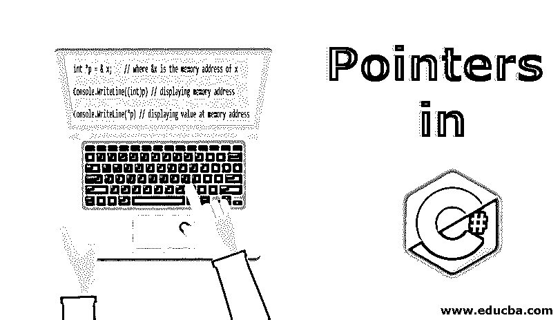
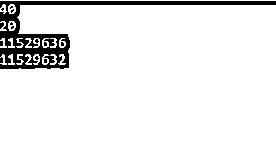
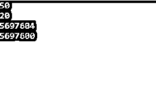
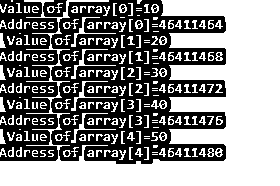
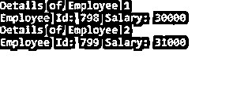
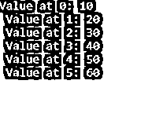

# C#中的指针

> 原文：<https://www.educba.com/pointers-in-c-sharp/>




## C#中的指针简介

指针被定义为包含另一个变量的内存地址的变量。每当有不安全的语句并且用 unsafe 关键字标记时，就会使用 C#中的指针。这些类型的语句不受垃圾收集器的控制，并且使用指针变量。

**语法:**指针可以声明为

<small>网页开发、编程语言、软件测试&其他</small>

```
type  *var name;
int* a;
```

这里的*称为解引用操作符，a 是包含 int 类型地址的变量。

**例子**

```
int *p = & x;    // where &x is the memory address of x
Console.WriteLine((int)p) // displaying memory address
Console.WriteLine(*p) // displaying value at memory address
```

### 指针在 C#中是如何工作的？

下面的例子展示了它在 C#中是如何工作的。

#### C#中的指针–示例 1

```
using System;
using System.Collections.Generic;
using System.Linq;
using System.Text;
namespace Pointers
{
class Demo
{
public void Method()
{
unsafe
{
int a = 40;
int b = 20;
int* ptr1 = &a;
int* ptr2 = &b;
Console.WriteLine(*ptr1);    // displaying the value
Console.WriteLine(*ptr2);    // displaying the value
Console.WriteLine((int)ptr1); // displaying the address
Console.WriteLine((int)ptr2); // displaying the address
}
}
}
class Example
{
// main method
public static void Main()
{
Demo d = new Demo();
d.Method();
}
}
}
```

有不同的方法来执行不安全的语句，如修饰符、构造函数等。在上面的示例中，一组语句被标记为不安全。在上面的代码中，有两个值分别为 40 和 20 的变量 a 和 b，指针包含它们的地址。控制台。WriteLine()用于显示变量的值和地址。

**输出:**




#### C#中的指针–示例 2

```
using System;
using System.Collections.Generic;
using System.Linq;
using System.Text;
namespace Pointers
{
class Demo
{
public unsafe void Method()
{
int a = 50;
int b = 20;
int* ptr1 = &a;
int* ptr2 = &b;
Console.WriteLine(*ptr1);       // displaying the value
Console.WriteLine(*ptr2);       // displaying the value
Console.WriteLine((int)ptr1);   // displaying the address
Console.WriteLine((int)ptr2);   // displaying the address
}
}
class Example
{
// main method
public static void Main()
{
Demo d = new Demo();
d.Method();
}
}
}
```

在上面的示例中，unsafe 用于包含两个变量 a 和 b 的方法，这两个变量的值分别为 50 和 20。指针*ptr1 和*ptr2 指向它们的内存地址。

**输出:**




#### C#中的指针–示例 3

```
using System;
using System.Collections.Generic;
using System.Linq;
using System.Text;
namespace Pointers
{
class Demo
{
public unsafe static void Main()
{
int[] array = { 10, 20, 30, 40, 50 };    // declaring array
fixed (int* ptr = array)                 // fixed for pinning the object
/* let us have array address in pointer */
for (int i = 0; i < 5; i++)
{
Console.WriteLine("Value of array[{0}]={1}", i, *(ptr + i));
Console.WriteLine("Address of array[{0}]={1}", i, (int)(ptr + i));
Console.ReadKey();
}
}
}
}
```

在上面的代码中，定义了一个由五个元素和控制台组成的数组。WriteLine()用于显示数组元素的值和数组元素的地址。C#中有一个概念叫做对象的固定。在上面的代码中，固定语句用于对象锁定，这样垃圾收集器就不会让对象移动并“锁定”它。它可能会影响运行时的效率。

**输出:**




#### C#中的指针–示例 4

```
using System;
namespace Pointers
{
// Struct employee
struct Employee
{
// members
// employee id and salary
public int empid;
public double salary;
// Constructor to initialize values
public Employee(int e, double s)
{
empid = e;
salary = s;
}
}; // end of struct
class Program
{
// Main Method
static void Main(string[] args)
{
// unsafe so as to use pointers
unsafe
{
// Declaring two employee Variables
Employee E1 = new Employee(798, 30000);
Employee E2 = new Employee(799, 31000);
// Declaring two employee pointers
// and initializing them with addresses
// of E1 and E2
Employee* E1_ptr = &E1;
Employee* E2_ptr = &E2;
// Displaying details of employees using pointers
// Using  the arrow ( -> ) operator
Console.WriteLine("Details of Employee 1");
Console.WriteLine("Employee Id: {0} Salary: {1}",
E1_ptr->empid, E1_ptr->salary);
Console.WriteLine("Details of Employee 2");
Console.WriteLine("Employee Id: {0} Salary: {1}",
E2_ptr->empid, E2_ptr->salary);
} // end unsafe
} // end main
} // end class
}
```

在上面的示例中，employee struct 使用成员 employee id 和 salary 以及参数化构造函数来初始化这些值。指针指向包含基元值类型的结构，而不是包含引用类型的结构。在 main 方法中，有两个雇员变量和雇员指针，它们用地址 E1 和 E2 初始化。控制台。WriteLine()用于使用指针显示雇员[的详细信息。](https://www.educba.com/pointers-in-data-structure/)

**输出:**




#### C#中的指针–示例 5

```
using System;
using System.Collections.Generic;
using System.Linq;
using System.Text;
namespace Pointers
{
class Demo
{
public static void Main()
{
unsafe
{
int* arr = stackalloc int[6];   // declaring array
arr[0] = 10;
arr[1] = 20;
arr[2] = 30;
arr[3] = 40;
arr[4] = 50;
arr[5] = 60;
for (int i = 0; i < 6; i++)
{
Console.WriteLine($"Value at {i}: {arr[i]}");
Console.ReadKey();
}
}
}
}
}
```

在上面的代码中，使用了 stackalloc 关键字，其中内存是在堆栈上分配的。在堆栈块上执行的内存是在方法执行期间创建的。stackalloc 性能更好，不需要固定数组。它比堆分配数组好，因为不需要释放它，因为当方法返回时它会自动释放。

**输出:**




在指针中，转换属于隐式和显式类型。隐式类型的转换类似于任何指针类型到 void* type 和 null 到任何指针类型。在显式类型中，可以从 byte、sbyte、ushort、short、uint、int、ulong、long 转换为任何指针类型，反之亦然，也可以从一个指针转换为另一个指针。

### 结论–c#中的指针

所以指针被用来指向内存地址，并用不安全的语句代码执行它们。它只在非托管环境中使用，不会被垃圾收集器跟踪。指针用于堆栈、队列等。

### 推荐文章

这是 C#中的指针指南。在这里，我们讨论 C#中的介绍和指针如何工作，以及各种例子。你也可以看看下面的文章来了解更多-

1.  [c#的用途](https://www.educba.com/uses-of-c-sharp/)
2.  [c++中的指针](https://www.educba.com/pointers-in-c-plus-plus/)
3.  [C#与 Java 性能对比](https://www.educba.com/c-sharp-vs-java-performance/)
4.  [什么是 C？](https://www.educba.com/what-is-c/)


