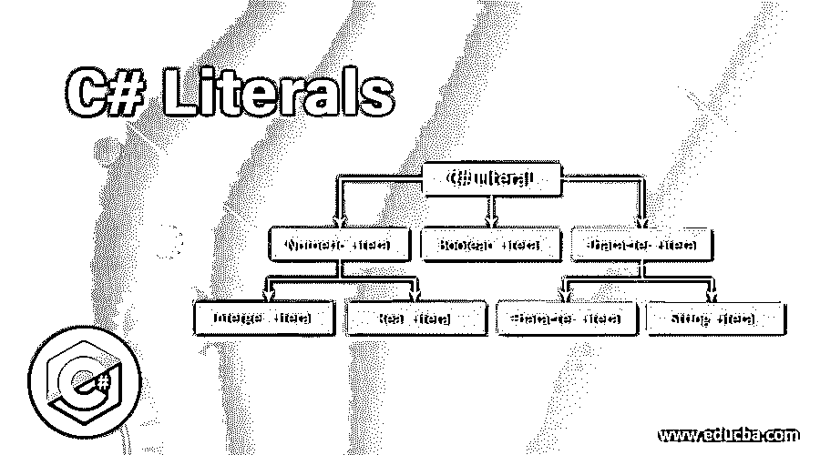
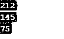
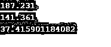

# C#文本

> 原文：<https://www.educba.com/c-sharp-literals/>




## C#文本简介

C#中的文本是预定义变量使用的固定值，在代码执行期间不能修改。像其他变量一样，这些是常量值的方便形式，但是它们的值不能改变。变量使用的值可以是整数、小数、浮点类型或字符串。C#中有不同形式的不同类型的文字。C#中有各种类型的文字。

1.  整数文字
2.  字符串文字
3.  字符文字
4.  浮点文字
5.  布尔文字

### C#中前 5 种文字类型

下面是 C#中不同类型的文字。

<small>网页开发、编程语言、软件测试&其他</small>

#### 1.整数文字

整数类型的文字可以是八进制、十进制或十六进制。前缀用于指定它是十进制、八进制还是十六进制。u 和 u 也用作无符号数字的整数类型文字的后缀，L 和 L 用于长数字。默认情况下，每个文字都是整数类型。

*   ******十进制字面量:**** 在十进制类型的字面量中允许 0-9 位数。十进制类型的文字不需要前缀。**

 **int x = 100//小数类型

*   ******八进制常值:**** 八进制常值类型中允许 0-7 位数。0 用作前缀来指定八进制类型文本的形式。**

 **int x = 072//八进制类型

*   ******六进制文字:**** 在十六进制类型的文字中，允许 0- 9 的数字和 A-f 的字符。在这种情况下，大写和小写这两种类型的字符都是允许的。0x 或 0X 用作前缀来指定十六进制类型的文字形式。**

 **int x = 0x123f//十六进制类型

#### 2.字符串文字

字符串类型文字用(" "/双引号括起来，也可以以@ "开头。长行可以用字符串文字分成多行，并用空格分隔。

```
string s= "Hi";   // string literals
```

#### 3.字符文字

字符类型文字用(')/单引号括起来。有三种方法可以指定字符文本。

*   ******单引号:**** 字符文字可以用单引号指定为单个字符。**
***   ******Unicode 表示:**** 可以使用 Unicode 表示' \uxxxx '来指定字符文字，其中 xxxx 是十六进制数。*****   ******转义序列:**** 有一些转义字符称为 char 文字。******

 ****```
char c = '\n';
```

下面是一些转义序列文字，解释了它们的含义。

| **转义序列** | **意为** |
| \\ | 字符 |
| \' | 字符 |
| \'' | 字符 |
| \? | 字符 |
| \a | 警报 |
| \b | 退格 |
| \n | 新行 |
| \f | 换页 |
| \v | 垂直标签 |
| \xhh | 十六进制数 |

#### 4.浮点文字

在浮点类型的文字中，有整数部分、小数部分、小数部分和指数部分。浮点类型文本是双精度类型。F 或 F 可以用作后缀来指定值，因为它不能直接赋给 float 变量。

#### 5.布尔文字

在布尔类型的文字中，true 和 false 将是仅有的两个值。

### C#文本的示例

下面的例子展示了我们如何在 C#中实现上述所有文字

#### 示例# 1–整数文字

**代码:**

```
using System;
using System.Collections.Generic;
using System.Linq;
using System.Text;
using System.Threading.Tasks;
namespace Literals
{
class Program
{
static void Main(string[] args)
{
int x = 212;   // decimal literal
int y = 0145;  // octal literal
int z = 0x4b;  // hexadecimal literal
Console.WriteLine(x);
Console.WriteLine(y);
Console.WriteLine(z);
Console.ReadLine();
}
}
}
```

**输出:**




**解释:**在上面的例子中，整数类型的文字有各种形式。在此，十进制形式不使用前缀，0 用于指定八进制形式，0x 用于指定十六进制数。使用前缀，我们可以定义整型文字的形式。在这段代码中，首先是没有前缀的十进制类型的文字，第二种类型是以 0 为前缀的八进制形式，最后是以 0x 为前缀的十六进制类型。

#### 示例 2–浮点文字

**代码:**

```
using System;
using System.Collections.Generic;
using System.Linq;
using System.Text;
using System.Threading.Tasks;
namespace Literals
{
class Program
{
static void Main(string[] args)
{
double x = 187.231;
double y = 0141.361;
double z = 374159E-4F;
Console.WriteLine(x);
Console.WriteLine(y);
Console.WriteLine(z);
Console.ReadLine();
}
}
}
```

**输出:**




**说明:**上面的例子，实现的是浮点文字。它可以是十进制数、分数或任何指数。所以我们可以用十进制或者指数形式来表示它。浮点类型文本是双精度类型。F 或 F 可以用作后缀来指定值，因为它不能直接赋给 float 变量。

#### 示例# 3–字符文字

**代码:**

```
using System;
using System.Collections.Generic;
using System.Linq;
using System.Text;
using System.Threading.Tasks;
namespace Literals
{
class Program
{
static void Main(string[] args)
{
char c = 'b';
char ch = '\u0071';
Console.WriteLine(c);
Console.WriteLine(ch);
Console.WriteLine("\nHello World\t!");
Console.ReadLine();
}
}
}
```

**输出:**


**说明:**在上面的例子中，实现了字符类型文字。在上面的代码中，显示了字符类型的所有三种形式。我们可以使用单引号、Unicode 表示和转义序列来指定字符文字。我们有多种类型的转义字符，它们有各自的含义。在这段代码中，指定了第一个单引号字符，第二个单引号字符具有 Unicode 表示形式，最后，我们有转义形式的字符文字。

#### 示例# 4–字符串文字

**代码:**

```
using System;
using System.Collections.Generic;
using System.Linq;
using System.Text;
using System.Threading.Tasks;
namespace Literals
{
class Program
{
static void Main(string[] args)
{
String s1 = "This is C# programming";
String s2 = @"This is C# programming";
Console.WriteLine(s1);
Console.WriteLine(s2);
Console.ReadLine();
}
}
}
```

**输出:**


**说明:**上面的例子中，实现了字符串文字。有两种方法可以指定字符串文字，如代码所示。首先，使用双引号实现它，然后使用@符号指定字符串。

#### 示例 5–布尔型文字

**代码:**

```
using System;
using System.Collections.Generic;
using System.Linq;
using System.Text;
using System.Threading.Tasks;
namespace Literals
{
class Program
{
static void Main(string[] args)
{
bool x = true;
bool y = false;
Console.WriteLine(x);
Console.WriteLine(y);
Console.ReadLine();
}
}
}
```

**输出:**


**解释:**在上面的例子中，实现了具有两个值 true 或 false 的布尔类型文字。

### 结论

所以文字是固定值。在 C#中，有不同类型的文字具有特定的形式类型。它可以是整数、布尔、字符串、文字字符类型。

### 推荐文章

这是一个 C#文字指南。在这里，我们讨论了 C#文字的基本概念和前 5 种类型，以及不同的例子和代码实现。您也可以阅读以下文章，了解更多信息——

1.  [Else If in C#](https://www.educba.com/else-if-in-c-sharp/)
2.  [c#中的 TextReader](https://www.educba.com/textreader-in-c-sharp/)
3.  [C++文字](https://www.educba.com/c-plus-plus-literals/)
4.  [C 文字量](https://www.educba.com/c-literals/)


**********