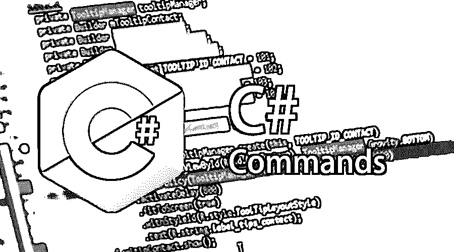

# c#命令

> 原文：<https://www.educba.com/c-sharp-commands/>




## C#命令简介

C#实际上被称为 C 调。C sharp 是一种非常流行的编程语言，它严格遵循面向对象的编程概念，具有适当的类型、函数式、声明式、命令式和泛型，并遵循正常的面向组件的编程概念的适当原则。

### 基本 C#命令

在 C sharp 环境中，通过适当的面向对象编程概念，有许多 C#命令专门用于运行或处理任何种类的关键业务逻辑。下面提到了一些基本的 C#命令:

<small>网页开发、编程语言、软件测试&其他</small>

#### 1.使用

该关键字已被用作任何 C#编程的第一条语句。它基本上指示了在任何 [C sharp 编程](https://www.educba.com/c-vs-c-sharp/)中提及名称空间的基本关键字之一。在一个 C sharp 大型编程代码中多次使用关键字的可能性很大。
使用系统

#### 2.班级

这是在 C sharp 编程中用来声明一个特定类的重要关键字之一。

```
Class User{
….
}
```

#### **3。**评论

任何一种编程语言都非常频繁地使用注释。但是对于每种类型的语言，注释的定义是不同的。注释通常用于提及编译器，注释代码不需要考虑编译。在 C 调的情况下，有两种命令用于注释代码，

*   使用“/*…”。*/'关键字，用于避免编译多行代码。
*   使用“/”来避免编译一行代码。

#### **4。**成员或类变量

成员或类变量可以被认为是一个[实例变量](https://www.educba.com/instance-variable-in-java/)。这种变量通常在类定义中定义。这些变量在类中随处可见，每个单独的方法都可以根据自己的需要轻松地访问这些变量。并且该变量上的任何值变化将同时影响所有方法。

#### **5。**对象的实例化

在[面向对象编程概念](https://www.educba.com/object-oriented-programming-in-java/)的情况下，为了使用类方法或变量，总是需要实例化一个类。可以对那些实际持有 main 方法的类进行类实例化。通常在每个类实例化之后，main 方法会直接调用。

#### **6。**标识符

在 C#程序员声明类、变量等任何东西时，标识符是非常必要的。这个标识符基本上非常有助于识别特定的类、函数或变量，或者用户定义的任何类型的 C#编程项目。在 C#编程的情况下，开发人员需要遵循的非常基本的规则是:

*   名称应该以字母或字母序列开头。它可以包含数字，如 0-9 或下划线(_)。但是标识符名称的开头应该是字母，在 C#编程的情况下不接受数字。
*   它不应该包含任何键盘上可用的符号语言，如+、-、！、@、#、$、%、^、&、*、(、)、/等。在 C#编程中，只有下划线(_)是可接受的提及名称标识符之一。
*   Identifier never 是 C#的常用关键字。

### 中间 C#命令

开发人员还使用了其他几个流行的 C#命令，它们不是非常基本的命令，但是与 C#一起使用时，非常需要执行这些 C#命令。下面提到了一些需要中间 C#命令的类型:

#### 1.关键词

C#编程有各种特殊的关键字，开发者可以非常频繁地使用它们。这些关键字实际上是 C#编译器所知道的一些保留字。C#编程中一些非常流行的关键字是抽象的，as、break、byte、case、char、decimal、default、else、event、finally、float、for each、goto、if、int、lock、long、new、null、object、out、private、public、read-only、return、short、sizeOf、String、switch、this、try、unchecked、using、virtual、void、while、volatile 等。一些上下文关键字是升序、降序、from、global、get、into、join、remove、select 等。

#### 2.公共变量

*   **值类型变量**

这种类型的变量主要用于直接赋值。这是一个源自 C#编程的通用包，名字是 System。值类型。这种类型的变量有布尔型、字节型、字符型、双精度型、十进制、整型、浮点型、长整型、短整型等。

*   **参考类型变量**

这种引用类型变量在开发者编程使用时从不包含其实际数据。它只是保存了那个变量的具体引用，或者说，我们可以说它保存了那个具体变量的内存位置。如果某个特定变量的内存位置发生变化，将会影响整个编程。

*   **指针型变量**

指针类型变量主要是帮助存储另一种类型的合适的内存地址。它的工作方式基本上和 C 或 C++编程语言中使用指针的方式一样。

### 高级 C#命令命令

下面提到了一些高级 C#命令:

#### 类型变换

在 C#编程的情况下，可能会发生两种类型的对话。确保 C#的类型安全实用程序的隐式类型转换意味着将一些对象类转换为其基类。另一种类型的转换是显式转换，在这种情况下，需要进行类型转换，开发人员必须正确地提及转换后的对象类型。

#### 常数

这是 C#的一个关键功能，它将一个变量作为常量。在这种情况下，编程中的任何逻辑都不能修改相同的变量值。

### 使用 C#命令的提示和技巧

普通 C#命令频繁用户遵循的一些常见提示和技巧。下面提到的那些技巧都是窍门:

#### 1.字符串规范化

当我们使用字符串规范化时，我们必须确保使用 UpperInVariant 而不是 LowerIntVariant，因为[微软能够](https://www.educba.com/microsoft-azure-interview-questions/)仅在大写变量的情况下优化代码。

#### 2.避免无效问题

更好的做法是使用空合并操作符来避免任何与空相关的问题，在 C#中，操作符会问这样的问题(？).

### 结论

C#编程主要是微软为给定适当的面向对象[概念而设计的。NET 框架](https://www.educba.com/uses-of-net/)。这是目前市场上用于交付各种项目的关键编程语言之一。NET 框架。

### 推荐文章

这是 C#命令的指南。在这里，我们讨论了概念、基本、中级和高级 C#命令以及有效使用的技巧和诀窍。您也可以阅读以下文章，了解更多信息——

1.  [C#接口 vs 抽象类](https://www.educba.com/c-sharp-interface-vs-abstract-class/)
2.  [C#面试问题](https://www.educba.com/c-sharp-interview-questions-and-answers/)
3.  [c#的用途](https://www.educba.com/uses-of-c-sharp/)
4.  [C#接口](https://www.educba.com/c-sharp-interface/)


