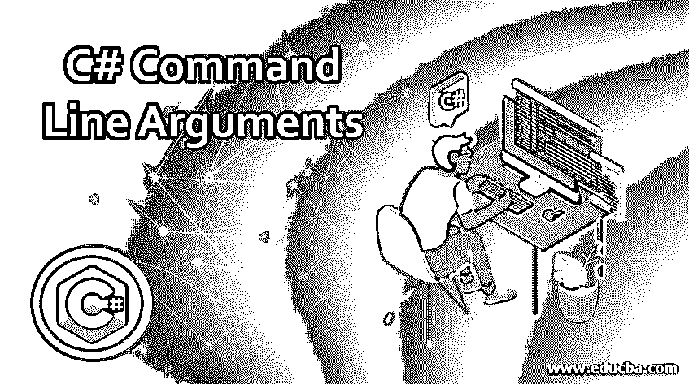
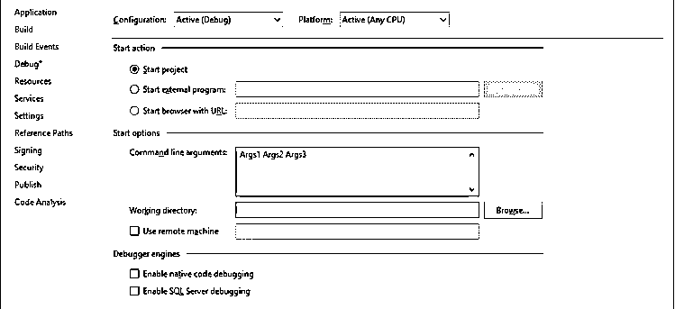
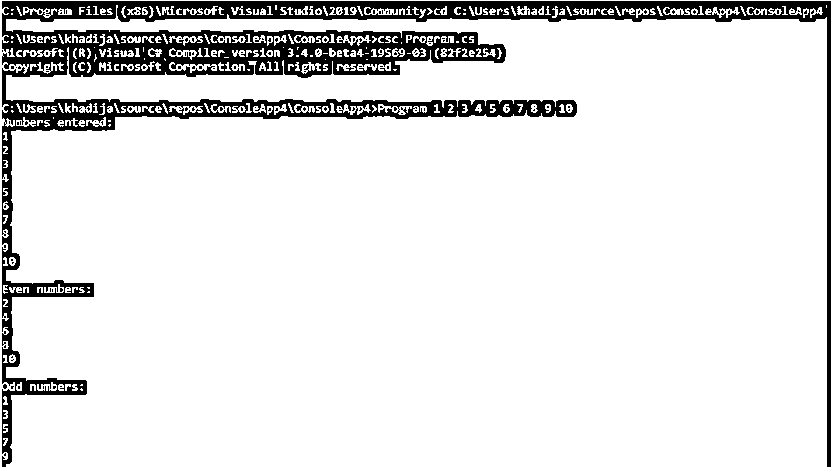
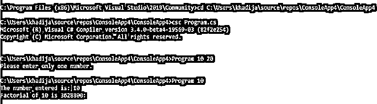

# C#命令行参数

> 原文：<https://www.educba.com/c-sharp-command-line-arguments/>




## C#命令行参数简介

在 C#中，程序的执行从 main()方法开始。main()方法不接受来自任何其他方法的参数，但是它接受用户通过命令行传递给它的参数，这些参数称为命令行参数。以下是关于 C#中命令行参数的一些要点:

*   main()方法接受用户在字符串类型数组中传递的参数。
*   它在程序执行期间接受参数。
*   用户可以使用 Convert class 或 Parse()方法将这些字符串类型的参数转换为 C#中的其他类型。

**带解释的语法**

<small>网页开发、编程语言、软件测试&其他</small>

接受命令行参数的 Main()方法的语法如下:

```
static void Main(string[] args)
{
//user code
}
```

在上面的语法中，“static”是表示 Main()方法可以在没有任何实例的情况下执行的关键字。“void”是返回类型。“Main”表示这是程序的 Main()方法，“string[]”是传递给该方法的参数类型。“args”是用户定义的参数名称。

### C#中命令行参数是如何工作的？

命令行参数以字符串类型数组的形式传递给 Main()方法，因此我们可以在运行程序时传递 n 个参数。

**举例:**

```
public static void Main(string[] args)
{
//user code
}
```

当我们将参数传递给上面的 Main()方法时，它将被“args”变量看到，这是一个 string 类型的数组。然后，我们可以使用索引位置访问数组中的单个参数。

之前，传递的每个元素都是字符串类型，稍后可以使用 C#提供的 Convert 类或 Parse()方法将其更改为所需的数据类型，如下例所示:

```
long num = long.Parse(args[0]);
```

上述语句将使用 Parse()方法将索引号 0 处的参数转换为等效的“long”值，然后将其存储在变量“num”中，该变量的类型为“long”

```
int num = Convert.ToInt32(args[1]);
```

该语句会将索引号 1 处的参数转换为等效的 32 位有符号整数，然后将其存储在变量“num”中，该变量的类型为“int”

我们还可以检查命令行参数是否存在，即使用“Length”属性检查参数是否传递给 Main()方法，如下所示:

```
if (args.Length > 0)
{
System.Console.WriteLine("Arguments passed");
}
else
{
System.Console.WriteLine("Arguments are not passed");
}
```

对于 windows 窗体应用程序，要在 Main()方法中启用命令行参数，我们需要修改“program.cs”文件中 Main()方法的签名。这是因为 windows 窗体设计器生成的代码包含不带输入参数的 Main()方法。

如果您在 visual studio 中使用 C#，那么在 visual studio 中有一种为 Main()方法输入命令行参数的好方法。以下是一些步骤:

1.  右键单击包含解决方案资源管理器的 main()方法的项目。
2.  点击“属性”
3.  在“属性”窗口中，转到“调试”选项卡
4.  在调试中，会有一个文本框显示“命令行参数”

我们可以在这个文本框中输入命令行参数，每个参数用空格隔开。请在下面找到相同的截图:




### C#命令行参数的示例

下面提到了不同的例子:

#### 示例#1

例如，用户通过命令行参数输入十个整数，并检查这些数字中的奇数和偶数。

**代码:**

```
using System;
using System.IO;
using System.Collections.Generic;
namespace ConsoleApp4
{
class Program
{
public static void Main(string[] args)
{
List<int> evenArray = new List<int>();
List<int> oddArray = new List<int>();
try
{
//checking if any argument exists
if (args.Length == 0)
{
Console.WriteLine("Please enter numbers to check for odd even!");
return;
}
//accessing arguments using for loop
for (int i = 0; i < args.Length; i++)
{
//checking for odd and even
if ((Convert.ToInt32(args[i]) % 2) == 0)
{
evenArray.Add(Convert.ToInt32(args[i]));
}
else
{
oddArray.Add(Convert.ToInt32(args[i]));
}
}
//displaying all the numbers entered
Console.WriteLine("Numbers entered:");
for (int i = 0; i < args.Length; i++)
{
Console.WriteLine(args[i]);
}
//displaying even numbers entered
Console.WriteLine("\nEven numbers: ");
for (int i = 0; i < evenArray.Count; i++)
{
Console.WriteLine(evenArray[i]);
}
//displaying odd numbers entered
Console.WriteLine("\nOdd numbers: ");
for (int i = 0; i < oddArray.Count; i++)
{
Console.WriteLine(oddArray[i]);
}
Console.ReadLine();
}
catch(Exception ex)
{
Console.WriteLine(ex.Message);
}
}
}
}
```

**输出:**




包含运行上述程序的命令、输入的输入和接收的输出的屏幕截图如下:

#### 实施例 2

例如，通过命令行从用户处获取一个数字并计算其阶乘。

**代码:**

```
using System;
using System.IO;
using System.Collections.Generic;
namespace ConsoleApp4
{
class Program
{
public static void Main(string[] args)
{
int number;
int factorial;
try
{
//checking if any argument exists
if (args.Length == 0)
{
Console.WriteLine("Please enter a number to calculate " +
"its factorial!");
return;
}
if(args.Length > 1)
{
Console.WriteLine("Please enter only one number.");
return;
}
Console.WriteLine("The number entered is: " + args[0]);
number = Convert.ToInt32(args[0]);
factorial = number;
//calculating factorial of number using 'for' loop
for(int i = number - 1; i >= 1; i--)
{
factorial = factorial * i;
}
Console.WriteLine("Factorial of {0} is {1}: ", args[0], factorial);
Console.ReadLine();
}
catch(Exception ex)
{
Console.WriteLine(ex.Message);
}
}
}
}
```

**输出:**




包含运行上述程序的命令以及输入的数字和收到的输出的屏幕截图如下:

**Note:** We have executed the above two programs using “Developer Command Prompt for VS 2019”. We can also execute these programs from the visual studio by providing command line arguments through the ‘Command line arguments’ textbox in the ‘Debug’ option of the visual studio.

### 结论

命令行参数是使用命令行从用户传递给程序的 Main()方法的参数。用户在程序执行期间输入这些参数。这些参数由 Main()方法以字符串类型数组的形式接收。

### 推荐文章

这是一个 C#命令行参数的指南。在这里，我们讨论了命令行参数在 C#中是如何工作的，以及示例和输出。您也可以看看以下文章，了解更多信息–

1.  [c#中的日期时间](https://www.educba.com/datetime-in-c-sharp/)
2.  [c#中的条件运算符](https://www.educba.com/conditional-operators-in-c-sharp/)
3.  [C#多维数组](https://www.educba.com/c-sharp-multidimensional-arrays/)
4.  [c#中的逻辑运算符](https://www.educba.com/logical-operators-in-c-sharp/)


