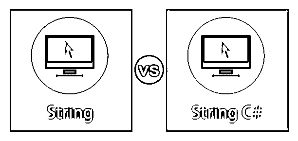
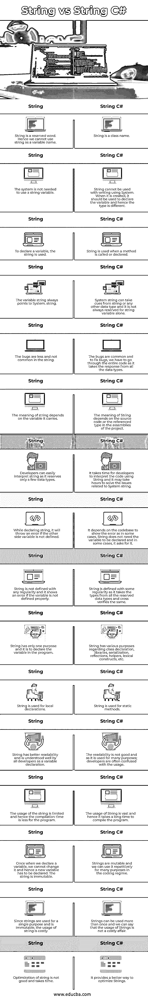

# 字符串与字符串 C#

> 原文：<https://www.educba.com/string-vs-string-c-sharp/>

## 字符串和字符串 C#的区别

文本表示称为字符串。它是字符的组合，否则就称为变量。从字母表中选择一个字符串，该字符串始终是字母字符。字符串被视为数据类型数组。它也是数组的表示。字符串中的变量允许静态或动态分配内存。字符串在 C#中用作类，是 Unicode 字符的组合或字符数组。我们可以像使用字母表一样将一组字符称为文本，并组成有意义的单词。字符串是一个关键字，与类一起使用。

### String 和 String C#的直接比较(信息图表)

以下是字符串与字符串 C#的 16 大比较 **:**

<small>网页开发、编程语言、软件测试&其他</small>

### 字符串和字符串 C#的主要区别

让我们从以下几点来讨论 String 与 String C#之间的一些关键区别:

*   string 类需要一个系统名称空间导入到文件中，而 string 变量不需要声明它。系统命名空间有助于程序从 C#轻松地导入 VB.NET，没有任何麻烦。
*   字符串是一个类型类，而字符串是 C#中的词法结构。
*   必须为字符串定义指令，而字符串变量根本不需要它。
*   它被写成字符串和字符串。格式()或系统。字符串。
*   在 CLR 中，字符串是一种类型，而在 C#中，字符串是一种类型。当 C#和 CLR 一起使用时，系统。该字符串是自动使用的。
*   字符串是. NET Framework 数据类型，而字符串是 C#中的数据类型。
*   对于变量声明，字符串用于类声明系统。使用了一个字符串。
*   在 System 中，字符串是一种引用类型，而在 C#中，字符串作为变量不能用来引用任何数据或类型。
*   字符串可以指任何东西，这取决于用法。但是字符串是一个不能用于声明任何变量的关键字，它总是有正确的用法。
*   当需要静态函数时，最好使用系统。字符串。字符串作为变量可以用于变量的使用和适当的编码风格。
*   关键字 string 仅用于创建变量，在 C#中使用有限。系统。字符串有一组不同的函数和属性来改变字符串变量。
*   当字符串用于声明变量时，字符串用于从 C#中访问静态方法，如字符串。格式()和字符串。Compare()等等。
*   Clojure 的数值文字编译有无边界检查，而 Scala 的数值编译没有这么复杂。
*   字符串总是映射到系统中。字符串，而字符串不需要映射到任何变量或类。
*   当使用字符串时，它仅用于变量声明，但当使用字符串时，它在代码中有许多用途。

### 字符串与字符串 C#的比较表

下表总结了字符串与字符串 C# **:** 之间的比较

| **字符串** | **c#中的字符串** |
| 字符串是保留字。因此，我们不能使用字符串作为变量名。 | 字符串是一个类名。 |
| 系统不需要使用字符串变量。 | 字符串不能与使用 System 的书写一起使用。当它被创建时，它应该被用来声明变量，因此类型是不同的。 |
| 若要声明变量，请使用字符串。 | 调用或声明方法时使用字符串。 |
| 变量字符串总是指向系统。字符串。 | 系统字符串可以从字符串或任何其他数据类型中获取线索，并且它并不总是只保留给字符串变量。 |
| bug 较少，在字符串中不常见。 | 错误是常见的，为了修复错误，我们必须检查整个代码，因为它需要所有数据类型的响应。 |
| 字符串的意义取决于它携带的变量。 | String 的含义取决于源代码或项目程序集中引用的类型。 |
| 开发人员可以很容易地解释字符串，因为它只保留了几种数据类型。 | 开发人员使用 string 解释代码需要时间，解决与系统 String 相关的问题可能需要几个小时。 |
| 在声明 string 时，如果没有定义另一方变量，它将抛出一个错误。 | 它依赖于代码库来显示错误，因为在某些情况下，String 不需要声明变量，而在某些情况下，它要求声明变量。 |
| 字符串的定义没有任何规律性，如果变量定义不正确，它会显示一个错误。 | 该字符串的定义有一定的规律性，因为它从所有保留的数据类型中提取类型，并交叉验证相同的类型。 |
| 字符串只有一个用途，就是在程序中声明变量。 | 字符串有各种各样的用途，包括类声明、库、序列化、反射、帮助器、词法结构等等。 |
| 该字符串用于局部声明。 | 该字符串用于静态方法。 |
| 字符串具有更好的可读性，并且作为变量声明被所有开发人员很好地理解。 | 可读性不好，因为它有许多用途；开发人员经常对这种用法感到困惑。 |
| 字符串的使用是有限的，因此程序的编译时间更少。 | String 的使用量很大，因此编译程序需要很长时间。 |
| 一旦我们声明了一个变量，我们就不能改变它，因此必须声明一个新的变量。该字符串是不可变的。 | 字符串是可变的，我们可以在编码体系中为许多目的重复使用它们。 |
| 由于字符串只用于一个目的，并且是不可变的，因此字符串的使用成本很高。 | 字符串可以被多次使用，我们可以说字符串的使用并不是一件昂贵的事情。 |
| 字符串的优化并不好，而且需要时间。 | 它提供了一种更好的优化字符串的方法。 |

### 结论

字符串和字符串变量在大多数方面是相似的，例如性能、用法与上面指出的不同。然而，字符串变量在大多数情况下是首选的，因为它很容易突出语法。当 C#编译器与 Java 字节码一起使用时，编译器将映射到一个字符串或系统。字符串。

### 推荐文章

这是一个字符串与字符串 C#的指南。在这里，我们讨论信息图和比较表的主要区别。您也可以看看以下文章，了解更多信息–

1.  [String vs StringBuffer](https://www.educba.com/string-vs-stringbuffer/)
2.  [c#中的字符串数组](https://www.educba.com/string-array-in-c-sharp/)
3.  [什么是 C#中的 StringBuilder](https://www.educba.com/what-is-stringbuilder-in-c-sharp/)
4.  [C 中的字符串](https://www.educba.com/string-in-c/)

