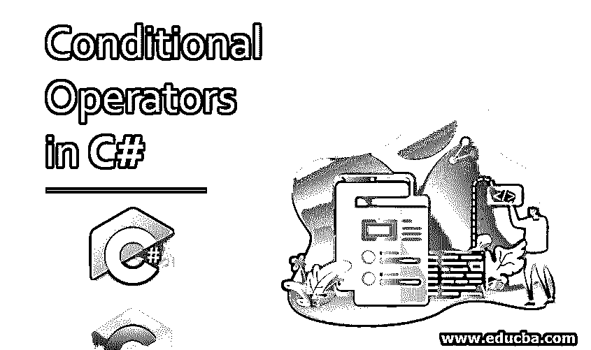

# C#中的条件运算符

> 原文：<https://www.educba.com/conditional-operators-in-c-sharp/>




## C#中条件运算符简介

顾名思义，C#中的条件运算符指的是在 C#程序中使用三个操作数。用来表示一个条件的操作数，如果条件为真则为值，如果条件为假则为值。C#中用来表示条件运算符的符号是'？:'(引号将被忽略，因为它们不是符号的一部分，并且用于将符号 discribe 括起来)。

**语法:**

<small>网页开发、编程语言、软件测试&其他</small>

```
condition_expression ? first_expression : second_expression;
```

### 如何定义条件运算符？

第一个操作数在。并包含评估条件表达式的定义。定义表达式时需要小心，这样计算条件应该总是产生一个布尔值结果。不，指定布尔表达式或指定错误表达式将导致编译错误。在:符号之前指定的第二个表达式，它保存定义或赋值，以防第一个表达式中定义的条件计算结果为 true。因此，如果第一个表达式中确定的返回值为真，则对第二个操作数求值。

定义中的第三个操作数包含表达式的定义，以防第一个操作数的条件结果评估为 false。或者，条件运算符被称为[三元运算符](https://www.educba.com/ternary-operator-in-php/)或内嵌 if 运算符。在 C#中，条件运算符的主要用途是作为 if-else 循环的替代，用于减小代码块的大小。条件操作符的另一个主要优点是，它根据分支语句来翻译编译流，这减少了嵌套 if 语句所需的的[使用。](https://www.educba.com/nested-if-statement-in-c/)

条件运算符遵循右关联原则，即运算从右向左分组。此外，由于条件运算符仅评估单个操作数值表达式，因此编译时间大大减少。第二个和第三个操作数的值仅限于赋值、递增和递减函数。

### C#中条件运算符的示例

让我们试着用条件操作符来理解传统 C#编程的方法。

#### 示例#1

让我们首先尝试一个常规的 if else 语句:-

**代码:**

```
using System;
using System.Collections.Generic;
using System.Linq;
using System.Text;
using System.Threading.Tasks;
namespace ConsoleApplication1
{
class Program
{
static void Main(string[] args)
{
int x = 10, y = 25;
string result1;
if (x > y)
{
result1 = "value of x is greater than y";
}
else
{
result1 = "value of x is less than y";
}
Console.WriteLine(result1);
Console.ReadLine();
}
}
}
```

**输出:**


上面的程序演示了一个简单的 if-else 语句，该语句比较两个变量 x 和 y 的值，并根据分配给它们的值以及对条件 x> y 的评估打印结果。

#### 实施例 2

让我们尝试使用条件运算符复制上面的程序→。

**代码:**

```
using System;
using System.Collections.Generic;
using System.Linq;
using System.Text;
using System.Threading.Tasks;
namespace ConsoleApplication1
{
class Program
{
static void Main(string[] args)
{
int x = 10, y = 25;
string result1;
//using the Ternary Operator (?:) for the comparison of x and y variable
result1 = (x > y) ? "value of x is greater than y" : "value of x is less than y";
Console.WriteLine(result1);
Console.ReadLine();
}
}
}
```

**输出:**


现在，我们将确定条件运算符的主要用途，通过提供其自身的分支或嵌套标准，它被用作简化复杂的 if-else if 嵌套的手段，与 if-else if 循环相比，它的复杂性要低得多。

#### 实施例 3

为了理解这一点，让我们首先考虑一个常规的 if-else if 程序

**代码:**

```
using System;
using System.Collections.Generic;
using System.Linq;
using System.Text;
using System.Threading.Tasks;
namespace ConsoleApplication1
{
class Program
{
static void Main(string[] args)
{
string comparisonResult;
int a = 25, b = 50;
if (a < b)
{
comparisonResult = "value of a is less than b ";
}
else if (a > b)
{
comparisonResult = " value of a is more than b";
}
else
{
comparisonResult = "a and b are both equal in value ";
}
Console.WriteLine(comparisonResult);
Console.ReadLine();
}
}
}
```

**输出:**


#### 实施例 4

现在我们将看到如何使用条件操作符在 C#中实现相同的逻辑。

**代码:**

```
using System;
using System.Collections.Generic;
using System.Linq;
using System.Text;
using System.Threading.Tasks;
namespace ConsoleApplication1
{
class Program
{
static void Main(string[] args)
{
string comparisonResult;
int a = 25, b = 50;
//Nested Ternary Operator (?:)
comparisonResult = (a < b) ? "value of a is less than b" : (a > b) ? "value of a is more than b" : "a and b are both equal in value";
Console.WriteLine(comparisonResult);
Console.ReadLine();
}
}
}
```

**输出:**


因此，我们看到了两者的区别，因为通过使用嵌套的条件运算符，if-else if 语句的复杂性大大降低了。也理解了程序的流程，我们发现光标流是正确的关联原则

```
(a < b) ? "value of a is less than b" : (a > b) ? "value of a is more than b" : "a and b are both equal in value";
```

代码块用不同的颜色表示，就像？乙:丙？D : E 相同的被评估为(A？乙:丙)？D : E。

### 结论

条件运算符是在求值和赋值运算中使用的三个操作数运算符，对条件操作数的求值有单独的赋值，即 true 或 false。条件运算符遵循右关联原则，即运算从右向左分组。条件运算符不能使用任何用户定义的类型重载，也不能限制为 bool 值进行计算。条件运算符为冗长的 if-else if 语句提供了最合适的替代，并且通过提供分支语句求值的机会减少了编译时间。

### 推荐文章

这是 C#中条件运算符的指南。在这里，我们讨论语法和如何在 C#中定义条件运算符，以及示例和代码实现。你也可以看看下面的文章来了解更多-

1.  [c#中的逻辑运算符](https://www.educba.com/logical-operators-in-c-sharp/)
2.  [C#三元运算符](https://www.educba.com/c-sharp-ternary-operators/)
3.  [三元运算符 JavaScript](https://www.educba.com/ternary-operator-javascript/)
4.  [C 语言中的条件运算符](https://www.educba.com/conditional-operator-in-c/)


