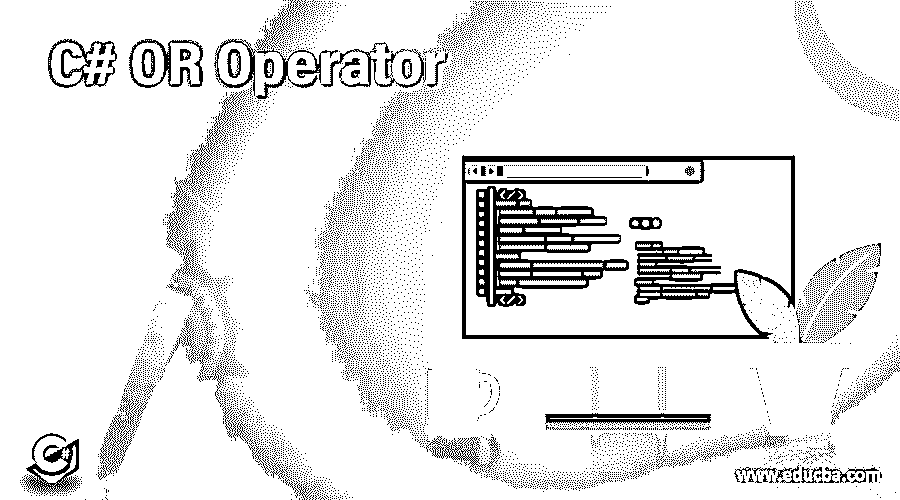
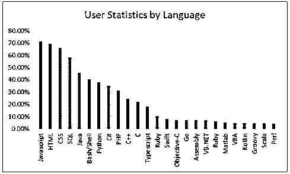

# C#或运算符

> 原文：<https://www.educba.com/c-sharp-or-operator/>

## C#或运算符简介

以下文章提供了 C#或运算符的概述。C#或 Operator 是一种简单、现代、通用、面向对象的编程语言，由微软在其。NET 倡议由安德斯·海尔斯伯格领导。C#是一种基于 C 和 C++编程语言的[编程语言](https://www.educba.com/what-is-a-programming-language/)。支持异常处理的、多种[类型的多态性](https://www.educba.com/polymorphism-in-c-sharp/)、接口与实现的分离等特性，结合其强大的开发工具、多平台支持和[泛型，使得 C#](https://www.educba.com/c-sharp-generics/) 成为许多类型软件开发项目的良好选择。C#基本上用于所有的微软产品。然而，它主要用于开发桌面应用程序，以及最近的 Windows 8/10 应用程序。它也是的一部分。NET，所以它在 web 开发和应用程序中与 ASP 等语言一起使用。根据调查堆栈溢出，下面是一个图表，按语言显示用户统计百分比。以下数字是专业开发者的回应。

<small>网页开发、编程语言、软件测试&其他</small>

本文讨论了 C# OR 运算符，并比较和区分了 C#逻辑运算符和条件 OR 运算符。

### C#或运算符的直接比较

以下是 C# or 运算符的顶级比较:

#### 说明

*   C#按位 OR 运算符

二元|运算符是为整型和布尔型预定义的。对于整型，|计算操作数的按位 or。For bool 操作数|计算两个操作数的逻辑或，仅当两个操作数都为假时，结果为假。

*   C#条件 OR 运算符

条件 OR ||对其 bool 操作数执行逻辑 OR 运算。如果第一个操作数的计算结果为 true，则不会计算第二个操作数。如果第一个操作数的计算结果为 false，则第二个运算符确定 or 表达式作为一个整体的计算结果是 true 还是 false。

#### 运算符优先级

下面是一个包含所有 C#运算符的表格。优先级最高的出现在表格的顶部，优先级最低的出现在表格的底部。

| **类别** | **操作员** | **关联性** |
| **后缀** | () [] -> .++ – – | 从左到右 |
| **一元** | + – !~ ++–-(类型)* &大小 | 从右到左 |
| **乘法** | * / % | 从左到右 |
| **添加剂** | + – | 从左到右 |
| **换挡** | << >> | 从左到右 |
| **关系型** | < <= > >= | 从左到右 |
| **相等** | == != | 从左到右 |
| **按位与** | “&”号 | 从左到右 |
| **按位异或** | ^ | 从左到右 |
| **按位或** | &#124; | 从左到右 |
| **逻辑与** | && | 从左到右 |
| **逻辑或** | &#124;&#124; | 从左到右 |
| **条件** | ?: | 从右到左 |
| **分配** | = += -= *= /= %=>>= <<= &= ^= &#124;= | 从右到左 |
| **逗号** | , | 从左到右 |

### C#与操作的主要区别

有两种类型的逻辑运算符(&、|和^)

*   那些采用布尔参数的。
*   那些接受整数参数的函数。

后者通常被称为位运算符，因为它们通常用于执行位算术。由于“短路”点，前者很少使用。对于总是接受 bool 操作数的条件运算符 ( & &，||)就没有这样的除法[。在](https://www.educba.com/conditional-operator-in-java/)[逻辑运算符](https://www.educba.com/matlab-logical-operators/)的情况下，第二个操作数总是被求值，即使表达式的整体值可以仅通过求值第一个操作数来确定。因此，如果你有一个& b，那么即使 a 为假，b 也将被求值，因此& b 也必须为假。在条件运算符的情况下，使用“短路”评估。如果你有一个& & b，a 为 false，那么编译器就懒得对 b 求值了。

### 结论

总结一下对 C# OR 运算符的理解，C#中有两种 OR 运算符，按位/逻辑，条件。前者采用 bool 或 integer 参数，只有当两个操作数都为 false 时才为 false。后者总是取 bool 操作数，依靠第二个操作数来确定运算符输出是真还是假。

### 推荐文章

这是 C#或运算符的指南。在这里，我们讨论了两种类型的比较，一个是按语言显示用户统计百分比的图表，一个是显示所有 C#操作符的表格。你也可以浏览我们的文章来了解更多-

1.  [C#函数](https://www.educba.com/csharp-functions/)
2.  [c#的用途](https://www.educba.com/uses-of-c-sharp/)
3.  [C#字符串函数](https://www.educba.com/c-sharp-string-functions/)
4.  [C#命令](https://www.educba.com/lookup-function-in-tableau/)

