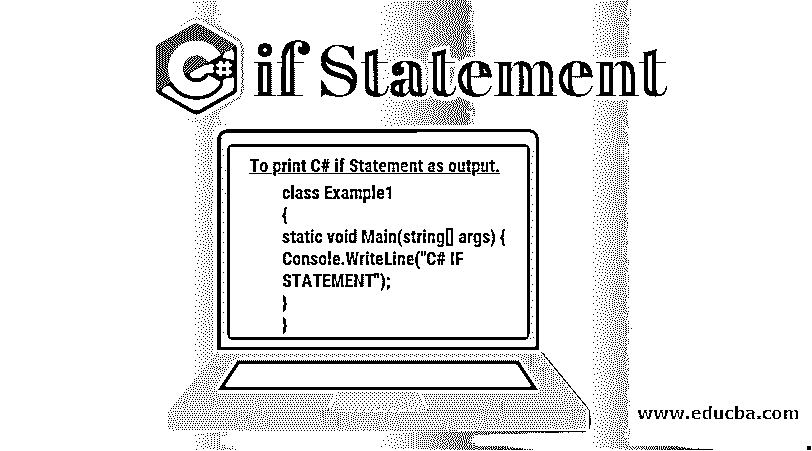

# C# if 语句

> 原文：<https://www.educba.com/c-sharp-if-statement/>




## C# if 语句简介

*   C#是一种非常强大的面向对象编程语言 of.Net 框架。的。Net framework 是一个广泛的、革命性的平台，使用它可以开发以下应用程序，如 Windows 应用程序、Web 应用程序、Web 服务等。，可以轻松开发。
*   该框架支持多种语言，如 C#、C++、Visual Basic 等。因此，使用该框架开发的应用程序受到多种平台的支持。例如，C#是这个框架非常流行的语言之一。
*   C#简单却非常强大。它是由微软创建的，使用它，我们可以根据我们的需求创建不同类型的应用程序，如 web 应用程序、控制台应用程序、windows 应用程序。

在跳到 if 语句之前，让我们先了解一下 C#程序的基本结构。

输出 C# if 语句。

<small>网页开发、编程语言、软件测试&其他</small>

```
using System;   //declaring namespace
class Example1   //declaring class
{
static void Main(string[] args) {     //declaring class method
Console.WriteLine("C# IF STATEMENT");    //print
}
}
```

**输出:**


这篇文章主要关注 C# IF 语句，所以让我们一步一步来。

### C#中的“if”语句

*   在 C#中，当需要某些逻辑条件来连续运行程序时，可以使用一些决策语句。C#中包含的决策语句有–if 语句、if-else 语句、switch 语句、[三元运算符](https://www.educba.com/python-ternary-operator/)。
*   “if”条件或 if-else 条件接受一个布尔表达式作为其参数并对其求值。只有当被评估的条件为真时，if 语句下的语句块才会被执行。如果条件为假，将跳过 if 块。

### 详细的 C# if 语句

条件 [if 语句接受](https://www.educba.com/if-statement-in-matlab/)一个布尔表达式或括号内的条件，或者作为一个参数，后跟一行或多行代码块。在运行期间，当程序已经被执行时，括号内的条件被评估。如果该布尔表达式的结果为真，那么将执行 [if 语句之后的代码块](https://www.educba.com/if-statement-in-python/)。

考虑下面的例子，其中 if 条件包含 true 作为表达式。

**if 语句的语法是-**

```
if(a conditional statement or boolean expression)
{
// the block of code to be executed if the expression results into true
}
```

让我们用一个例子来进一步理解这一点。

**考虑—**

```
using System;
class Ex2
{
static void Main(string[] args)
{
{
if(true)
Console.WriteLine("True Condition: We are inside the for loop");
if(false)
Console.WriteLine("False Condition: We will not be able to enter inside the for loop");
}
}
}
```

*   如上所述，如果语句包含一个条件，则结果为真或假。与 if 循环相关的代码的执行依赖于[这个布尔表达式](https://www.educba.com/boolean-operators-in-java/)。请考虑下面给出的问题陈述示例，以便进一步澄清——
*   问题陈述:Ravi 的年龄(R_age)是 15 岁。阿玛尔的年龄(A_age)是 12 岁。如果 Ravi 比 Amar 年长或年轻，则打印。

**例如—**

```
using System;
class Ex3
{
static void Main(string[] args)
{
int R_age = 15, A_age = 12;
if ( R_age > A_age)
Console.WriteLine("Ravi is elder to Amar");
if (R_age < A_age)
Console.WriteLine("Ravi is younger than Amar");
if (R_age == A_age)
Console.WriteLine("Ravi is of the same age as Amar");
}
} 
```

**输出**--


请注意，第一个“if”语句中的布尔表达式作为参数给出，当 Ravi 的年龄(15)大于 Amar 的年龄(12)时，计算结果为 true。因为只有一个 if 语句为真，所以只执行与第一个 if 条件相关的第一个块。

### if-else 语句

C#提供的第二种条件语句是 if-else 语句。代码的第二部分可以放在 else 块中，它需要在条件为假时执行。else 块不能独立存在。这意味着 else 语句必须跟在 if 语句或 [else if 语句](https://www.educba.com/else-if-statement-in-c/)之后。在 if-else 语句链中，else 语句只能使用一次。

**if-else 语句的语法是-**

```
if(a conditional statement or boolean expression)
{
// the block of code to be executed if the expression results into true
}
else
{
// executes when “if” exp is false
}
```

*   正如所观察到的，else 语句不包含任何布尔表达式。每当“if”括号中给出的条件评估为 false 时，总是执行 else 语句后面的代码块。
*   我们将以 Ravi 和 Amar 的年龄为例，进一步阐明我们的问题

**例如—**

```
using System;
class Ex4
{
static void Main(string[] args)
{
int R_age = 12, A_age = 15;
if ( R_age > A_age)
Console.WriteLine("Ravi is elder to Amar");
else
Console.WriteLine("Ravi and Amar are of the same age");
}
}
```

**输出:**


到目前为止，您一定已经注意到，作为参数给出的第一个“if”语句中的布尔表达式计算为 false，因为 Ravi 的年龄(12)小于 Amar 的年龄(15)。像[一样，if 语句保持](https://www.educba.com/if-statement-in-shell-scripting/)为假，将执行第二个块，即与 else 条件相关联的代码块。

### else if 语句

C#提供的第二种条件语句是 else if 语句。如果要检查的给定条件不止一个，那么 else-if 条件就会出现。

**考虑—**

```
using System;
class Ex5
{
static void Main(string[] args)
{
int R_age = 12, A_age = 15;
if ( R_age > A_age)
Console.WriteLine("Ravi is elder");
else if (R_age < A_age)
Console.WriteLine("Ravi is younger");
else
Console.WriteLine("Ravi is of the same age as Amar");
}
}
```

**输出:**


### 嵌套 If

嵌套 if 语句是 if 语句中的 if 语句。

**例如—**

```
using System;
class Ex6
{
static void Main(string[] args)
{
int R_age = 12, A_age = 15;
if(R_age != A_age) //yields true as 12 is not equal to 15
{
if( R_age < A_age) //enters inside this
Console.WriteLine("Ravi is younger");
else
Console.WriteLine("Ravi is elder");
}
}
}
```

**输出:**


### 结论

if-else 或 [else-if 语句](https://www.educba.com/else-if-statement-in-java/)对布尔表达式求值，并根据结果控制程序的流程。

### 推荐文章

这是一个 C# if 语句指南。这里我们也讨论一个简介，C#程序的基本结构，If 语句，If-else，Else-if，嵌套 IF 及其样例代码示例。您也可以浏览我们推荐的其他文章，了解更多信息——

1.  [c#中什么是多线程？](https://www.educba.com/what-is-multithreading-in-c-sharp/)
2.  [C#命令](https://www.educba.com/c-sharp-commands/)
3.  [c#的用途](https://www.educba.com/uses-of-c-sharp/)
4.  [C 编程生涯](https://www.educba.com/career-in-c-programming/)


