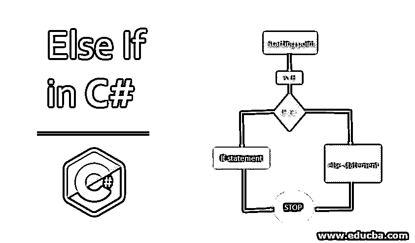
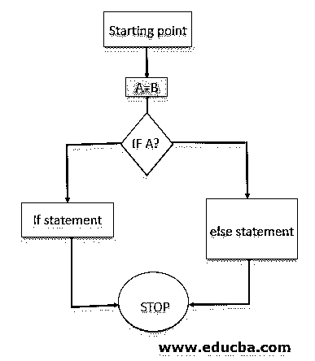

# 否则如果在 C#中

> 原文：<https://www.educba.com/else-if-in-c-sharp/>




## C#中的 Else If 简介

C#也支持条件语句。这些语句基本上是在有人想要执行一组语句时使用的，如果某个特定条件失败，则执行另一组语句。因此，当我们有多组语句，并且希望根据场景或条件来执行这些语句时，这非常有用。这主要用于决策场景。

**语法:**

<small>网页开发、编程语言、软件测试&其他</small>

```
if (some statement) {
}
else if (other statement) {
}
else {
(other statement)
}
```

### C#中 Else If 的流程图

这是 C#中 else if 语句的流程图，如下所示:




### C#中的 Else If 是如何工作的？

例如，我们希望根据学生获得的分数来显示成绩。

*   超过 80%的学生成绩为 A。
*   60 以上 80 以下的同学 B 级。
*   类似地，超过 40%低于 60%的学生成绩为 C，低于 40%的学生成绩为 D。
*   因此，在这些类型的场景(决策)中，我们使用 If-else-if 语句来帮助开发人员得出结论。

### 在 C#中实现 Else 的示例

下面的例子展示了如何用 C#实现 else-if。

#### 示例#1

**代码:**

```
using System;
using System.Collections.Generic;
using System.Linq;
using System.Text;
using System.Threading.Tasks;
namespace elseif
{
class Program
{
static void Main(string[] args)
{
int p = 15;
if (p == 20)
{
Console.WriteLine("Value of p is equal to 20");
}
else if (p> 20)
{
Console.WriteLine("Value of p is greater than 20");
}
else
{
Console.WriteLine("Value of p is less than 20");
}
Console.ReadLine();
}
}
}
```

**代码解释:**上例中根据条件使用了 if else-if 语句。如果 p 值等于 20，则显示该值等于 20 的输出，否则，如果 p 值大于 20，则显示不同的输出。如果两者都不满足，则显示该值小于 20。

**输出:**


#### 实施例 2

**代码:**

```
using System;
using System.Collections.Generic;
using System.Linq;
using System.Text;
using System.Threading.Tasks;
namespace elseif
{
class Program
{
static void Main(string[] args)
{
int a = 30, b = 20;
if (a > b)
{
Console.WriteLine("Value of a is greater than b");
}
else if (a < b)
{
Console.WriteLine("Value of a is less than b");
}
else
{
Console.WriteLine("Value of a is equal to b");
}
Console.ReadLine();
}
}
}
```

**代码解释:**在上面的例子中，变量 a 和 b 的值被初始化。如果 a 的值大于 b，则显示 a 的值较大，否则，如果 b 的值较大，则显示 a 的值较小。如果上述两个条件都不成立，则 a 的显示值等于 b。

**输出:**


#### 实施例 3

**代码:**

```
using System;
using System.Collections.Generic;
using System.Linq;
using System.Text;
using System.Threading.Tasks;
namespace elseif
{
class Program
{
static void Main(string[] args)
{
int x = -1; int y = 20; int z;
if (x < 0 && y < 0)
{
Console.WriteLine("Both x and y are negative.");
}
else if (x < 0 || y < 0)
{
if (y > 0 && y <= 20)
{
z = x + y;
Console.WriteLine("Sum: {0}", z);
}
Console.WriteLine("One of them is negative");
}
else
{
Console.WriteLine("Both x and y are positive.");
}
Console.ReadKey();
}
}
}
```

**代码解释:**上例中，||和& &运算符也与语句一起使用。Else if 语句在一个循环中还可以有其他语句，称为嵌套语句。

**输出:**


#### 实施例 4

**代码:**

```
using System;
using System.Collections.Generic;
using System.Linq;
using System.Text;
using System.Threading.Tasks;
namespace elseif
{
class Program
{
static void Main(string[] args)
{
int marks = 65;
if (marks >= 80)
{
Console.WriteLine("Student has passed with higher first class");
}
else if (marks >= 60)
{
Console.WriteLine("Student has passed with first class");
}
else if (marks >= 40)
{
Console.WriteLine("Student has passed with second class");
}
else
{
Console.WriteLine("Student has failed");
}
Console.ReadLine();
}
}
}
```

**代码解释:**在上面的例子中，根据得到的分数使用了多个 [else if 语句](https://www.educba.com/else-if-statement-in-python/)。

**输出:**


### 结论

当我们希望仅在特定条件为真时才执行代码块，或者当我们希望根据某些要求执行特定步骤时，就需要条件决策。C sharp 中的条件语句用于决策。

### 推荐文章

这是一个用 C#编写的 Else If 的指南。在这里，我们讨论语法、流程图以及示例和代码实现。您也可以浏览我们推荐的文章，了解更多信息——

1.  [c#中的 text writer](https://www.educba.com/textwriter-in-c-sharp/)
2.  [复选框类型](https://www.educba.com/checkbox-in-c-sharp/)
3.  [c#中的集合](https://www.educba.com/collections-in-c-sharp/)
4.  [C 语言中的 Else if 语句](https://www.educba.com/else-if-statement-in-c/)


