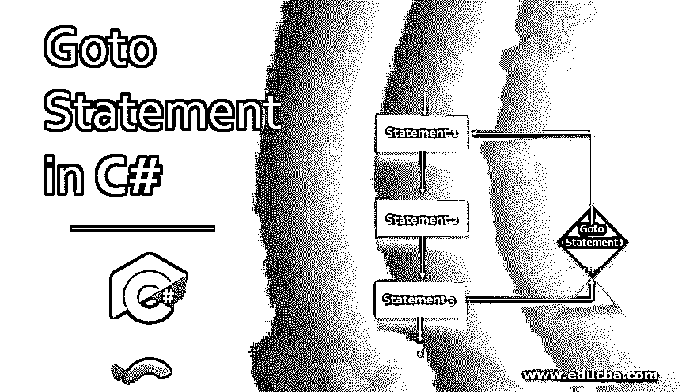
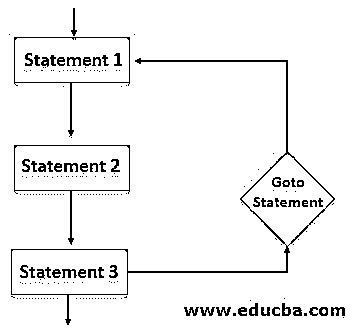
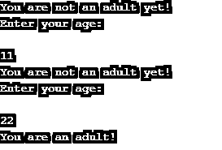
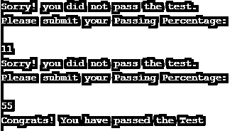

# C#中的 Goto 语句

> 原文：<https://www.educba.com/goto-statement-in-c-sharp/>




## C#中 Goto 语句的介绍

C#中的 Goto 语句，也称为 Jump 语句，用于将程序的流程直接转移到带标签的语句。这些语句将程序的控制权转移到其他部分。Goto 语句最常见的应用之一是将程序的控制移动到 switch 语句中的特定点。在深度嵌套循环的情况下，goto 语句是一个很好的跳出循环的函数。嵌套循环继续，程序一直等到循环结束，但如果中途满足条件，我们可以实现 goto 语句，快速退出循环，节省时间。

**语法:**

<small>网页开发、编程语言、软件测试&其他</small>

下面是 goto 语句的标准语法:

```
goto statement_name;
```

语法从声明 goto 关键字开始，然后使用语句名。在程序中，每当要执行这一行时，程序将跳转到程序的 statement_name 部分。当任何程序，无论何时何地，偶然发现上述 goto 语法时，它将执行 goto 语句并跳转到所提到的 statement_name，这就是控制转移的方式。

### Goto 语句的流程图

现在让我们理解流程图中 goto 语句的工作原理。




参考上面的流程图，我们可以用 goto 语句来理解一个程序的代码流程。我们有多个语句，1、2 和 3，随着代码向前移动，它会在第三个语句中遇到 goto 语句。从第 3 条<sup>到第 3 条</sup>语句，代码将跳转到 goto 语句指向的任何地方。在我们的示例中，goto 语句引用了语句 1。也就是说，当代码遇到 goto 语句时，它将检查条件，并根据条件的结果，代码要么向前移动，这意味着它将结束程序，要么 goto 语句将被执行，代码将进行跳转。

### Goto 语句在 C#中是如何工作的？

基本上 Goto 语句是一个跳转语句。在某种程度上，它可以在任何程序中快速退出。它的工作原理是，在任何给定的时间将程序的控制权转移到任何特定的点，这是 C#中 Goto 语句的主要目的。

#### 示例#1

现在我们已经了解了 Goto 语句的工作原理，让我们用适当的代码来演示 Goto 语句的工作原理。

**代码:**

```
using System;
public class sampleGoto
{
public static void Main(string[] args)
{
eligibility:
Console.WriteLine("You are not an adult yet!");
Console.WriteLine("Enter your age:\n");
int age = Convert.ToInt32(Console.ReadLine());
if (age < 18) {
goto eligibility;
}
else
{
Console.WriteLine("You are an adult!");
Console.Read();
}
}
}
```

**代码解释:**基本上我们有我们使用的，命名空间文件。然后我们开始上课，主课在里面。然后，我们有我们的 goto 关键字，作为“资格”，它有一个打印声明，“你还不是一个成年人！”.打印完这条语句后，程序将继续执行下一行。这里“输入您的年龄:”是将要打印的语句，我们必须输入一个值。输入值后，程序将进入 if 语句并检查条件。如果条件满足，也就是说，如果我们输入的值不是 18，它将转到下一条语句，在那里我们有 go to 语句。当我们的程序触及 goto 语句时，它将跳转到提到的部分，即合格性，并从该点向前移动。否则，如果条件满足，程序将得到它，并将进入 Else 部分，在那里它将打印“你是一个成年人！”，意味着程序已经结束。参考下面-输出附加截图。




如屏幕截图所示，当我们传递一个小于 18 的值时，它打印第一条语句，然后当我们输入一个大于 18 的值时，程序打印 else 语句。现在，我们已经演示了一个带有 Goto 语句的简单程序，让我们尝试另一个将执行相同操作的示例。

#### 实施例 2

**代码:**

```
using System;
public class sampleGoto
{
public static void Main(string[] args)
{
result:
Console.WriteLine("Sorry! you did not pass the test.");
Console.WriteLine("Please submit your Passing Percentage:\n");
int age = Convert.ToInt32(Console.ReadLine());
if (age < 40)
{
goto result;
}
else
{
Console.WriteLine("Congrats! You have passed the Test");
Console.Read();
}
}
}
```

代码解释:与第一个程序类似，我们已经演示了 Goto 语句的工作原理。这里我们有一个简单的条件来检查输入的输入值是否大于 40。在执行时，程序将打印第一行“对不起！你没有通过测试。”然后程序会要求用户输入一个数值。输入值后，程序将进入 IF ELSE 循环，在该循环中，将检查输入值的起始条件是小于还是大于 40。如果输入的值小于 40，程序将执行 goto 语句并跳转到带标签的语句。如果输入的值大于 40，那么程序将继续并进入 else 部分。在 else 部分，它将打印“恭喜！你已经通过了考验”而结束。

请参考下面附上的截图，以获得正确的输出。




是否应该实现 goto:建议不要实现或使用 GOTO 语句，因为程序逻辑会更复杂。此外，一旦程序遇到 goto 语句，跟踪代码流可能会非常困难。相反，如果你认为使用 Goto 会使程序流畅，那么你可以自由使用它。很少使用 Goto。

### 结论

我们已经了解了 C#中的 Goto 语句是什么。我们已经大致理解了 Goto 语句的工作原理和语法。稍后，通过一个例子，我们演示了 Goto 语句的工作原理。我们用两个不同场景的例子实现了 Goto 语句。虽然 Goto 语句很容易使用，但不太建议在长程序中使用它，因为 Goto 语句可能会使程序混乱，并且很难用更简单的方法进行调试。

### 推荐文章

这是一个 C#中 Goto 语句的指南。在这里，我们将讨论 C#中 Goto 语句的简要概述及其示例和代码实现。您也可以浏览我们推荐的其他文章，了解更多信息——

1.  [c#中的方法重载](https://www.educba.com/method-overloading-in-c-sharp/)
2.  [c#中的多态性](https://www.educba.com/polymorphism-in-c-sharp/)
3.  [c#中的私有](https://www.educba.com/private-in-c-sharp/)
4.  [c#中异常的类型](https://www.educba.com/types-of-exception-in-c-sharp/)


