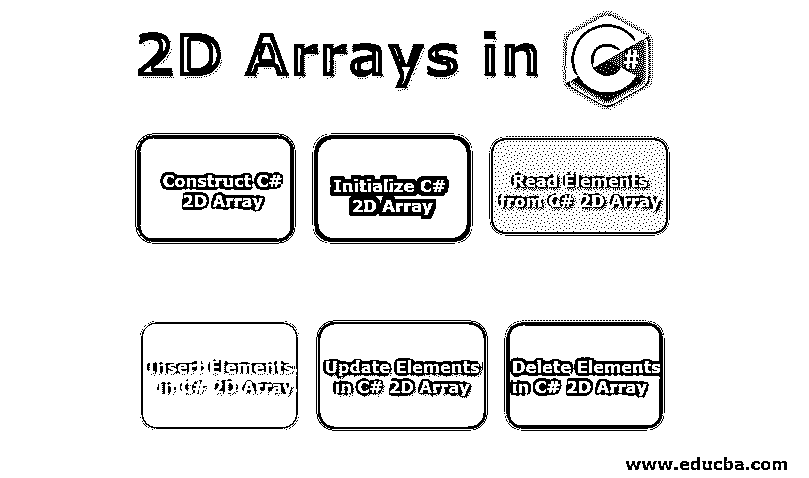
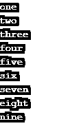
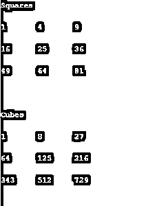
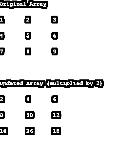
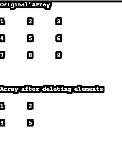

# C#中的 2D 数组

> 原文：<https://www.educba.com/2d-arrays-in-c-sharp/>




## C#中的 2D 数组简介

二维数组是跨越多行和多列的同质元素的集合，采用矩阵的形式。下面是一个 2D 阵列的例子，它有 m 行和 n 列，因此创建了一个 m×n 配置的矩阵。

```
[ a1, a2, a3, a4, ..., an
b1, b2, b3, b4, ..., bn
c1, c2, c3, c4, ..., cn
.
.
.
m1, m2, m3, m4, ..., mn ]
```

### 交错数组的概念

交错数组是数组的数组。交错数组本质上是多个数组交错在一起形成一个多维数组。二维交错数组可能如下所示:

<small>网页开发、编程语言、软件测试&其他</small>

```
[ [ a1, a2, a3, a4, ..., an ],
[ b1, b2, b3, b4, ..., b20 ],
[ c1, c2, c3, c4, ..., c30 ],
.
.
.
[ m1, m2, m3, m4, ..., m25 ] ]
```

请注意，交错数组的所有行可能包含相同数量的元素，也可能不包含相同数量的元素。

### 真实 2D 阵列与交错阵列

从实现的角度来看，交错阵列与真正的 2D 阵列完全不同。理解 C#如何实现多维数组和交错数组是很重要的。

编程语言在多维数组的[实现上有所不同。一些编程语言像 C，C++，C#，Fortran 等。支持真正的 2D 阵列。而其他人则用数组的数组(也称为交错数组)来模拟这种行为。那么，真正的二维数组和交错数组有什么不同呢？](https://www.educba.com/multidimensional-array-in-php/)

就存储消耗而言，[多维数组的两种实现](https://www.educba.com/multidimensional-array-in-python/)是不同的。一个真正的 2D 数组应该有 m 行各有 n 个元素的 T2，而一个交错数组可能有 m 行各有不同数量的元素。这导致数据集的空间浪费最小。因此，下面的交错数组非常好:

```
int[][] jagged array = [ [1, 2, 3, 4],
[5, 6, 7],
[8, 9] ]
```

如果在真正的 2D 阵列中实施相同的数据集，它将如下所示:

```
int[,] multiDimArray = [ 1, 2, 3, 4
5, 6, 7, 0
8, 9, 0, 0 ]
```

### C#中 2D 数组的运算

下面是对 2D 阵列的一些操作:

#### 1.构建 C# 2D 数组

让我们看看如何在 C#中声明 2D 数组的方法，以及如何在 C#中不声明 2D 数组的另一种方法。

**如何？**

C#中真正的 2D 数组实现是从数组声明开始的。它看起来像下面这样:

```
int[,] arr2D;
string[,] arr2D_s;
```

定义中逗号的数量决定了数组的维数。请注意，您不能在数组声明中指定数组的大小。它必须在数组初始化期间完成。

**怎么不去？**

很容易混淆 2D 数组和交错数组的实现。交错数组声明如下所示:

```
int[][] jagged array;
```

#### 2.初始化 C# 2D 数组

下一步是初始化我们刚刚声明的 2D 数组。有几种方法可以做到这一点。

**使用新运算符**

```
arr2D = new int[2,3];                    //separate initialization
string[,] arr2D_s = new string[4,5];    //with declaration
```

**用值**初始化

```
//without dimensions
arr2D = new int[,]{{1,2}, {3,4}, {5,6}};
//with declaration
arr2D_s = new string[2,2]{{"one","two"},{"three", "four"}};
```

**没有新操作员**

```
Int[,] arr2D_a = {{1,2}, {3,4}, {5,6}, {7,8}};
```

#### **3。从 C# 2D 数组中读取元素**

**读取单个元素**

下一个操作是从 2D 数组中读取元素。由于 2D 数组是一个 m×n 元素的矩阵，每个元素都有一个指定的行索引和列索引组合。我们可以通过在下标中提供行索引和列索引来访问元素。下面是一个例子:

```
int[,] arr2D_i = {{1,2}, {3,4}, {5,6}, {7,8}};
string arr2D_s = {{"one","two"},{"three", "four"}};
int val_i = arr2D_i[2,1];          //returns '6'
string val_s = arr2D_s[1,1];       //returns 'four'
```

**Note-** The indices of rows and columns start from 0\. Thus, the index position [0,0] is the first element and [m-1, n-1] is the last element of the array.

**读取所有元素**

但是，上面的方法给出了数组中单个元素的值。我们如何遍历整个数组来读取其中的每个元素呢？简单的解决方案是使用嵌套的 for/while 循环遍历整个数组。

**代码**

```
using System;
public class Program
{
public static void Main()
{
int[,] arr2D_i = new int[3, 3]{{1, 2, 3}, {4, 5, 6}, {7, 8, 9}};
//reading all the elements through for loop
for (int i = 0; i < 3; i++)
{
for (int j = 0; j < 3; j++)
{
Console.Write(arr2D_i[i, j] + "\t");
}
Console.WriteLine("\n");
}
}
}
```

**输出**


**GetLength()方法**

好吧。但是，只有当我事先知道数组中元素的数量时，上面的例子才有效。如果我的数组是动态的呢？如何遍历动态数组的所有元素？GetLength 方法来拯救我们了。

int arr2D。GetLength(0)；//返回第一维(行)

int arr2D。GetLength(1)；//返回第二维度(列)

**代码**

```
using System;
public class Program
{
public static void Main()
{
int[,] arr2D_i = new int[3, 3]{{1, 2, 3}, {4, 5, 6}, {7, 8, 9}};
//reading all the elements through for loop
for (int i = 0; i < arr2D_i.GetLength(0); i++)
{
for (int j = 0; j < arr2D_i.GetLength(1); j++)
{
Console.Write(arr2D_i[i, j] + "\t");
}
Console.WriteLine("\n");
}
}
}
```

**输出**


**每个回路的功率**

for-each 循环对数组的每个元素执行一组命令。这是一个非常强大的循环机制，强烈推荐使用，因为它比传统的 for 循环更有效。

**代码**

```
using System;
public class Program
{
public static void Main()
{
string[,] arr2D_s = new string[3, 3]{{"one", "two", "three"}, {"four","five","six"}, {"seven","eight","nine"}};
//reading all the elements through foreach loop
foreach(var ele in arr2D_s)
{
Console.WriteLine(ele);
}
}
}
```

**输出**




#### 4.在 C# 2D 数组中插入元素

现在让我们看一个如何在 C# 2D 数组中插入元素的例子。这个想法是遍历数组的每个位置并给它赋值。

**代码**

```
using System;
public class Program
{
public static void Main()
{
int[,] arr2D_i = new int[3, 3]{{1, 2, 3}, {4, 5, 6}, {7, 8, 9}};
int[,] squares = new int[3, 3];
int[,] cubes = new int[3, 3];
for (int i = 0; i < arr2D_i.GetLength(0); i++)
{
for (int j = 0; j < arr2D_i.GetLength(1); j++)
{
squares[i, j] = arr2D_i[i, j] * arr2D_i[i, j];
cubes[i, j] = squares[i, j] * arr2D_i[i, j];
}
}
Console.WriteLine("Squares\n");
DisplayArray(squares);
Console.WriteLine("\n\nCubes\n");
DisplayArray(cubes);
}
static void DisplayArray(int[, ] arr)
{
for (int i = 0; i < arr.GetLength(0); i++)
{
for (int j = 0; j < arr.GetLength(1); j++)
{ Console.Write(arr[i, j] + "\t"); }
Console.WriteLine("\n");
}
}
}
```

**输出**




#### 5.更新 C# 2D 数组中的元素

我们将更新数组，将每个元素乘以 2。这个想法是遍历数组的每个位置并更新它保存的值。

**代码**

```
using System;
public class Program
{
public static void Main()
{
int[, ] arr2D_i = new int[3, 3]{{1, 2, 3}, {4, 5, 6}, {7, 8, 9}};
Console.WriteLine("Original Array\n");
DisplayArray(arr2D_i);
for (int i = 0; i < arr2D_i.GetLength(0); i++)
{
for (int j = 0; j < arr2D_i.GetLength(1); j++)
{
arr2D_i[i, j] *= 2;
}
}
Console.WriteLine("\n\nUpdated Array (multiplied by 2)\n");
DisplayArray(arr2D_i);
}
static void DisplayArray(int[, ] arr)
{
for (int i = 0; i < arr.GetLength(0); i++)
{
for (int j = 0; j < arr.GetLength(1); j++)
{
Console.Write(arr[i, j] + "\t");
}
Console.WriteLine("\n");
}
}
}
```

**输出**




#### 6.删除 C# 2D 数组中的元素

这是一个棘手的操作。不可能从真正的 C# 2D 数组中删除一个元素。删除单个元素会扰乱数组的维度，使其不再是一个矩阵。C#不允许这样，除非它是一个交错数组。

那么，解决办法是什么呢？我们是删除整行还是整列？不，C#也不允许这样做。数组在声明或初始化时大小是固定的。它分配了固定字节内存。我们不能在运行时改变它。

这里的解决方案是创建一个没有我们想要删除的元素的新数组。

**代码**

```
using System;
public class Program
{
public static void Main()
{
int[,] arr2D_i = new int[3, 3]{{1, 2, 3}, {4, 5, 6}, {7, 8, 9}};
int[,] new_array = new int[2,2];
Console.WriteLine("Original Array\n");
DisplayArray(arr2D_i);
int rowToDel = 2;
int colToDel = 2;
for (int i = 0; i < arr2D_i.GetLength(0); i++)
{
if(i==rowToDel)
continue;
for (int j = 0; j < arr2D_i.GetLength(1); j++)
{
if(j==colToDel)
continue;
new_array[i,j]=arr2D_i[i,j];
}
}
Console.WriteLine("\n\nArray after deleting elements\n");
DisplayArray(new_array);
}
static void DisplayArray(int[, ] arr)
{
for (int i = 0; i < arr.GetLength(0); i++)
{
for (int j = 0; j < arr.GetLength(1); j++)
{
Console.Write(arr[i, j] + "\t");
}
Console.WriteLine("\n");
}
}
}
```

**输出**




### **结论**

因此，我们已经看到了 2D 数组是如何在 C#中实现的，以及我们可以对它执行的各种 CRUD 操作。我们还了解了真正的 2D 实现和参差不齐的数组之间的区别。C#中有更多的方法可以帮助开发人员轻松使用数组。一定要去 MSDN 医院检查一下。

### **推荐文章**

这是 C#中 2D 数组的指南。这里我们讨论交错数组的概念以及 C#中对 2D 数组的操作。你也可以看看下面的文章来了解更多-

1.  [Java 中的 2D 数组](https://www.educba.com/2d-arrays-in-java/)
2.  [2](https://www.educba.com/2d-arrays-in-python/)Python 中的 [D 数组](https://www.educba.com/2d-arrays-in-python/)
3.  [c#中的数组](https://www.educba.com/arrays-in-c-sharp/)
4.  [c++中的数组](https://www.educba.com/arrays-in-c-plus-plus/)


