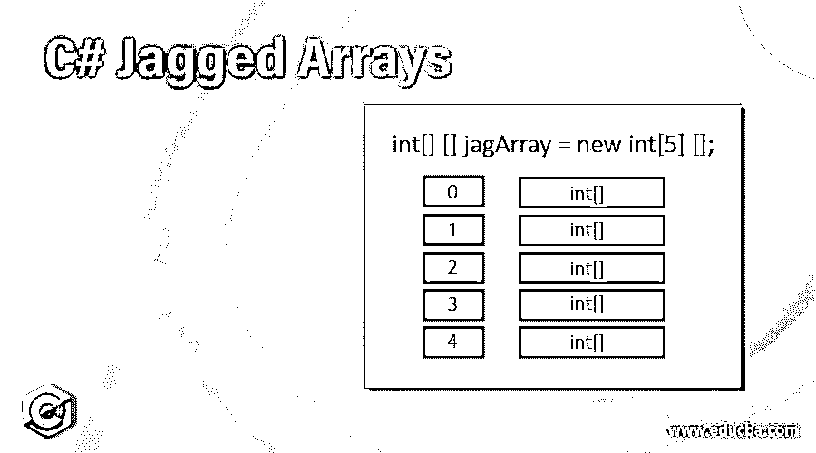
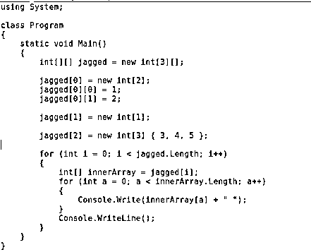
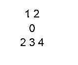

# C#交错数组

> 原文：<https://www.educba.com/c-sharp-jagged-arrays/>




## C#交错数组简介

在开发应用程序时，高级编程语言为我们提供了几个被认为非常有用的选项。在某些语言中，程序员需要为所有事情编写逻辑，但是在 python 这样的编程语言中，有许多内置函数可用是一个优点。在开发需要大量功能的现代 web 应用程序时，经常会用到由高级编程语言提供的功能。高级语言的一个非常重要的特性是数组，它允许我们存储相同的数据类型值。在本文中，我们将学习增强高级语言能力的特殊类型的数组。我们将使用 C#来实现这里的交错数组。**T3】**

### 什么是交错数组？

*   交错数组可以定义为多维数组,它能够在单个变量的名称下存储各种值。交错数组非常有助于增强应用程序的功能，因为它允许应用程序处理以特定方式存储的多个值。存储在交错数组中的值必须是相同的数据类型，这是所有高级编程语言中的通用标准。
*   为了开发一个算法，需要一个操作以矩阵中的方式完成，交错数组提供者使用最好的平台来完成。因此，在处理复杂算法时，这是有益的。换句话说，交错数组也可以被认为是一种特殊的数组，它允许开发人员以一种复杂的方式存储值，以便进行操作来生成所需的输出。
*   使用交错数组有几个好处。最重要的优点之一是，当需要使用相同的变量名以多维方式存储数据时，它使事情变得简单。此外，它有助于内存管理，使程序执行起来非常顺利和快速。实际上，它提高了程序的效率，让程序享受到使用高效开发的应用程序的好处。

### C#中交错数组的语法

要使用高级语言或任何一种编程语言提供的任何功能，学习如何在程序中编写它是非常重要的，我们称之为语法。同样，C#中的交错数组也有我们将在这里讨论的特定数组。

<small>网页开发、编程语言、软件测试&其他</small>

```
datatype[][] variableName = new datatype[rows][columns]
```

在上面提到的内容中，数据类型是用来确定哪种类型的数据必须存储在数组中。例如，如果数组应该存储整数值，那么在这种情况下，数据类型必须是 int。变量名是在使用数组获取存储在其中的值时将使用的数组的名称。它可以是任何名称，通常应该是字符或字符串。New 是用于创建新数组的关键字。在 new 关键字之后，是这里提到的数据类型，后面是数组应该包含的行数和列数。例如，写 int[2][3]意味着数组将包含总共 6 个值，并且将有两行和三列。

### 如何在 C#中声明交错数组？

在值可以存储在数组中或者数组可以在程序中使用之前，声明它是非常重要的。为了声明交错数组，我们将使用上一节中讨论过的相同语法。下面是一个如何声明交错数组的例子。

```
Int a = new int[2][4]
```

这里，变量名或数组名是“a ”,它应该只存储整数值。它可以存储或保存的值的总数是 8。数据将以矩阵的形式存储。将有两行，列数为 4。因为数据类型是 int，所以我们不能在这个数组中存储其他数据类型的值。

### 如何在 C#中初始化交错数组？

在声明了交错数组之后，初始化它是非常重要的，因为我们不能在初始化之前实际使用它。初始化是指给数组或任何变量赋值的过程，以便在需要时可以使用它。我们已经在上一节声明了交错数组，现在轮到初始化它了。下面是它可以被初始化的方式。

a[0][0] = 4

a[0][1] = 4

a[0][2] = 4

a[0][3] = 4

a[1][0] = 4

a[1][1] = 4

a[1][2] = 4

a[1][3] = 4

通过使用这种方法，可以初始化交错数组。借助上述例子让它明白。我们知道，交错数组以矩阵的形式存储数据。让我们考虑一下，a[0][0]对于我们的理解。这里的“a”是变量名或数组名，而写在它旁边的数字表示实际存储该值的行数和列数。当我们写[0][0]时，值将被存储在第一行和第一列，这是在矩阵中串行填充时值首先进入的位置。

#### 例子

这里我们将使用一个真实的例子来理解如何正确地使用交错数组来开发程序。重要的是要确保在编写程序时，应该管理适当的缩进以减轻程序的复杂性。下面是程序的截图。




**或** **tput:**




### 结论

交错数组是高级编程语言中最重要的部分，它让我们能够以一种方便的方式存储值。在编写必须处理大量必须以特定方式存储的数据的程序或算法时，它非常有用。它在内存管理中非常有用，因为它只使用一个变量名来存储多个数据。使用数组代替各种变量被认为是编程的最佳实践。它使得程序非常轻便，在内存管理中起着至关重要的作用。

### 推荐文章

这是一个 C#交错数组的指南。这里我们讨论一种特殊的数组，它通过初始化和适当的例子增强了高级语言的能力。您也可以浏览我们推荐的其他文章，了解更多信息——

1.  [C#编译器](https://www.educba.com/c-sharp-compilers/)
2.  [C# While 循环](https://www.educba.com/c-sharp-while-loop/)
3.  [C#函数](https://www.educba.com/csharp-functions/)
4.  [Python 中的多维数组](https://www.educba.com/multidimensional-array-in-python/)


