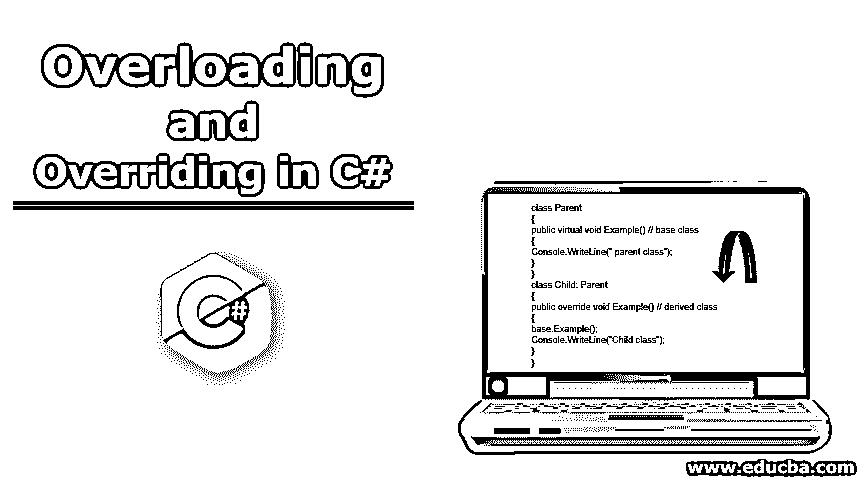

# C#中的重载和重写

> 原文：<https://www.educba.com/overloading-and-overriding-in-c/>




## C#中的重载和重写简介

多态性是 C#中的重要概念之一。有两种类型的多态性，编译时和运行时。重载和重写概念分别用于实现这一点。在重写中，子类可以以不同的方式实现父类方法，但是子类方法与父类具有相同的名称和相同的方法签名，而在重载中，一个类中有多个方法具有相同的名称和不同的参数。

### C#中重写和重载是如何工作的？

下面举例说明 C#中重写和重载的工作原理:

<small>网页开发、编程语言、软件测试&其他</small>

#### 最重要的

我们在覆盖中使用了一些关键字，如虚拟、覆盖和基本。

**语法:**

```
class Parent
{
public virtual void Example() // base class
{
Console.WriteLine("parent class");
}
}
class Child: Parent
{
public override void Example() // derived class
{
base.Example();
Console.WriteLine("Child class");
}
}
```

在这里，使用了 virtual 和 override 关键字，这意味着基类是虚拟的，子类可以实现这个类，override 意味着这个子类与父类具有相同的名称和相同的方法签名。

##### 示例#1

```
using System;
using System.Collections.Generic;
using System.Linq;
using System.Text;
using System.Threading.Tasks;
namespace OverridingExample
{
class Subject           // base class
{
public virtual void study()              // base class method
{
Console.WriteLine("Study all the subjects");
}
}
class Mathematics: Subject      //  derived class
{
public override void study()        // derived class method
{
Console.WriteLine("Study Mathematics");
}
}
class Program
{
// main method
static void Main(string[] args)
{
Subject s = new Mathematics();
s.study();
Console.ReadLine();
}
}
}
```

在上面的例子中，方法名称是相同的，但是它们的实现是不同的。基类是虚的，因此子类可以用自己的方式实现父类的方法。子类方法具有关键字 override，这表明该方法是一个重写方法。

**输出:**


##### 实施例 2

```
using System;
using System.Collections.Generic;
using System.Linq;
using System.Text;
using System.Threading.Tasks;
namespace OverridingExample
{
class Subject             // base class
{
public virtual void study()              // base class method
{
Console.WriteLine("Study all the subjects");
}
}
class Mathematics: Subject      //  derived class
{
public override void study()        // derived class method
{
base.study();
Console.WriteLine("Study Mathematics");
}
}
class Program
{
// main method
static void Main(string[] args)
{
Mathematics m = new Mathematics();
m.study();
Console.ReadLine();
}
}
}
```

**输出:**


在此示例中，派生类有一个 base 关键字，用于调用基类方法。因此，在这种情况下，派生方法在基类方法之后被调用。

**要点记住:**

*   在[覆盖概念](https://www.educba.com/overriding-in-python/)中，方法名、方法签名和访问修饰符始终与父类和子类相同。
*   父类方法不能是静态的。

#### 过载

在重载中，有多个具有不同方法签名的方法。下面是一些例子，展示了我们如何通过改变参数的数量、参数的顺序以及参数的数据类型来实现重载。

##### 示例#1

```
using System;
using System.Collections.Generic;
using System.Linq;
using System.Text;
using System.Threading.Tasks;
namespace OverloadingExample
{
class Demo
{
public int Sum(int x, int y)
{
int value = x + y;
return value;
}
public int Sum(int x, int y, int z)
{
int value = x + y + z;
return value;
}
public static void Main(string[] args) // main method
{
Demo d = new Demo();
int sum1 = d.Sum(24, 28);
Console.WriteLine("sum of the two "
+ "integer value : " + sum1);
int sum2 = d.Sum(10, 20, 30);
Console.WriteLine("sum of the three "
+ "integer value : " + sum2);
Console.ReadLine();
}
}
}
```

在上面的例子中，有两个同名但参数数量不同的方法。第一种方法由两个参数组成，而第二种方法有三个参数。这被称为[方法重载](https://www.educba.com/method-overloading-in-python/)。

**输出:**


##### 实施例 2

```
using System;
using System.Collections.Generic;
using System.Linq;
using System.Text;
using System.Threading.Tasks;
namespace OverloadingExample
{
class Demo
{
public int Sum(int x, int y, int z)
{
int value = x + y + z;
return value;
}
public double Sum(double x, double y, double z)
{
double value = x + y + z;
return value;
}
public static void Main(string[] args) // main method
{
Demo d = new Demo();
int sum1 = d.Sum(24, 28,7);
Console.WriteLine("sum of the two "
+ "integer value : " + sum1);
double sum2 = d.Sum(10.0, 20.0, 30.0);
Console.WriteLine("sum of the three "
+ "integer value : " + sum2);
Console.ReadLine();
}
}
}
```

在上面的例子中，有两个同名的方法，但是它们的[数据类型不同](https://www.educba.com/pl-sql-data-types/)。第一个方法具有整数数据类型，而第二个方法具有双精度数据类型。所以在这种情况下，参数会因为不同的数据类型而变化。

**输出:**


##### 实施例 3

```
using System;
using System.Collections.Generic;
using System.Linq;
using System.Text;
using System.Threading.Tasks;
namespace OverloadingExample
{
class Demo
{
public void Details(String name,int id)
{
Console.WriteLine("Name " + name + ", "
+ "Id " + id); ;
}
public void Details(int id,string name)
{
Console.WriteLine("Name " + name + ", "
+ "Id " + id);
}
public static void Main(string[] args) // main method
{
Demo d = new Demo();
d.Details("John", 10);
d.Details("Joe", 20);
Console.ReadLine();
}
}
}
```

在上面的例子中，方法的名称相同，但是参数的顺序不同。第一个方法分别有一个名称和 id。而第二个分别有 id 和名称。

**输出:**


**要点记住:**

*   在重载概念中，在顺序、类型和数量的情况下，不可能用相同的参数定义多个方法。
*   不可能基于不同的返回类型重载一个方法。

### C#中重载和重写的优势

下面是解释的优点。

*   重载是实现静态的方式之一，重写是 C#实现[动态多态](https://www.educba.com/what-is-polymorphism/)的方式之一。
*   它为用户提供了灵活性和代码的整洁性。

### 结论

[重载和重写在实现多态性中起着重要的作用。](https://www.educba.com/overloading-vs-overriding/)[覆盖允许](https://www.educba.com/overriding-in-python/)派生类以自己的方式实现，另一方面，重载是关于同名的方法和各种类型的参数实现。

### 推荐文章

这是 C#中重载和重写的指南。在这里，我们通过例子和代码实现来讨论 C#中重载和重写的工作原理、语法和优点。您也可以阅读以下文章，了解更多信息——

1.  [c#中的对象](https://www.educba.com/objects-in-c-sharp/)
2.  [c#中的 2D 数组](https://www.educba.com/2d-arrays-in-c-sharp/)
3.  [在 C#中覆盖](https://www.educba.com/overriding-in-c-sharp/)
4.  [换入 C#](https://www.educba.com/swapping-in-c-sharp/)


