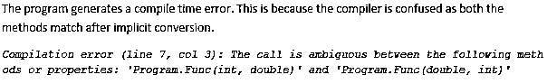

# C#中的重载

> 原文：<https://www.educba.com/overloading-in-c-sharp/>


## C#中的重载概述

在 C#的重载中，多态性是面向对象编程的一个概念，它定义了对象、变量或方法在编译/运行时采用多种形式的能力。数据、参数、返回对象等实时因素。，确定对象/方法/变量将采用什么形式。这允许程序员用更通用的而不是特定的代码。例如，你吃水果。你如何吃水果取决于实时提供给你的水果。你马上吃一个苹果，而你在吃之前削一个香蕉。简单。

### C#中什么是方法重载？

方法重载是多态性概念的编译时实现。开发人员可以用相同的名称定义相似的方法，不同之处在于参数的数量、顺序或类型。在水果的例子中，你不需要为每个水果定义单独的方法(吃苹果，吃香蕉，等等。).可以用同一个名字吃水果，给它传不同的参数。编译器会自动调用适当的方法。

<small>网页开发、编程语言、软件测试&其他</small>

现在让我们从 C#的角度来看。用最简单的话来说，[c#](https://www.educba.com/method-overloading-in-c-sharp/)中的方法重载就是你有两个或两个以上同名但签名不同的方法。这可以通过多种方式实现:

*   不同数量的参数。
*   不同类型的参数。
*   参数顺序不同。
*   可选参数。
*   命名参数。

### C#中方法重载是如何工作的？

那么，如何根据实参/参数调用合适的方法呢？嗯，编译器在编译期间检查每个方法定义，并将方法调用绑定到各自的定义。如果有两个同名的方法，编译器会检查方法的签名，并将适当的定义绑定到调用中。即使签名不能解决歧义，编译器也会寻找参数的隐式转换来匹配签名。如果隐式转换导致签名匹配，则绑定完成。否则，编译器会生成一个错误。

在本文中，我们将通过不同的例子来理解编译器在不同类型的方法重载中的工作。

### C#中方法重载的类型

下面我们讨论 C#中各种类型的方法重载，给出如下:

#### 1.不同数量的参数

第一类也是最简单的一类[方法重载](https://www.educba.com/method-overloading-in-java/)是当方法在其签名中有不同数量的参数时。

**代码:**

下面的例子非常简单明了。

```
using System;
public class Program
{
public static void Main()
{
Func(10);}
public static void Func(int a)
{
Console.WriteLine("Single Parameter");
}public static void Func(int a, int b)
{
Console.WriteLine("Multiple Parameters");
}
}
```

**输出:**


#### 2.不同类型的参数

当方法签名具有不同类型的参数时。参数的数量可以相同，也可以不同。

**例 1**

在下面的示例中，两种方法都需要一个参数。因此，基于方法调用期间传递的参数类型，编译器绑定适当的方法定义。

**代码:**

```
using System;
public class Program
{
public static void Main()
{
Func("Hello World");
}
public static void Func(int a)
{
Console.WriteLine("Integer Parameter");
}
public static void Func(string b)
{Console.WriteLine("String Parameter");
}
}
```

**输出:**


**例 2**

现在，让我们给编译器一些思考。我们会重载一个 double 和一个 float 类型的方法。我们知道，整数总是可以隐式转换为浮点类型和双精度类型。

当我们传递一个整数参数时，编译器会检查隐式转换，发现最好的转换是一个要浮点型的整数。因此，调用了 float 方法。

**代码:**

```
using System;
public class Program
{
public static void Main()
{
Func(10);
}
public static void Func(double a)
{
Console.WriteLine("Double Parameter");
}
public static void Func(float b)
{
Console.WriteLine("Floating Point Parameter");
}
}
```

**输出:**


#### 3.参数的不同顺序

当参数的数量和类型相同，但传递的顺序不同时。

**例#1**

下面的例子非常简单。

**代码:**

```
using System;
public class Program
{
public static void Main()
{
Func(10, 0.1);
}
public static void Func(int a, double b)
{
Console.WriteLine("Int-Double Parameters");
}
public static void Func(double a, int b)
{
Console.WriteLine("Double-Int Parameter");
}
}
```

**输出:**


**例 2**

在上面的例子中，当我们传递两个整数参数时，会发生什么？让我们找出答案。

**代码:**

```
Func(10, 1);
```

**输出:**




#### 4.可选参数

当我们在方法签名中定义一个可选参数时，编译器将其视为[方法重载](https://www.educba.com/method-overloading-in-python/)。

**注意:**这优先于隐式转换。

让我们用一个例子来理解这一点。

**例子**

在下面的例子中，我们给编译器两个选择。要么它可以隐式转换参数以匹配方法签名。或者它可以传递可选参数的默认值。编译器更喜欢后一种方法。

**代码:**

```
using System;
public class Program
{
public static void Main()
{
Func(10);
}
public static void Func(int a, int b = 1)
{
Console.WriteLine("Int-Int Parameters");
}
public static void Func(double a)
{
Console.WriteLine("Double Parameter");
}
}
```

**输出:**


#### 5.命名参数

C#的另一个特性是在调用方法时传递参数的名称。这个[也有助于方法重载](https://www.educba.com/method-overloading-in-c-plus-plus/)。开发人员可以选择调用特定的方法，即使默认情况下传递的参数会调用另一个方法。不过，重载方法的签名必须不同。

**例子**

在下面的例子中，我们通过传递参数名来指示编译器调用一个特定的方法。然后，编译器暂停其确定最适合方法的逻辑。

**代码:**

```
using System;
public class Program
{
public static void Main()
{
Func(b: 10);
}
public static void Func(int a)
{
Console.WriteLine("Int-Int Parameters");
}
public static void Func(double b)
{
Console.WriteLine("Double Parameter");
}
}
```

**输出:**


### 规则

在 C#应用程序中重载方法时，必须记住以下规则。

*   方法签名必须不同。参数的数量、类型或顺序必须不同。
*   方法的返回类型在方法重载中不起任何作用。
*   在决定绑定哪个方法定义时，可选参数优先于隐式类型转换。
*   隐式类型转换优先于父类方法。运动——为了理解这一点，这里有一个小练习。使用期望整数继承子类的方法创建父类。从子类中的父类重载该方法，以便子类方法需要双精度类型参数。创建一个子类的对象并调用重载方法传递一个整数。看看会发生什么。

### 结论

方法重载是一个相当强大的概念。这对编写优雅的代码很有帮助。然而，当数十个方法被重载时，开发人员不得不在调试错误调用时引用方法定义，这种情况可能会发展到一定程度。为了避免这种情况，当重载倾向于扩展到更高的级别时，通常建议用不同的方法命名。

### 推荐文章

这是一个 C#重载指南。这里我们分别讨论基本概念、工作原理、类型、示例和规则。您也可以浏览我们推荐的其他文章，了解更多信息——

1.  [C#函数](https://www.educba.com/csharp-functions/)
2.  [c++中的重载](https://www.educba.com/overloading-in-c-plus-plus/)
3.  [Java 中的重载](https://www.educba.com/overloading-in-java/)
4.  [c#中的重载和重写](https://www.educba.com/overloading-and-overriding-in-c/)


