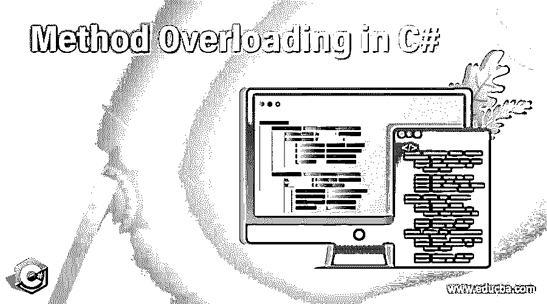
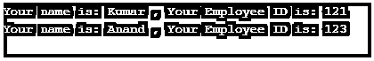

# C#中的方法重载

> 原文：<https://www.educba.com/method-overloading-in-c-sharp/>




## C#中什么是方法重载？

当你想实现多态特性时，可以通过方法重载来实现。通俗地说，如果我们想将一个函数用于多个表单，我们使用方法重载。由于 C#是基于 OOPs 的语言，它完全支持多态性。

一个程序员可以用不同的参数用相同的名字多次使用一个类。当使用执行多态性时，两个类或方法可以使用相同的名称。

<small>网页开发、编程语言、软件测试&其他</small>

下面说说 c#的类和方法中使用参数的各种方法。

1.  我们可以基于传递的几个参数重载该方法。在方法中，参数应该作为实参传递。
2.  不能用相同的名称、相同的类型和相同的参数传递顺序定义两个方法。它会给你一个错误。
3.  尽管不考虑编译器的返回类型，但不能用相同的名称、类型或签名声明两个方法。

### 方法重载有什么用？

当您不希望为要执行的类似任务的类似类型的方法声明多个方法，并且希望以不同的方式使用相同的方法时，例如，不同的输入、不同的顺序、相同方法的不同输入数量，您应该使用[方法重载](https://www.educba.com/method-overloading-in-java/)。

让我们举一个现实生活中的例子。我们正在为一个计算器编码，你被提供为计算器的总和部分编码。用户输入的所有数字应该相加，并返回所有输入数字的总和。

有一个限制。用户不能一次添加三个以上的数字。

以下是轻松做到这一点的步骤:

1.  声明一个方法，该方法应该对参数中传递的所有数字求和
2.  传递的参数数量会导致方法重载。
3.  该方法应该返回所有输入数字的总和。

**语法**

下面是方法重载的语法。

```
//declare the parameters in method
public void method1 (parameter1, parameter2)
{
//some statement
}
public void method1(parameter2, parameter1)
{
//some statement to be executed
}
//in main method pass the parameters while declaring these methods
public static void Main(Strings[] args)
{
class object=new class();
object.method(2, 3)  //value of parameter
object.method(3, 2) //value of parameter by changing the order
}
}
```

### 方法重载的例子

C#中的方法重载可以通过改变下面的东西来实现。

1.  您可以更改方法中传递的参数数量
2.  您可以更改方法中传递的参数类型
3.  您可以更改方法中传递的参数的顺序。

如果在同一个方法中传递相同类型的签名和参数，将会出现编译错误。如果使用多态特性或试图重载 C#中的方法，签名应该是不同的

让我们举一个例子。

#### 1.更改参数的数量

**代码:**

```
using System;
public class methodOverloadfirst
{
//declaring two integers x and y.
public int sum(int x, int y)
{
int result=x+y;
return result;
}
//Let’s add three integers in same method
public int sum(int x, int y, int z)
{
int result=x+y+z;
return result;
}
//Declare main method
public static void Main(String[] args)
{
methodOverloadfirst obj=new methodOverloadfirst();
int result1=obj.sum(2, 3);
Console.WriteLine("The Sum of the two integer value is : " + result1);
int result2=obj.sum(2, 3, 4);
Console.WriteLine("The Sum of the three integer value is : " + result2);
}
}
```

**输出:**


#### 2.更改参数的数据类型

//我们的程序展示方法重载的功能
//我们将在这里改变参数的数据类型。

**代码:**

```
using System;
public class methodOverloadfirst
{
//declaring two integers x and y.
public int sum(int x, int y)
{
int result=x+y;
return result;
}
//Let’s add three doubles in same method
public double sum(double x, double y, double z)
{
double result=x+y+z;
return result;
}
//Declare main method
public static void Main(String[] args)
{
methodOverloadfirst obj=new methodOverloadfirst();
int result1=obj.sum(2, 3);
Console.WriteLine("The Sum of the two integer value is : " + result1);
double result2=obj.sum(2.1, 3.2, 4.5);
Console.WriteLine("The Sum of the three double value is : " + result2);
}
}
```

**输出:**


#### 3.更改参数的数据类型。

//我们的程序展示方法重载的功能
//我们将在这里改变参数的数据类型。

**代码:**

```
using System;
class methodOverloadfirst
{
//declaring one integer and one String
public void displayinfo(string fname, int empID){
Console.WriteLine("Your name is: " + fname + " , " + "Your Employee ID is: " + empID);
}
//Let’s change the order of the parameters
public void displayinfo(int empID, string fname)
{
Console.WriteLine("Your Employee ID is: " + empID + " , " + "Your name is: " + fname);
}
//Declare main method
public static void Main(String[] args)
{
methodOverloadfirst obj=new methodOverloadfirst();
obj.displayinfo("Kumar", 121);
obj.displayinfo("Anand", 123);
}
}
```

**输出:**




### 结论

方法重载是 OOPs 概念的一个惊人的特性，如果你是一个程序员，它可以帮你省去很多麻烦。方法重载是多态性的特征之一。如果使用得当，它可以防止您声明多个方法，并且每次都为类似的任务声明它。

而使用此功能的是签名类型。每次该方法被几个参数和 order by 参数或上面示例中所示的参数类型使用时，这应该是不同的。

### 推荐文章

这是 C#中方法重载的指南。这里我们用不同的例子和输出详细讨论方法重载的使用。您也可以阅读以下文章，了解更多信息——

1.  [c#中的析构函数](https://www.educba.com/destructor-in-c-sharp/)
2.  [c#中的重载](https://www.educba.com/overloading-in-c-sharp/)
3.  [C#编译器](https://www.educba.com/c-sharp-compilers/)
4.  [c#中的重载和重写](https://www.educba.com/overloading-and-overriding-in-c/)


