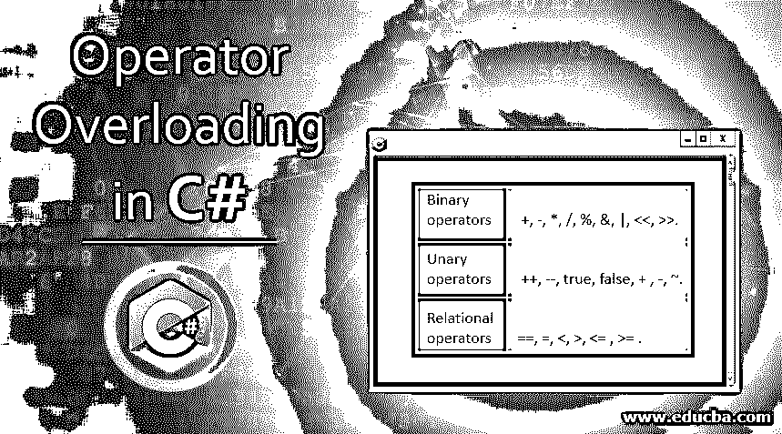

# C#中的运算符重载

> 原文：<https://www.educba.com/operator-overloading-in-c-sharp/>




## C#中运算符重载的介绍

重载可以定义为定义和实现多态技术的过程，它允许程序中的变量或对象在代码执行期间采用各种其他形式。当方法属性与参数类型不相似、执行顺序不同、有多个同名但属性不同的方法时，可以使用这种技术。这可以在一个程序中以不同的方法实现，例如不同数量的参数、不同类型的参数、不同顺序的参数、可选参数和命名参数。

### C#中的各种运算符重载

C#中有多个运算符。

<small>网页开发、编程语言、软件测试&其他</small>

1.  我们可以重载所有的二元运算符，即+、-、*、/、%、&、|、<>。
2.  我们可以重载所有一元运算符，例如++,–，true，false，+，-，~。
3.  有些运算符如&&、||、[]、()不能重载。
4.  我们可以成对重载关系运算符。这些是==，=，，<= , > =等。
5.  我们可以重载复合运算符，因为它们已经重载了二元运算符。

这些是我们可以重载的预定义的操作符。

**语法:**

下面是实现运算符重载的语法:

```
public static classname  operator op (parameters)
{
// Code
}
```

对于一元运算符

```
public static classname operator op (t)
{
// Code
}
```

对于二元运算符

```
public static classname operator op (t1, t2)
{
// Code
}
```

Operator 是用于实现运算符重载的关键字。运算符重载的返回类型永远不能为 void。在运算符重载中，优先选择用户定义的实现，而不是预定义的实现。在重载中，重载的方法应该有不同类型的参数，不同数量的参数和参数的顺序应该不同。所以操作符重载的方法和其他方法一样。在用户定义的实现中，不能修改语法和优先级。在二元运算符中，。运算符的左边是一个成员，右边是一个称为参数的对象。

### C#中运算符重载的示例

下面的例子展示了如何在 C#中实现运算符重载的概念:

#### 示例#1

用一元运算符**重载运算符。**在这个例子中，一元运算符用于重载。–运算符用于调用重载方法的名为 Example 的类中。正如下面提到的，代码编译器把它作为操作符-(obj)；.

**代码:**

```
using System;
using System.Collections.Generic;
using System.Linq;
using System.Text;
using System.Threading.Tasks;
namespace OperatorOverloading
{
class Example
{
public int val1, val2;
public Example(int no1, int no2)
{
val1 = no1;
val2 = no2;
}
public Example()
{
}
public static Example operator -(Example eg1)
{
eg1.val1 = -eg1.val1;
eg1.val1 = -eg1.val1;
return eg1;
}
public void Print()
{
Console.WriteLine("value1 =" + val1);
Console.WriteLine("value2 =" + val2);
Console.Read();
}
class Program
{
static void Main(string[] args)
{
Example eg = new Example(30, -60);
eg.Print();
Example eg1 = new Example();
eg1 = -eg;
eg1.Print();
Console.Read();
}
}
}
}
```

**输出:**


#### 实施例 2

用二元运算符重载运算符。在这个例子中，二元操作符被用来展示我们如何实现操作符重载。+运算符用于添加对象。操作员收到一个参数。在代码中，num 是一个名为 Example 的类的对象，对象被传递到该类。在重载中，运算符左边的是成员，右边的对象称为参数。

**代码:**

```
using System;
using System.Collections.Generic;
using System.Linq;
using System.Text;
using System.Threading.Tasks;
namespace OperatorOverloading
{
class Example
{
public int num;
public Example()
{
num = 0;
}
public Example(int n)
{
num = n;
}
public static Example operator +(Example e1, Example e2)
{
Example e3 = new Example();
e3.num = e1.num + e2.num;
return e3;
}
public void display()
{
Console.WriteLine("{0}", num);
}
}
class Program
{
static void Main(string[] args)
{
Example num = new Example(200);
Example num1 = new Example(300);
Example num2 = new Example();
num2 = num + num1;
num.display();
num1.display();
num2.display();
Console.Read();
}
}
}
```

**输出:**


#### 实施例 3

运算符重载和继承。

**代码:**

```
using System;
using System.Collections.Generic;
using System.Linq;
using System.Text;
using System.Threading.Tasks;
namespace OperatorOverloading
{
class Example
{
public int num;
public Example()
{
num = 0;
}
public Example(int n)
{
num = n;
}
public static Example operator +(Example e1, Example e2)
{
Example e3 = new Example();
e3.num = e1.num + e2.num;
return e3;
}
public void display()
{
Console.WriteLine("{0}", num);
}
}
class Example1 : Example
{
private double a;
private double b;
public Example1(double x, double y)
{
a = x;
b = y;
}
public Example1()
{
}
public void Show()
{
Console.WriteLine("{0} {1}", a, b);
}
}
class Program
{
static void Main(string[] args)
{
Example1 num = new Example1(20.0,2.3);
num.Show();
Example1 num1 = new Example1(3.0,3.1);
num1.Show();
Example1 num2 = new Example1();
//num2 = num + num1;
//num2.Show();
Console.Read();
}
}
}
```

**输出:**


重载运算符也可以被派生类继承。因为不可能在派生类中声明操作符来隐藏基类的声明操作符。

#### 实施例 4

用相等运算符重载运算符。在此示例中，使用等号运算符显示了运算符重载。等式运算符用在我们想要进行比较的地方。我们可以重载类中的方法来做比较。在这段代码中，对象 e1 和 e2 的值是相同的。但是他们的参照物不一样。对象值的比较是基于引用的。在 e2 和 e3 的情况下，它指的是同一个对象。

**代码:**

```
using System;
using System.Collections.Generic;
using System.Linq;
using System.Text;
using System.Threading.Tasks;
namespace OperatorOverloading
{
class Example
{
private int a;
private int b;
public Example()
{
}
public Example(int x, int y)
{
a = x;
b = y;
}
public void Display()
{
Console.WriteLine("{0} {1}", a, b);
}
}
class Program
{
public static void Main()
{
Example e1 = new Example(30, 20);
e1.Display();
Example e2 = new Example(30, 20);
e2.Display();
Example e3 = e2;
e3.Display();
if (e1.Equals(e2))
Console.WriteLine("equal");
else
Console.WriteLine("not equal");
if (e2.Equals(e3))
Console.WriteLine("equal");
Console.ReadLine();
}
}
}
```

**输出:**


### 结论

运算符重载是一个重要的概念。它提供了操作符在多个操作中的可重用性。在 C#中，我们只能重载一组定义好的参数。不是所有的语言。Net 支持运算符重载。所以在 C#中，它提供了用户定义实现方面的附加功能。

### 推荐文章

这是 C#中运算符重载的指南。这里我们讨论 C#中运算符重载的介绍及其代码实现的例子。您也可以浏览我们推荐的其他文章，了解更多信息——

1.  [c#中的方法重载](https://www.educba.com/method-overloading-in-c-sharp/)
2.  [c++中的函数重载](https://www.educba.com/function-overloading-in-c-plus-plus/)
3.  [c++中的重载](https://www.educba.com/overloading-in-c-plus-plus/)
4.  [c++中的方法重载](https://www.educba.com/method-overloading-in-c-plus-plus/)


