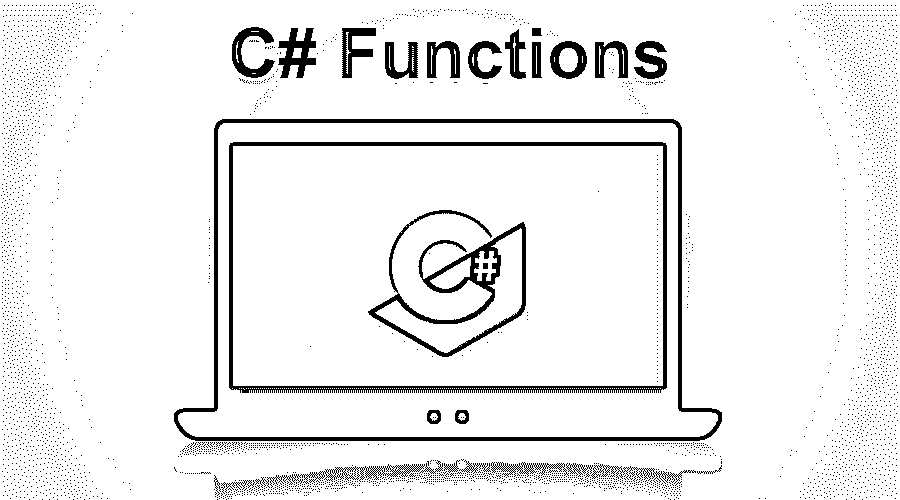
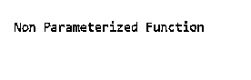
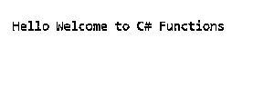
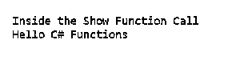
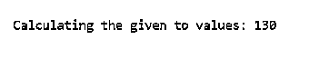

# C#函数

> 原文：<https://www.educba.com/csharp-functions/>




## C#函数简介

C#函数是 C#程序的重要组成部分，它可以由许多元素组成，例如用作函数引用的函数名、函数中操作的数据的返回类型、函数的逻辑体、可以作为函数参数传递的参数以及用于定义程序内函数可访问性的访问说明符。可以集成到 C#程序中的不同类型的函数是带参数或不带参数的函数的组合，根据所提供的需求，这些函数可以有返回值，也可以没有返回值。

函数中有几个组成部分，如下所示？

<small>网页开发、编程语言、软件测试&其他</small>

*   为了进行函数调用，我们有一个唯一的名字叫做函数名。
*   为了指定返回值的数据类型，我们将使用返回类型。
*   包含可执行语句的语句块称为主体。
*   我们可以在函数调用期间将函数作为一组参数传递。
*   为了指定应用程序中函数的可访问性，我们可以使用访问说明符**。**

### 不同的 C#函数

*   没有参数和返回类型
*   有参数但没有返回类型
*   使用 with 参数(实参)和 with 返回类型
*   不带参数(实参),带返回值

**C#函数语法**

```
<access-specifier><return-type>FunctionName(<parameters>)
{
// function body
// return statement
}
```

在上面的语法中，Return 语句、参数和访问说明符是可选的。

| **功能方面** | **语法(功能)** |
| 带参数和带
返回值 | **Declaration: **int display ( int );**函数调用:**显示(数值)；**函数定义:**
int display(int value)
{
语句；
返回值；
} |
| 带参数和不带
返回值 | **Declaration: **void display ( int );**调用:**显示(数值)；**函数定义:**
【void 显示(int 值)】
{
报表；
} |
| 无参数且无
返回值 | **Declaration: **void display ();**调用:**显示()；**定义:**
【void display()】
{
报表；
} |
| 不带参数，带
返回值 | **Declaration: **int display ( );**调用:**显示()；**定义:**
int display ( )
{
报表；
返回值；
} |

如果函数的返回值是“void ”,那么它不能向调用函数返回任何值。

**Note:** If the return value of the function such as “int, double, float, string, etc.” is other than void then, it can return values to the calling function.

#### 1.使用不带参数和返回类型的

没有参数也没有返回类型的函数，这个函数不返回任何值，这里我们指定 void type 作为返回类型值。在这个程序中，不应该向函数调用 Display()传递任何值，而且，从这个函数调用到 main 函数也没有返回值。让我们看一个没有返回类型和参数的函数构建的例子，

**例子**

**代码:**

```
using System;
namespace FunctionSamples
{
class Program_A
{
// User defined function without return type and parameter
public void Display()
{
Console.WriteLine("Non Parameterized Function"); // No return statement
}
static void Main(string[] args) // Main Program
{
Program_A program = new Program_A (); // to create a new Object
program.Display(); // Call the Function
}
}
}
```

**输出:**




#### 2.使用 With 参数(实参)且不带返回类型

在这个程序中，字符串作为参数传递给函数。这个函数的返回类型是“void”，函数不能返回任何值。字符串的值在函数本身内部被操作和显示。

**例子**

**代码:**

```
using System;
namespace FunctionSample
{
class Program_B
{
public void Display(string value) // User defined function without return type
{
Console.WriteLine("Hello " + value); // No return statement
}
static void Main(string[] args) // Main function
{
Program_B program = new Program_B(); // Creating Objec
program.Display("Welcome to C# Functions"); // Calling Function
}
}
}
```

**输出:**




#### 3.使用 with 参数(实参)和 With 返回类型

在这个程序中，字符串作为参数传递给函数。这个函数的返回类型是“字符串”，字符串的返回值可以从函数返回。字符串的值在函数本身内部被操作和显示。

**例子**

**代码:**

```
using System;
namespace FunctionsSample
{
class Program_C
{
// User defined function
public string Show(string message)
{
Console.WriteLine("Inside the Show Function Call");
return message;
}
// Main function
static void Main(string[] args)
{
Program_C program = new Program_C();
string message = program.Show("C# Functions");
Console.WriteLine("Hello "+message);
}
}
}
```

**输出:**




#### 4.使用不带参数(自变量)和带返回值的

在这个程序中，不会将任何参数传递给函数“calculate ”,而是传递给主函数，从这个 calculate()函数调用中返回值。变量 a 和 b 的值在函数调用“calculate”中计算，在主函数中这些值的和作为结果返回。

**例子**

**代码:**

```
using System;
namespace FunctionsSample
{
class Program_D
{
public void calculate()
{
int a = 50, b = 80, sum;
sum = a + b;
Console.WriteLine("Calculating the given to values: " +sum);
}
static void Main(string[] args) // Main function
{
Program_D addition =new Program_D();
addition.calculate();
}
}
}
```

**输出:**




### C#向方法传递参数

当我们在 c#中创建一个带有参数的方法时，我们必须在调用应用程序的函数时将参数传递给指定的方法。我们有几种方法向方法传递参数；让我们看看参数/自变量。

| **参数** | **描述** |
| **数值参数** | 值参数称为“输入参数”。输入参数将传递原始值的副本，而不是原始参数；因此，在被调用的方法期间，不会有任何原因或对参数的更改，并且当控制传递给调用函数时，它不会影响原始值。 |
| **参考参数** | 参考参数被称为“输入/输出参数”。参考参数将通过原始参数的参考存储器。因此，当控制返回到调用方函数时，对被调用方法中的参数所做的改变/变更会影响原始值。 |
| **输出参数** | 它是一个“输出参数”；这些类似于引用类型参数。唯一的区别是在传递数据之前不需要初始化它。 |

### 结论–C #函数

在本文中，我们仔细阅读了 C#中可用的函数/方法的用法，并学习了不同的 C#函数。我希望这篇文章能帮助你理解 C#的几个功能方面。

### 推荐文章

这是 C#函数的指南。为了更好地理解，我们在这里讨论了 C#函数的基本概念和不同类型及其语法。您也可以浏览我们推荐的其他文章，了解更多信息——

1.  [C#字符串函数](https://www.educba.com/c-sharp-string-functions/)
2.  [C#命令](https://www.educba.com/c-sharp-commands/)
3.  [c#的用途](https://www.educba.com/uses-of-c-sharp/)
4.  [C#与 Java 性能对比](https://www.educba.com/c-sharp-vs-java-performance/)


