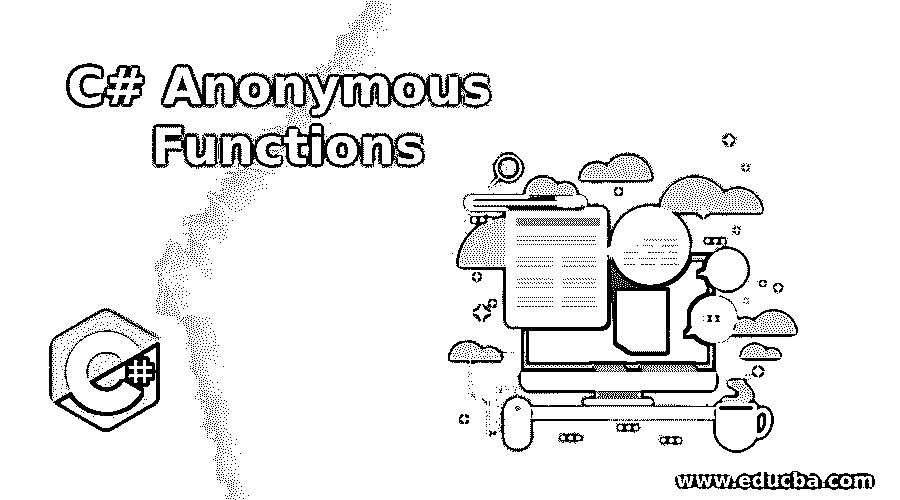
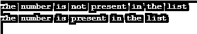

# C#匿名函数

> 原文：<https://www.educba.com/c-sharp-anonymous-functions/>




## 匿名函数简介

在 C#中，一种没有名字的函数称为匿名函数，也可以表示为没有名字的函数。匿名函数在 C#中有两种类型，即 C#中的 Lambda 表达式和 C#中的匿名方法，其中用于创建委托的匿名函数在 C#中称为 Lambda 表达式，使用该表达式可以创建本地函数，并可以作为参数传递，LINQ 的查询也可以借助 Lambda 表达式编写。匿名方法也提供了相同的功能，只是它不允许使用参数列表。

### C#中匿名函数的类型

C#中有两种类型的匿名函数。它们是:

<small>网页开发、编程语言、软件测试&其他</small>

#### 1.λ表达式

*   可以使用一种称为 Lambda 表达式的匿名函数来创建委托。
*   可以使用 Lambda 表达式创建局部函数，该表达式可以作为参数传递。
*   LINQ 的查询可以在λ表达式的帮助下编写。
*   C#中 lambda 表达式的语法如下:

```
(input-parameters) => expression
```

##### 示例#1

C#程序演示 Lambda 表达式在程序中求一个数的平方:

**代码:**

```
using System;
//a namespace called program is defined
namespace program
{
//a class called check is defined
class check
{
delegate int Findsquare(int number);
//main method is called
static void Main(string[] args)
{
//a lambda expression to find the square of a number is defined
Findsquare Obtainsquare = r => r * r;
int l = Obtainsquare(3);
Console.WriteLine("The Square of the given number is: "+l);
}
}
}
```

**输出:**


在上面的程序中，定义了一个名为 program 的名称空间。然后定义了一个名为 check 的类。然后调用 main 方法。然后定义一个 lambda 表达式来求一个数的平方。显示使用 lambda 表达式找到的数字的平方。

##### 实施例 2

演示 Lambda 表达式的 C#程序，以确定一个数字是否出现在列表中:

**代码:**

```
using System;
using System.Collections.Generic;
//a namespace called program is defined
namespace program
{
//a class called check is defined
class check
{
//main method is called
static void Main(string[] args)
{
//a new list of type integer is created
List<int> mylist = new List<int>();
//integers are added to the list using add() method
mylist.Add(10);
mylist.Add(20);
mylist.Add(30);
//a lambda expression and find method is used to determine if a number is present in the list
int found = mylist.Find(r => r == 20);
if(found==0)
{
Console.WriteLine("The number is present in the list");
}
else
{
Console.WriteLine("The number is not present in the list");
}
//a lambda expression and find method is used to determine if a number is present in the list
found = mylist.Find(r => r == 40);
if(found==0)
{
Console.WriteLine("The number is present in the list");
}
else
{
Console.WriteLine("The number is not present in the list");
}
}
}
}
```

**输出:**




在上面的程序中，定义了一个名为 program 的名称空间。然后定义了一个名为 check 的类。然后调用 main 方法。然后创建一个整数类型的新列表。然后使用 Add()方法将整数添加到列表中。然后使用 lambda 表达式和 Find()方法来确定一个数字是否出现在列表中。

#### 2.匿名方法

*   在 C#中，没有名字的方法称为匿名方法。
*   匿名方法是在 C # 2.0 版中引入的。
*   当要创建一个内联方法并且参数也必须传递给该方法时，我们使用匿名方法，类似于我们将参数传递给任何其他方法的方式。
*   关键字 delegate 用于定义一个匿名方法，该方法可以分配给 delegate 类型的变量。
*   C#中匿名方法的语法如下:

```
Delegate(parameter_list)
{
//Block of code
};
```

##### 示例#1

C#程序来演示程序中的匿名方法:

**代码:**

```
using System;
//a class called program is defined
class program
{
//a delegate is created by using delegate keyword
public delegate void subject(string favsubject);
// Main method is called
static public void Main()
{
// a parameter is passed to the anonymous method using delegate keyword
subject sub = delegate(string favsubject)
{
Console.WriteLine("{0} is my favourite subject", favsubject);
};
sub("C#");
}
}
```

**输出:**


在上面的程序中，定义了一个类程序。然后使用 delegate 关键字创建一个委托。然后调用 main 方法。然后使用 delegate 关键字将参数传递给匿名方法。

##### 实施例 2

C#程序演示了程序中的匿名方法，该方法可以访问外部方法中定义的变量:

**代码:**

```
using System;
//a class called program is defined
class program
{
//anonymous method is declared using delegate keyword
public delegate void subject(string favsubject);
// Main method is called
static public void Main()
{
//a string variable is defined in the outside method from anonymous method
string favsubject1 = "Coding_in_C#";
// a parameter is passed to the anonymous method using delegate keyword
subject sub = delegate(string favsubject)
{
Console.WriteLine("{0} is my favourite subject", favsubject);
Console.WriteLine("I also like {0}", favsubject1);
};
sub("C#");
}
}
```

**输出:**


在上面的程序中，定义了一个名为 program 的类。然后使用 delegate 关键字创建一个委托。然后调用 main 方法。然后定义一个字符串变量，它是匿名方法的外部方法。然后使用 delegate 关键字将参数传递给匿名方法。匿名方法也访问匿名方法之外的变量。

### 推荐文章

这是一个 C#匿名函数的指南。这里我们还讨论了 c#中匿名函数的介绍和类型，以及不同的例子和代码实现。您也可以看看以下文章，了解更多信息–

1.  [c#中的分部](https://www.educba.com/partial-in-c-sharp/)
2.  [C# MessageBox](https://www.educba.com/c-sharp-messagebox/)
3.  [C# StreamReader](https://www.educba.com/c-sharp-streamreader/)
4.  [C#元组](https://www.educba.com/c-sharp-tuples/)


