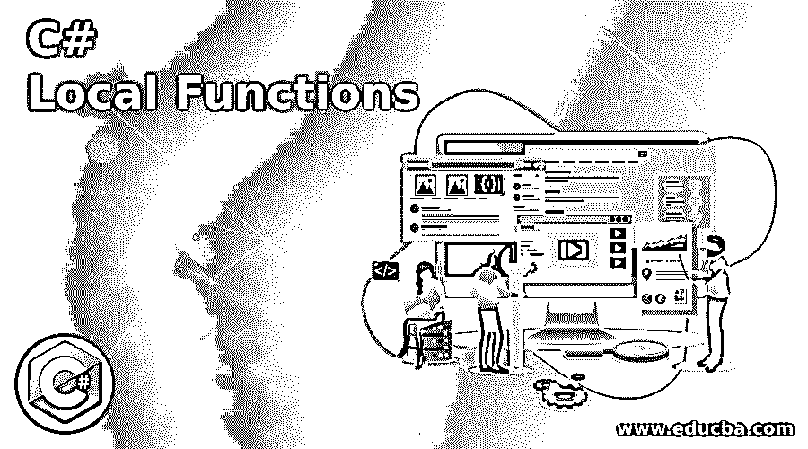
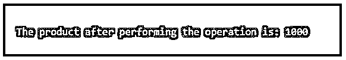
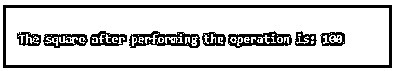

# C#局部函数

> 原文：<https://www.educba.com/c-sharp-local-functions/>




## C#局部函数简介

在另一个函数体内的私有函数，其作用域仅限于在其中创建它的函数，在 C#中被称为局部函数，使用它可以在另一个已经定义的方法体内声明一个方法，这个局部函数特性是在 C# 7.0 版的 C #中引入的。并且在另一个函数体内创建的函数的类型与在其中创建该函数的函数的类型相同，并且这样的局部函数可以被它们的容器的成员调用，并且允许创建一个以上的局部函数，但是不允许对局部函数使用 static 关键字。

**语法:**

<small>网页开发、编程语言、软件测试&其他</small>

下面给出了语法:

```
<modifiers: async | unsafe> <return-type> <method-name> <parameter-list>
```

*   其中 async 和 unsafe 是可用于本地方法的修饰符。
*   返回类型是方法返回值的类型。
*   方法名是赋予方法的名称。
*   参数列表是可以传递给方法的参数列表。

### C#中局部函数的工作原理

*   局部函数是私有函数，可以在另一个函数体内声明，并且这种局部函数的作用域仅限于创建它的函数。
*   局部函数可以从终结器、lambda 表达式、属性评估器、构造器等调用。
*   访问修饰符和 static 关键字不能用在局部函数中，即使是修饰符 private 也不行，因为局部函数在默认情况下是私有的。
*   在容器方法中定义的局部变量包括方法参数，可以使用局部函数来访问。
*   属性不能应用于局部函数或其参数和参数类型。
*   修饰符 unsafe 和 async 可以用于局部函数。

### 例子

下面是提到的例子:

#### 示例#1

C#程序演示局部函数，在一个程序中增加两个数。

**代码:**

```
using System;
//a class called check is defined
namespace LocalFunction
{
public class Program
{
// Main method is called
public static void Main(string[] args)
{
// the local methods are being called within the main method
int res = Addition(100, 200);
Console.WriteLine("The addition result of adding 100 and 200 is: {0}", +res);
//local method is created
int Addition(int x, int y)
{
return x + y;
}
}
}
}
```

**输出:**


在上面的程序中，定义了一个名为 check 的类。然后调用 main 方法，在该方法中定义局部方法。然后调用在 main 方法中创建的局部方法，要添加的两个数字作为参数传递给局部方法。

#### 实施例 2

C#程序来演示程序中的局部函数。

**代码:**

```
using System;
//a class called program is called
namespace LocalFunction
{
public class Program
{
//main method is called
public static void Main(string[] args)
{
//Local Function is created
int Function(int x)
{
return 100 * x;
}
//Calling the local function within the main method
Console.WriteLine("The product after performing the operation is: {0}",Function(10));
}
}
}
```

**输出:**




在上面的程序中，定义了一个名为 program 的类。然后调用 main 方法，在该方法中定义了局部方法，该方法用于查找数字与 100 相乘后的乘积，该方法作为参数传递。然后用一个数字调用在 main 方法中创建的局部方法，该数字的乘积在乘以 100 后作为参数传递给局部方法。

#### 实施例 3

C#程序，演示在一个程序中局部函数求一个数的平方。

**代码:**

```
using System;
//a class called program is called
namespace LocalFunction
{
public class Program
{
//main method is called
public static void Main(string[] args)
{
//Local Function is created
int Square(int x)
{
return x * x;
}
//Calling the local function within the main method
Console.WriteLine("The square after performing the operation is: {0}",Square(10));
}
}
}
```

**输出:**




在上面的程序中，定义了一个名为 program 的类。然后调用 main 方法，其中定义了查找作为参数传递的数字的平方的局部方法。然后调用在 main 方法中创建的 local 方法，将一个数字的平方作为参数传递给 local 方法。

### 推荐文章

这是一个 C#局部函数的指南。这里我们讨论 C#中局部函数的介绍、工作原理和编程实例。您也可以看看以下文章，了解更多信息–

1.  的 C#名称
2.  [C# MessageBox](https://www.educba.com/c-sharp-messagebox/)
3.  [IEnumerable C#](https://www.educba.com/ienumerable-c-sharp/)
4.  [C# StreamReader](https://www.educba.com/c-sharp-streamreader/)


