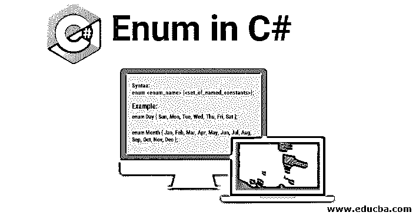

# C#中的枚举

> 原文：<https://www.educba.com/enum-in-c-sharp/>




## C#中的枚举简介

Enum 是 C#中的保留关键字，表示枚举。枚举是 C#中用户定义的类型，它保存一组命名的常数。集合中的每个常量都有一个值(默认为整数)。常数可以通过名称和值来访问。因此，名称不能在枚举中重复。枚举的语法很简单。它以关键字 enum 开始，后面是一个变量名，再后面是一组用花括号括起来的命名常量。当然，它以分号结尾。

**语法:**

<small>网页开发、编程语言、软件测试&其他</small>

```
enum <enum_name> {<set_of_named_constants>};
```

**举例:**

**代码:**

```
enum Day { Sun, Mon, Tue, Wed, Thu, Fri, Sat };
enum Month { Jan, Feb, Mar, Apr, May, Jun, Jul, Aug, Sep, Oct, Nov, Dec };
```

### 在 C#中使用枚举

枚举在 C#中有一个基础类型。这意味着枚举中的每个常量都将被赋予一个基础类型的值。C#中枚举的默认基础类型是整数。

在上面的 enum Day 中，我们声明了七个常量。它有一个默认的整数基础类型。因此，每个常数都将被赋予一个整数值。默认情况下，该值从 0 开始。因此，Sun 将被分配 0，Mon 将被分配 1，Tue 将被分配 2，依此类推。

让我们再举一个例子。我们将把值 1 赋给 Sun。这将迫使编译器从 1 而不是从 0 开始赋值。然后，我们将值 8 赋给 Thu。编译器会从 8 开始继续赋值。

#### 示例#1

**代码:**

```
using System;
public class Program
{
enum Day
{
Sun = 1,
Mon,
Tue,
Wed,
Thu = 8,
Fri,
Sat
};
public static void Main()
{
for (int i = 0; i < 10; i++)
{
Console.WriteLine((Day)i);
}
}
}
```

**输出:**


真实世界的例子可以是客户旅程中的各个阶段。当然，所有的常量都可以单独声明并赋予相应的整数值，但是使用 enum 消除了记忆每个阶段的整数值的麻烦，也使代码更容易理解。

#### 实施例 2

**代码:**

```
using System;
public class Program
{
enum ClientJourney
{
Introduced = 1,
UnderReview = 2,
Reviewed = 3,
Documentation = 4,
Onboarded = 5,
Declined = 6,
Deboarded = 7
};
public static void Main()
{
Console.WriteLine("The various stages in the journey of a client are:\n");
foreach (string str in Enum.GetNames(typeof(ClientJourney)))
{
Console.WriteLine(str);
}
}
}
```

**输出:**


### C#中的枚举方法

以下是 C#中枚举的一些方法:

#### 1.GetName(Type，Int32)

GetName 方法返回映射到枚举中指定值的命名常数。如果该值没有命名常量，则返回一个空字符串。

此方法需要两个参数，一个是类型，即枚举本身，另一个是指定的值。

在上面的同一个 Days 示例中，我们将通过 GetName 方法打印命名的常量。

**代码:**

```
using System;
public class Program
{
enum Day
{
Sun = 1,
Mon,
Tue,
Wed,
Thu = 8,
Fri,
Sat
}
;
public static void Main()
{
for (int i = 0; i < 10; i++)
{
Console.WriteLine(Enum.GetName(typeof(Day), i));
}
}
}
```

**输出:**

**

** 

#### 2.GetNames(类型)

注意，在上面的例子中，我们不得不使用 for 循环来获取枚举的所有命名常量。当我们需要单个或者有限数量的命名常量时，GetName 方法更有用。

为了获取所有命名的常量，我们有另一个方法 GetNames()。它将枚举作为输入参数。

在上面的同一个 Days 示例中，我们将通过 GetNames 方法打印命名的常量。

**代码:**

```
using System;
public class Program
{
enum Day
{
Sun = 1,
Mon,
Tue,
Wed,
Thu = 8,
Fri,
Sat
}
;
public static void Main()
{
foreach(string namedConstant in Enum.GetNames(typeof(Day))){
Console.WriteLine(namedConstant);
}
}
}
```

**输出:**


#### 3.获取值(类型)

GetValues()方法用于获取枚举的每个命名常量的基础映射值。

在上面的同一个 Days 示例中，我们将通过 GetNames 方法打印命名的常量。

**代码:**

```
using System;
public class Program
{
enum Day
{
Sun = 1,
Mon,
Tue,
Wed,
Thu = 8,
Fri,
Sat
}
;
public static void Main()
{
foreach (int i in Enum.GetValues(typeof(Day)))
{
Console.WriteLine(i);
}
}
}
```

**输出:**


### C#中的枚举规则

下面给出了 C#中的枚举规则:

*   枚举是一种类型，而不是变量/常数/方法。
*   枚举命名常量不能重复。它们必须是独特的。
*   枚举的基础类型不能是 char。
*   枚举的默认基础类型是整数。
*   默认情况下，分配给枚举命名常量的值从 0 开始，每个连续的命名常量增加 1。

### C#中枚举的优势

下面是提到的优点:

*   枚举是一种非常有利的编码实践。它们用于定义应用程序或程序的常量集。因此，集合保持不变，避免程序混乱，特别是当它是一个涉及多个开发人员的大型应用程序时。
*   有许多可以使用枚举的场景。一周中的几天、一年中的几个月、温度的换算率、时区的换算系数或应用程序的任何主表数据。这使得代码可读性更强，更容易理解。

### 结论

因此，我们已经看到了枚举在 C#中的使用。我们已经看到了它是如何工作的，以及它的实际用途是什么。我们理解使用枚举时要遵守的规则。还有一些方法可以帮助我们访问和格式化枚举。建议尽可能在代码中使用枚举。这将有助于您观察编码的良好实践并学习枚举。

### 推荐文章

这是一个 C#中枚举的指南。在这里，我们通过例子和代码实现来讨论 C#中 Enum 的工作原理、方法、规则和优点。您也可以阅读以下文章，了解更多信息——

1.  [c#中的回文](https://www.educba.com/palindrome-in-c-sharp/)
2.  [c#中的命名空间](https://www.educba.com/namespaces-in-c-sharp/)
3.  [c#中的模式](https://www.educba.com/patterns-in-c-sharp/)
4.  [c++中的枚举](https://www.educba.com/enum-in-c-plus-plus/)


