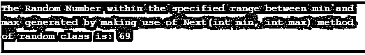

# C#随机

> 原文：<https://www.educba.com/c-sharp-random/>


## C# random 简介

使用预定义方法生成随机整数的类在 C#中称为随机类。其中 Next()方法是 Random 类中最常用的方法，用于生成可以以三种形式重载的随机整数，例如 Next()方法可以随机返回介于 2，147，483，648 和+2，147，483，648 之间的整数值，Next(int max)方法是返回小于指定为最大值的整数值的另外两种形式之一，Next(int min，int max)是另一种形式，它返回介于指定值范围之间的整数值

**语法**

<small>网页开发、编程语言、软件测试&其他</small>

语法如下:

```
Random.Next();
Random.Next(int max);
Random.Next(int min, int max);
```

**解释:**其中 max 是 Next()方法必须返回的随机整数值所在的值，min 和 max 指定必须返回的随机整数值必须所在的范围。

### C# random 是如何工作的？

每当需要使用预定义的方法生成随机整数时，我们就使用 C#中的 random 类。next()方法是 Random 类中最常用的生成随机整数的方法，它可以以三种形式重载。Next()方法可以随机返回一个介于 2，147，483，648 和+2，147，483，648 之间的整数值。Next(int max)方法是另外两种可以返回小于 max 指定值的整数值的形式之一。Next(int min，int max)是另一种形式，它返回一个介于最小值和最大值之间的整数值。

### 实现 C# random 的示例

下面是提到的例子:

#### 示例#1

使用 Next()方法生成介于 2，147，483，648 和+2，147，483，648 之间的随机整数来演示 Random 类的 C#程序:

**代码:**

```
using System;
//a class called check is defined
public class check
{
//main method is called within which an instance of the random class is created to be able to make use of Next() method
public static void Main()
{
Random ran = new Random();
//Next() method is called to generate a random integer value between −2,147,483,648 and +2,147,483,648 and stored in an integer variable
int num= ran.Next();
//The random number generated by making use of Next() method of random class is displayed as the output
Console.WriteLine("The Random Number generated by making use of Next() method of random class is: "+num);
}
}
```

**输出:**


**说明:**在上面的程序中，定义了一个名为 check 的类。然后调用 main 方法，在其中创建 Random 类的一个实例，以便能够使用 Next()方法。然后调用 Next()方法生成一个介于 2，147，483，648 和+2，147，483，648 之间的随机整数值，并存储在一个整数变量中。然后，使用 random 类的 Next()方法生成的随机数被显示为输出。输出显示在上面的快照中。

#### 实施例 2

使用 Next(int max)方法生成指定最大值范围内的随机整数来演示 Random 类的 C#程序:

**代码:**

```
using System;
//a class called check is defined
public class check
{
//main method is called within which an instance of the Random class is created to be able to make use of Next(int max) method
public static void Main()
{
Random ran = new Random();
// Next(int max) method is called to generate a random integer value which is within the specified value max and stored in an integer variable
int num= ran.Next(50);
//The random number generated by making use of Next(int max) method of random class is displayed as the output
Console.WriteLine("The Random Number within the specified range 50 generated by making use of Next(int max) method of random class is: "+num);
}
}
```

**输出:**


**说明:**在上面的程序中，定义了一个名为 check 的类。然后调用 main 方法，在其中创建 Random 类的一个实例，以便能够使用 Next(int max)方法。然后调用 Next(int max)方法生成一个随机整数值，其值在指定为 max 的值范围内，并存储在一个整数变量中。然后，通过使用随机类的 Next(int max)方法生成的随机数被显示为输出。输出显示在上面的快照中。

#### 实施例 3

C#程序，通过使用 Next(int min，int max)方法在由值 min 和 max 指定的范围内生成一个随机整数来演示 Random 类:

**代码:**

```
using System;
//a class called check is defined
public class check
{
//main method is called within which an instance of the Random class is created to be able to make use of Next(int min, int max) method
public static void Main()
{
Random ran = new Random();
// Next(int min, int Maxx) method is called to generate a random integer value which is within the specified range of values min and max and stored in an integer variable
int num= ran.Next(50,100);
//The random number generated by making use of Next(int min,int max) method of random class is displayed as the output
Console.WriteLine("The Random Number within the specified range between min and max generated by making use of Next(int min, int max) method of a random class is: "+num);
}
}
```

**输出:**




**说明:**在上面的程序中，定义了一个名为 check 的类。然后调用 main 方法，在其中创建 Random 类的实例，以便能够使用 Next(int min，int max)方法。然后调用 Next(int min，int max)方法生成一个随机整数值，其值在指定为 min 和 max 的范围内，并存储在一个整数变量中。然后，使用随机类的 Next(int min，int max)方法生成的随机数被显示为输出。输出显示在上面的快照中。

### 结论

在本教程中，我们通过 Random 的定义、语法和工作原理来理解 C#中 Random 的概念，并通过编程示例及其输出来理解 Random 的方法。

### 推荐文章

这是一个 C#随机指南。这里我们讨论一个 C#随机的介绍，语法，它是如何工作的，有编程的例子。您也可以浏览我们的其他相关文章，了解更多信息——

1.  [C#最后](https://www.educba.com/c-sharp-finally/)
2.  [C#排序列表](https://www.educba.com/c-sharp-sortedlist/)
3.  [c#中的冒泡排序](https://www.educba.com/bubble-sort-in-c-sharp/)
4.  [c#中的排序](https://www.educba.com/sorting-in-c-sharp/)


