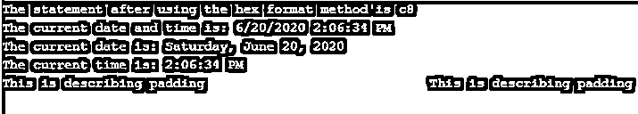

# C#字符串格式()

> 原文：<https://www.educba.com/c-sharp-string-format/>


## C#字符串格式介绍()

在 C#中，通过使用一种称为字符串格式方法的方法，可以将变量、表达式或对象的值插入到另一个字符串中。通过使用 string format 方法，指定字符串的格式项将被指定对象的字符串表示所替换。有几种类型的字符串格式方法，如日期时间格式方法，数字格式方法，自定义格式方法等。通过使用这些不同类型的格式方法，格式项可以由 C#编程语言中对象的相应表示来替换。

**语法:**

<small>网页开发、编程语言、软件测试&其他</small>

C#字符串格式方法的语法如下:

```
public string Format(string, object)
public string Format(string, object, object)
public string Format(IFormatProvider, string, object)
```

其中 format 方法的第一个语法用于将指定字符串的格式项替换为指定对象的字符串表示形式。format 方法的第二种语法用于将指定字符串的格式项替换为两个指定对象的字符串表示形式。format 方法的第三种语法用于将指定字符串的格式项替换为相应对象的字符串表示形式。

### C#字符串格式方法的功能

*   每当需要通过用不同对象的字符串表示替换字符串来格式化字符串时，我们就使用字符串格式化方法。
*   通过使用 string format 方法，可以用指定对象的字符串表示形式替换指定字符串的格式项。
*   通过使用 string format 方法，可以用两个指定对象的字符串表示形式替换指定字符串的格式项。
*   通过使用 string format 方法，可以用相应对象的字符串表示形式替换指定字符串的格式项。
*   有几种格式可以指定字符串的格式项。有数字格式，日期和时间格式，以及自定义格式。

### C#字符串格式的示例()

下面是一些例子:

#### 示例#1

C#程序演示了用两个以上的对象替换指定字符串的格式项的字符串格式方法:

**代码:**

```
using System;
//a namespace called program is defined
namespace program
{
//a class called check is defined
class check
{
//main method is called
static void Main(string[] args)
{
//a string variable is used to store the format items that needs to be replaced with the string representation of objects
string str = "{0} {1:0.0%}";
//string format method is used to replace the format items of the specified string with the string representation of objects
string res = string.Format(str, "India has a total power consumption of", 0.73);
Console.WriteLine("The statement after using the string format method is:");
Console.WriteLine("\n {0}",res);
Console.ReadLine();
}
}
}
```

**输出:**


在上面的程序中，创建了一个名为 program 的名称空间。然后创建一个名为 check 的类，在这个类中调用 main 方法。在 main 方法内部，定义了一个字符串变量来存储需要由对象的字符串表示替换的格式项。其中一个格式字符串用%符号指定，这意味着它将给定的值乘以 100 并给出乘积作为结果。因此，从输出中可以看出，当格式项为 0.0%时，我们获得了 73.0%。然后使用字符串格式方法将字符串的格式项替换为指定对象的字符串表示形式。

#### 实施例 2

演示字符串格式方法的 C#程序，该方法用十六进制表示形式替换指定整数值的格式项，并使用 DateTime 显示日期和时间格式。现在属性:

**代码:**

```
using System;
//a namespace called program is defined
namespace program
{
//a class called check is defined
class check
{
//main method is called
static void Main(string[] args)
{
//an integer variable is used to store the value
int value = 200;
//hexadecimal format method is used to replace the format items of the specified integer value with the hexadecimal representation of objects
Console.WriteLine("The statement after using the hex format method is {0:x}", value);
//DateTime.Now is used to obtain the current date and time by creating an instance of it
DateTimedt = DateTime.Now;
Console.WriteLine("The current date and time is: {0}", dt);
//By using date format which can display only the date, the current date is displayed
Console.WriteLine("The current date is: {0:D}", dt);
//By using time format which can display only the time, the current time is displayed
Console.WriteLine("The current time is: {0:T}", dt);
//a string variable is used to store the values for padding, here negative values indicate left alignment and positive values indicate right alignment
string hey = "{0,-40} {0,40}";
string res = string.Format(hey,"This is describing padding");
Console.WriteLine(res);
Console.ReadLine();
}
}
}
```

**输出:**




在上面的程序中，创建了一个名为 program 的名称空间。然后创建一个名为 check 的类，在这个类中调用 main 方法。在 main 方法中，定义了一个整数变量来存储需要转换为十六进制格式的整数。然后使用十六进制格式方法将格式项替换为对象的十六进制表示形式。然后是日期时间。Now 用于通过创建其实例来获取当前日期和时间。然后通过使用只能显示日期的日期格式，显示当前日期。然后通过使用只能显示时间的时间格式，显示当前时间。然后，使用一个字符串变量来存储填充值，其中负值表示左对齐，正值表示右对齐。输出如上面的快照所示。

### 推荐文章

这是一个 C#字符串格式的指南()。在这里，我们还讨论了 c#字符串格式方法的介绍和工作原理，以及不同的例子和它的代码实现。您也可以看看以下文章，了解更多信息–

1.  [C#字典](https://www.educba.com/c-sharp-dictionary/)
2.  [C#流写入器](https://www.educba.com/c-sharp-streamwriter/)
3.  [c#中的类型转换](https://www.educba.com/type-casting-in-c-sharp/)
4.  [DataReader C#](https://www.educba.com/datareader-c-sharp/)


