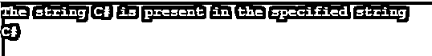

# C# String IndexOf()

> 原文：<https://www.educba.com/c-sharp-string-indexof/>


## C# String IndexOf()简介

在 C#中，用于从字符串的给定实例中查找给定字符或字符串的第一个匹配项的 string 方法称为 String Indexof()方法，如果要查找的字符或字符串不在字符串的给定实例中，并且要查找的字符或字符串的索引是使用此方法返回的整数，则此方法返回-1。

**语法:**

<small>网页开发、编程语言、软件测试&其他</small>

C# String IndexOf()方法的语法如下:

```
public intIndexOf (string string_name);
```

其中，字符串名称是要在给定的字符串实例中找到的字符或字符串。由于此方法返回字符串的给定实例的字符或字符串的索引，因此类型为 int。

### C#字符串 IndexOf()方法的工作原理

*   每当需要在给定的字符串实例中查找字符或字符串第一次出现的位置或索引时，我们就使用 String IndexOf()方法。
*   字符串的实例，其中要查找的字符或字符串的第一个匹配项的索引从零开始。
*   如果要在字符串的给定实例中找到的字符或字符串不在该字符串的给定实例中，则 String IndexOf()方法返回-1。

### C#字符串 IndexOf()的示例

下面是一些例子:

#### 示例#1

演示 String IndexOf()方法的 C#程序，用于从给定的字符串实例中查找第一个出现的字符或字符串:

**代码:**

```
using System;
//a class called check is called
class check
{
//main method is called
static void Main()
{
//a string variable is used to store the string from which the index of the letter e for all the occurrences must be found and the substring following the letter e must be printed
string str = "Welcome to C#";
//We are looping through all instances of the letter e in the given string
int j = 0;
while ((j = str.IndexOf('e', j)) != -1)
{
// we are using substring method to find out the substring starting from each occurrence of the letter e
Console.WriteLine(str.Substring(j));
// the index is incremented until the indexof method returns -1 and the loop ends
j++;
}
}
}
```

**输出:**


在上面的程序中，调用了一个名为 check 的类。然后调用 main 方法，在该方法中定义一个字符串变量来存储字符串，必须从该字符串中找到所有出现的字母 e 的索引，并且必须打印字母 e 后面的子字符串。在表达式 str 中。IndexOf(e，j)在上面的程序中，j 表示必须从其开始搜索字母 e 的出现的索引位置，并且只要在给定的字符串和 str 中不再出现字母 e，它就递增。IndexOf(e，j)表达式返回-1。substring(j)用于获取子字符串。

#### 实施例 2

演示 string IndexOf 方法的 C#程序，该方法在给定的字符串中查找字符串的匹配项，然后从指定为给定字符位置的索引位置开始打印给定字符串的子字符串:

**代码:**

```
using System;
//a class called check is defined
class check
{
//main method is called
static void Main()
{
// a string variable is used to store the string from which the specified string must be found
const string val = "Welcome to C#";
//Using IndexOf method to find the occurrence of the given string in the specified string
if (val.IndexOf("C#") != -1)
{
Console.WriteLine("The string C# is present in the specified string");
}
//IndexOf method is used again to find the index of the first occurrence of the letter C and substring method is used to print the substring followed by the first occurrence of the letter C
int j = val.IndexOf("C");
Console.WriteLine(val.Substring(j));
}
}
```

**输出:**




在上面的程序中，创建了一个名为 check 的名称空间。然后调用 main 方法，在该方法中定义一个字符串变量来存储要从中找到指定字符串的第一个匹配项的字符串。然后使用 IndexOf 方法在指定字符串中查找给定字符串的匹配项。然后再次使用 IndexOf 方法查找字母 C 第一次出现的索引，使用 substring 方法打印第一次出现的字母 C 后面的子字符串。

#### 实施例 3

演示 String IndexOf()方法的 C#程序，用于从给定的字符串实例中查找第一个出现的字符或字符串:

**代码:**

```
using System;
//a class called check is defined
class check
{
//main method is called
static void Main()
{
// a string variable is used to store the string from which the specified string must be found
const string val = "12,34";
//Using IndexOf method to find the occurrence of the given string in the specified string
if (val.IndexOf(",") != -1)
{
Console.WriteLine("The character , is present in the specified string");
}
}
}
```

**输出:**


在上面的程序中，调用了一个名为 check 的类。然后调用 main 方法，在该方法中使用一个字符串变量来存储必须从中找到指定字符串的字符串。然后使用 IndexOf 方法在指定字符串中查找给定字符串的匹配项。

### 推荐文章

这是一个 C#字符串 IndexOf()的指南。在这里，我们还讨论了 c#字符串 indexof()的介绍和工作原理，以及不同的例子和它的代码实现。您也可以看看以下文章，了解更多信息–

1.  [C#字符串函数](https://www.educba.com/c-sharp-string-functions/)
2.  [C#系统。IO](https://www.educba.com/c-sharp-system-dot-io/)
3.  [C#数据网格视图](https://www.educba.com/c-sharp-data-grid-view/)
4.  [C#排序集](https://www.educba.com/c-sharp-sortedset/)


