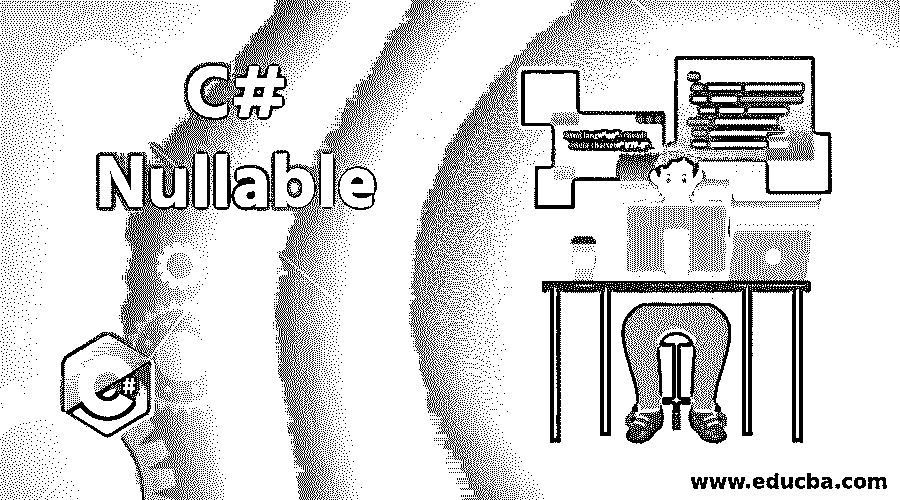

# C#可空

> 原文：<https://www.educba.com/c-sharp-nullable/>




## C#可空简介

在 C#中，变量不能被赋予空值，因此为了克服这一点，C#提供了一个特殊的功能，它将空值赋予一个称为可空类型的变量，并且它不适用于引用类型，因为空值已经存在，它仅适用于可空类型，即 System 的实例。可空的 <t>struct，其中 T 表示不可空的值类型，如布尔类型、整数类型、浮点类型等。</t>

**语法:**

<small>网页开发、编程语言、软件测试&其他</small>

```
Nullable<data_type> variable_name = null;
```

上面的语法表示 C#中可空的数据类型。关键字 nullable 表示可为 null 的类型，它是 System 的一个实例。可空的 <t>struct，其中 T 表示不可空的值类型，如布尔类型、整数类型、浮点类型等。数据类型表示变量的数据类型，其中 variable_name 表示变量的名称，并为其赋一个空值。</t>

这个语法还有一个捷径，它包括。运算符以及数据类型，如下所述:

```
data_type? variable_name = null;
```

上面的语法表示 C#中可空的数据类型。那个？标记符号表示可空类型。数据类型表示变量的数据类型，其中 variable_name 表示变量的名称，并为其赋一个空值。

### C#中可空类型的特征

*   不能直接访问可空类型的值。GetValueOrDefault()方法用于提取未赋值为 null 的赋值，如果为 null，则返回默认值，即零。
*   可以使用可空类型将空值赋给变量，而无需基于引用类型创建可空类型。
*   可以将值赋给可空类型。
*   Nullable HasValue 和 Nullable 可用于检查值。如果为对象赋值，则返回 true，如果为对象赋值，则返回 false。如果没有给对象赋值，将引发编译时错误。
*   ==还有！运算符可以用于可空类型。
*   如果将 null 赋给可空类型，GetValueOrDefault(T)方法将给出赋值或默认值。
*   零合并运算符(？?)也可用于为可空类型的值赋值。
*   可空类型不支持嵌套的可空类型。
*   可空类型不支持 var 类型。如果 nullable 与 var 一起使用，编译器会给出编译时错误。

### C#中可空类型的优势

*   可空类型用于数据库应用程序中。如果数据库中的列需要空值，可以使用可空类型为该列分配空值。
*   未定义的值可以用可空类型来表示。
*   可以使用可空类型而不是引用类型来存储空值。

### 可空助手类

null 的值小于任何值；因此比较运算符不能与 null 一起使用，所以我们使用可为 null 的静态类。它被视为可空类型的帮助器类。可为 null 的静态类提供了 GetUnderlyingType 方法。此方法返回可空类型的类型参数。

### 在 C#中使用可空类型

原始数据类型是值类型，例如数字。值类型存储在堆栈中，并由。NET framework，即使它们在定义时没有显式初始化。例如，缺省情况下，整数值被初始化为零；默认情况下，布尔值被初始化为 false，依此类推。同样，所有值类型都表示默认值。它们都不能表示在数据库应用程序中非常突出的空值，并且表示空值在这样的应用程序中非常重要。选择用来表示空值的任何值都可能不在该值的数据类型所允许的值范围内。例如，如果我们选择-1 来表示值类型的 null，则-1 可能不是该数据类型允许的值。还应该确保如果选择某个值来表示应用程序中的空值，则该值不能在应用程序中的其他地方用于任何其他目的。为了解决这个问题，C# 2.0 提供了可空类型。系统的结构。可空如下，可用于定义可空类型:

**代码:**

```
namespace System
{
public struct Nullable : System.IComparable, System.INullableValue
{
public Nullable(T value);
public static explicit operator T(T? value);
public static implicit operator T?(T value);
public T Value { get; }
public bool HasValue { get; }
public T GetValueOrDefault();
}
}
```

这里 T 代表值类型，结构接受一个参数。通过使用语法，可以将任何值定义为可空类型。

**语法:**

```
System.Nullable<data_type> variable_name = null;
```

### C#可空的示例

下面是 C#可空的例子。

#### 示例#1

C#程序演示当变量没有赋值时的可空类型

**代码:**

```
using System;
public class Geeks {
//Defining Main Method
public static void Main(string[] args)
{
// Nullable type is defined
Nullable<int> a = null;
// We use the method GetValueOrDefault(), the default value is 0
Console.WriteLine(a.GetValueOrDefault());
// Nullable type is defined
int? b = null;
//We use the method GetValueOrDefault(), the default value is 0
Console.WriteLine(b.GetValueOrDefault());
// non-nullable is defined using nullable type syntax
int? a1 = 200;
// We use the method GetValueOrDefault(), the default value is 0 but the value that is assigned to the variable is returned
Console.WriteLine(a1.GetValueOrDefault());
// non-nullable is defined using nullable type syntax
Nullable<int> b1 = 10;
//  We use the method GetValueOrDefault(), the default value is 0 but the value that is assigned to the variable is returned
Console.WriteLine(b1.GetValueOrDefault());
}
}
```

上面代码的输出显示在下面的快照中:

**输出:**


#### 示例 2

C#程序使用可空类型来说明可空的使用。HasValue 方法。

**代码:**

```
using System;
public class GFG {
//Defining Main Method
public static void Main()
{
// defining the variable m as a nullable type
Nullable<int> m = 100;
// the value of the variable m is checked
Console.WriteLine(m.HasValue);
// defining the variable n as a nullable type and assigned a value to it
Nullable<int> n = null;
// check the value of object
Console.WriteLine(n.HasValue);
}
}
```

上面代码的输出显示在下面的快照中:

**输出:**


### 结论

在本教程中，我们通过定义理解了 C#中可空类型的概念，然后理解了 C#中可空类型的工作原理。然后我们理解了使用可空类型的不同 C#程序，以及它们如何处理包含在程序结果中的输出快照。

### 推荐文章

这是一个 C#可空的指南。这里我们讨论 C#中可空类型的引入和工作，以及不同的例子和它的代码实现。您也可以看看以下文章，了解更多信息–

1.  [克隆 C#中的()](https://www.educba.com/clone-in-c-sharp/)
2.  [C#字典](https://www.educba.com/c-sharp-dictionary/)
3.  [DataReader C#](https://www.educba.com/datareader-c-sharp/)
4.  [C#流写入器](https://www.educba.com/c-sharp-streamwriter/)


