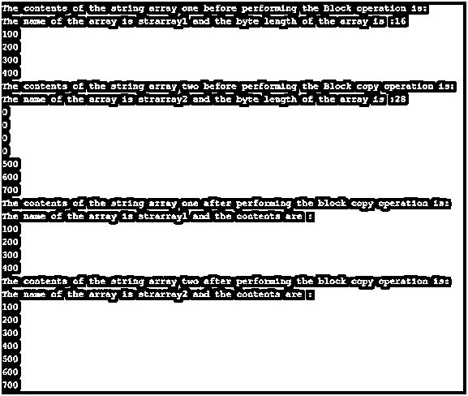

# C#缓冲区

> 原文：<https://www.educba.com/c-sharp-buffer/>


## C#缓冲区简介

buffer 这个词的意思是直接作用于内存的东西，在 C#中，操作非托管的、以字节数组表示的内存的过程称为缓冲。C#中的 buffer 类的成员是 BlockCopy()，它将一个数组中从给定位置开始的字节复制到另一个数组中从给定位置开始的字节，ByteLength()使用它可以获得数组中的总字节数，GetByte()使用它可以获得给定位置的字节，SetByte()使用它可以设置数组中给定位置的字节。

**语法:**

<small>网页开发、编程语言、软件测试&其他</small>

```
Buffer.Buffer_member_name(parameters);
```

其中，缓冲区成员名称是缓冲区类的成员名称，并且

参数是传递给它的参数。

### 使用 C#缓冲区

*   每当需要直接在内存上工作时，更具体地说，如果我们想要操作非托管的内存，它是以字节数组表示的形式，我们就使用 C#中的缓冲区。
*   Buffer 类由几个缓冲区成员组成，它们是 GetByte()、SetByte()、BlockCopy()和 ByteLength()。
*   GetByte()是 Buffer 类的一个缓冲区成员，使用它可以获得给定位置的一个字节。
*   SetByte()是 Buffer 类的缓冲区成员，使用它可以在数组中的给定位置设置字节。
*   BlockCopy()是一个缓冲区成员，它将一个数组中从给定位置开始的字节复制到另一个数组中从给定位置开始的字节。
*   ByteLength()是一个缓冲区成员，使用它可以获得数组中的总字节数。

### C#缓冲区类的成员

Buffer 类有四个成员。它们是:

#### 1\. BlockCopy()

BlockCopy()是一个缓冲区成员，它将一个数组中从给定位置开始的字节复制到另一个数组中从给定位置开始的字节。

#### 2.字节长度()

ByteLength()是一个缓冲区成员，使用它可以获得数组中的总字节数。

下面是一个例子:

演示类 ByteCopy()和 ByteLength()成员的缓冲区成员的 C#程序，用于将字节从一个从给定位置开始的数组复制到另一个从给定位置开始的数组:

**代码:**

```
using System;
//a class called program is defined
public class program
{
//main method is called
public static void Main(string[] args)
{
//an integer array is defined to store 4 integers
int[] strarray1 = new int[4] { 100, 200, 300, 400 };
//another integer array is defined to store 7 integers
int[] strarray2 = new int[7] { 0,0,0,0,500,600,700 };
Console.Write("The contents of the string array one before performing the Block operation is:\n");
//Bytelength() member of buffer class is used to find the bytelength of th given array
Console.Write("The name of the array is strarray1 and the byte length of the array is :{0}\n", Buffer.ByteLength(strarray1));
for (int j = 0; j < strarray1.Length; j++)
{
Console.Write(strarray1[j]);
Console.Write("\n");
}
Console.Write("The contents of the string array two before performing the Block copy operation is:\n");
Console.Write("The name of the array is strarray2 and the byte length of the array is :{0}\n", Buffer.ByteLength(strarray2));
for (int a = 0; a < strarray2.Length; a++)
{
Console.Write(strarray2[a]);
Console.Write("\n");
}
//Blockcopy() member of buffer class is used to copy the contents of one array starting from the location specified by the second parameter to another array starting from the location specified by fourth parameter and last parameter signifies the bytelength of the first array
Buffer.BlockCopy(strarray1, 0, strarray2, 0,Buffer.ByteLength(strarray1));
Console.Write("The contents of the string array one after performing the block copy operation is:\n");
Console.Write("The name of the array is strarray1 and the contents are :\n");
for (int b = 0; b < strarray1.Length; b++)
{
Console.Write(strarray1[b]);
Console.Write("\n");
}
Console.Write("The contents of the string array two after performing the block copy operation is:\n");
Console.Write("The name of the array is strarray2 and the contents are :\n");
for (int d = 0; d < strarray2.Length; d++) {
Console.Write(strarray2[d]);
Console.Write("\n");
}
}
}
```

**输出:**




**说明:**在上面的程序中，定义了一个名为 program 的类。然后调用 main 方法，其中定义了两个不同大小的整数数组来存储整数。使用 Buffer 类的 byte length 成员显示第一个数组的内容和第一个数组的字节长度。然后显示第二个数组的内容，并使用 Buffer 类的 byte length 成员显示第二个数组的字节长度。然后使用 buffer 类的 Blockcopy()成员将一个数组的内容从第二个参数指定的位置复制到另一个数组，从第四个参数指定的位置开始，最后一个参数表示第一个数组的字节长度。然后显示块复制操作后第一个数组的内容。然后显示块复制操作后第二个数组的内容。

#### 3.设置字节()

SetByte()是 Buffer 类的缓冲区成员，使用它可以在数组中的给定位置设置字节。

#### 4.位元组()

GetByte()是 Buffer 类的一个缓冲区成员，使用它可以获得给定位置的一个字节。

下面是一个例子:

演示类 SetByte()和 GetByte()成员的缓冲区成员的 C#程序:

**代码:**

```
using System;
//a class called check is defined
class check
{
//main method is called
static void Main()
{
//an inetger array is used to store the integers whose byte values are obtained by using GetByte member of buffer class
int[] arrayname = { 0, 1, 512 };
for (inti = 0; i<Buffer.ByteLength(arrayname); i++)
{
Console.WriteLine(Buffer.GetByte(arrayname, i));
}
// SetByte member of buffer class is used to set the byte values of the array
Buffer.SetByte(arrayname, 0, 10);
Buffer.SetByte(arrayname, 4, 20);
Buffer.SetByte(arrayname, 8, 30);
// The modified array after using SetByte member of the Buffer class is displayed
Console.WriteLine("The modified array after using SetByte member of the Buffer class is:");
for (inti = 0; i<Buffer.ByteLength(arrayname); i++)
{
Console.WriteLine(Buffer.GetByte(arrayname, i));
}
}
}
```

**输出:**


**说明**:在上面的程序中，定义了一个名为 check 的类。然后调用 main 方法，在该方法中使用一个整数数组来存储整数，这些整数的字节值是通过使用 buffer 类的 GetByte 成员获得的。然后使用 buffer 类的 SetByte 成员来设置数组的字节值。然后显示使用 Buffer 类的 SetByte 成员后修改的数组。输出显示在上面的快照中。

### 结论

在本教程中，我们通过编程示例及其输出，从定义、语法、工作以及 buffer 类的成员来理解 C#中的 Buffer 概念。

### 推荐文章

这是一个 C#缓冲区的指南。在这里，我们将讨论 C# Buffer 的介绍，以及它的工作原理、示例和代码实现。您也可以浏览我们推荐的其他文章，了解更多信息——

1.  [c#中的随机数生成器是什么？](https://www.educba.com/random-number-generator-in-sharp/)
2.  [Java | Working | Applications 中的静态构造函数](https://www.educba.com/static-constructor-in-java/)
3.  [c#中的 text writer |示例](https://www.educba.com/textwriter-in-c-sharp/)
4.  如何在 C#中使用静态构造函数？


