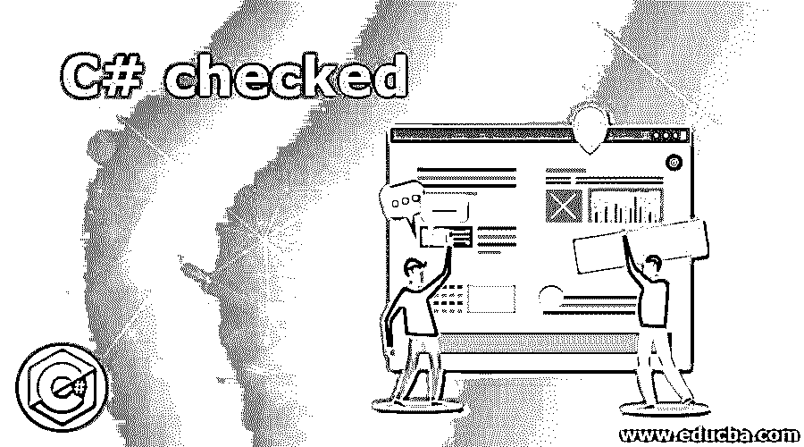
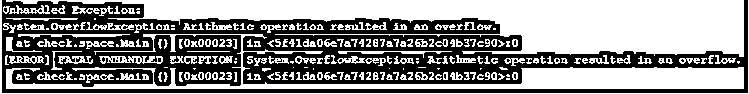
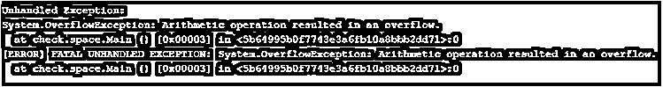
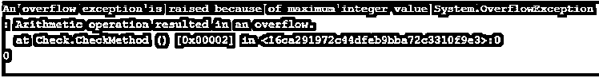

# C#已检查

> 原文：<https://www.educba.com/c-sharp-checked/>




## C#入门已检查

要显式检查算术中整数类型运算和转换的溢出，必须对算术中的整数类型运算和转换启用溢出检查，这可以通过在 C#中使用名为 checked keyword 的关键字以及在 C#中对表达式使用 checked keyword 来实现，在运行时检查常量表达式是否溢出，如果有溢出， 溢出异常由编译器引发，尽管使用了 checked 关键字和 overflow，但在运行时不会检查非常数表达式的溢出，在这种情况下不会引发异常。

**被检查关键字 C#的语法如下:**

<small>网页开发、编程语言、软件测试&其他</small>

```
checked(Expression)
```

### C#中 checked 关键字的处理

*   每当溢出一个数字时，该数字的值就变得无效。因此，不会引发任何异常。
*   对于每当数字溢出时抛出的异常，我们使用关键字 checked。
*   每当 checked 关键字用于值溢出的表达式时，都会引发异常。
*   由于溢出值会引发异常，因此可以通过捕捉异常来避免错误。因此，最终程序的质量会很好。
*   考虑下面的程序来演示 checked 关键字在 C#程序中的用法:

**代码:**

```
//a namespace called check is defined
namespace check
{
//a class called space is defined
public class space
{
//main method is called
public static void Main()
{
// Using checked keyword to check if the value is over flowing
checked
{
// Increasing the value upto the value of maximum
int number = 0;
for (int x = 0; x < int.MaxValue; x++)
{
number++;
}
// Increasing the value upto the value of maximum again (error).
for (int x = 0; x < int.MaxValue; x++)
{
number++;
}
}
}
}
}
```

**输出:**




在上面的程序中，定义了一个名为 check 的名称空间。然后定义了一个叫做空间的类。然后调用 main 方法。然后，我们使用 checked 关键字通过将值增加到最大值来检查该值是否溢出。如果我们在上面的程序中没有使用 checked 关键字，就不会抛出异常。因为我们在程序中使用了 checked 关键字，所以会抛出一个异常，如输出快照所示。程序中的 checked 关键字可以通过选择编译器中的选项“/checked”来激活。当变量编号每次递增 1，达到内存位置无法容纳的整数的最大值时，会引发溢出异常。通过使用特殊的中间指令，在运行时引发溢出异常。

### C#检查的示例

下面举几个例子

#### 示例#1

C#程序演示了如何使用 checked 关键字来抛出异常。

**代码:**

```
using System;
//a namespace called check is defined
namespace check
{
//a class called space is defined
public class space
{
//main method is called
public static void Main()
{
// Using checked keyword to check if the value is over flowing
checked
{
int twenty = 20;
int j = 2147483647 + twenty;
Console.WriteLine(j);
}
}
}
}
```

**输出:**




在上面的程序中，定义了一个名为 check 的名称空间。然后定义了一个叫做空间的类。然后调用 main 方法。然后，我们使用 checked 关键字检查该值是否溢出，方法是将值 20 赋给变量 20，然后将其与整数的最大值相加，这样就会引发异常。如果我们在上面的程序中没有使用 checked 关键字，就不会抛出异常。因为我们在程序中使用了 checked 关键字，所以会抛出一个异常，如输出快照所示。程序中的 checked 关键字可以通过选择编译器中的选项“/checked”来激活。当变量 twenty 的值被加到不适合存储单元的整数的最大值时，引发溢出异常。通过使用特殊的中间指令，在运行时引发溢出异常。

#### 实施例 2

C#程序演示了如何使用 checked 关键字来抛出异常。

**代码:**

```
using System;
//a class called check is defined
public class Check
{
//the maximum value of integer is assigned to a variable
static int maxInt = 2147483647;
//main method is called
public static void Main()
{
Console.WriteLine(CheckMethod());
}
static int CheckMethod()
{
int y = 0;
try
{
y = checked (maxInt + 1);
}
catch (System.OverflowException e)
{
Console.WriteLine("An overflow exception is raised because of maximum integer value " + e.ToString());
}
return y;
}
}
```

**输出:**




在上面的程序中，定义了一个名为 Check 的类。然后将整数的最大值赋给变量 maxInt。然后调用 main 方法。然后，我们调用 check 方法函数，在该函数中，我们使用了 try-catch 块，该块由检查的关键字用法组成，用于将整数的最大值加 1，catch 块由我们希望显示的异常语句组成。如果我们在上面的程序中没有使用 checked 关键字，就不会抛出异常。因为我们在程序中使用了 checked 关键字，所以会抛出一个异常，如输出快照所示。程序中的 checked 关键字可以通过选择编译器中的选项“/checked”来激活。当变量 twenty 的值被加到不适合存储单元的整数的最大值时，引发溢出异常。通过使用特殊的中间指令，在运行时引发溢出异常。

### 结论

在本教程中，我们通过定义了解了 C#中 checked 关键字的概念，C#中 checked 关键字的语法，通过示例了解了 C#中 checked 关键字的工作原理及其输出。

### 推荐文章

这是一个 C#检查指南。在这里，我们讨论了 C#中 checked 关键字的工作方式，并举例说明，以便更好地理解。您也可以阅读以下文章，了解更多信息——

1.  [c#中的 binary writer](https://www.educba.com/binarywriter-in-c-sharp/)
2.  [C#创建 JSON 对象](https://www.educba.com/c-sharp-create-json-object/)
3.  [C#委托人](https://www.educba.com/c-sharp-delegates/)
4.  [C#可空](https://www.educba.com/c-sharp-nullable/)


