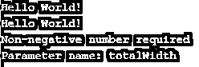
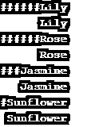

# C# String PadLeft

> 原文：<https://www.educba.com/c-sharp-string-padleft/>


## C#字符串 PadLeft 方法简介

填充只是在字符串的开头或结尾插入一个空格或任何 Unicode 字符。在字符串的开头插入空格或 Unicode 字符称为从左边填充字符串。C#提供了一个名为 PadLeft()的方法来实现这一点。

String 类包含 PadLeft()方法的两种重载形式:

<small>网页开发、编程语言、软件测试&其他</small>

*   字符串。PadLeft(Int32，Char)
*   字符串。PadLeft(Int32)

由于字符串在本质上是不可变的，PadLeft()方法在将指定的字符添加到其左侧后返回一个新的字符串，而不是将字符添加到现有的字符串中。

**语法:**

字符串的语法。PadLeft()方法的两种重载形式如下:

```
public string PadLeft(int totalLength, char paddingChar);
```

**说明:**

上述语法中的 PadLeft()方法有两个参数；第一个是一个整数，它指定在原始字符串的左侧添加指定的字符后，此方法将返回的字符串的长度。第二个参数用于指定将用于填充的 Unicode 字符。

```
public string PadLeft(int totalLength);
```

**说明:**

上述语法中的 PadLeft()方法只接受一个参数，该参数是一个整数，用于指定在原始字符串的左侧添加空格后得到的字符串的长度。以上两种重载形式的 PadLeft()方法都返回一个字符串值，其长度等于参数中指定的长度。

### C#中 String PadLeft()方法如何工作？

在 C#中,“System”命名空间包含一个名为 String 的类，用于处理字符串操作，并提供一系列方法来对字符串执行不同的操作。字符串就是这样一种方法。PadLeft()方法。此方法用于将指定的字符添加到开头，即字符串的左边，然后返回指定长度的新字符串。

因此，字符串。PadLeft()方法将字符串向右移动。

**举例:**

```
string str = "Hello";
string resultedString = str.PadLeft(8, '@');
```

现在让我们借助上面的例子来理解左填充的概念。这里，我们通过将结果字符串的总长度作为“8”和一个填充字符(即“@”)进行传递，对字符串(str)应用了左填充。这里，原始字符串(即“Hello ”)的长度是 5，我们需要结果字符串的长度为 8。因此，结果字符串的左边将添加三个“@”字符，使得总长度(原始字符串的长度加上结果字符串中的填充字符数)等于使用整数参数传递给方法的长度。

如果用户没有在方法中指定任何 Unicode 填充字符，那么默认情况下，空格将被添加到原始字符串的左侧，其方式与 Unicode 填充字符(如果指定的话)的添加方式相同。现在，如果用户指定结果字符串的总长度小于原始字符串的长度，那么该方法将返回对现有实例的引用。

同样，如果用户指定结果字符串的总长度等于原始字符串的长度，则该方法将返回与现有字符串相同的新字符串。由于字符串本质上是不可变的，PadLeft()方法的两种重载形式都会在原始字符串的左侧填充指定字符后返回一个新字符串。字符串。如果指定的总长度小于零，PadLeft()方法将返回 ArgumentOutOfRangeException。

### 实现 C#字符串 PadLeft 方法的示例

下面是 C#字符串 PadLeft 方法的例子:

#### 示例#1

显示 PadLeft()方法基本功能的示例。

**代码:**

```
using System;
using System.Text;
namespace ConsoleApp4
{
public class Program
{
public static void Main(string[] args)
{
string str = "Hello World!";
try
{
//making the length of the string 15
//by adding 3 '@' characters at the beginning of the string
string resultedStringWithChar = str.PadLeft(15, '@');
Console.WriteLine(resultedStringWithChar);
//making the length of the string 15
//by adding 3 white spaces at the beginning of the string
string resultedStringWithoutChar = str.PadLeft(15);
Console.WriteLine(resultedStringWithoutChar);
Console.ReadLine();
}
catch(Exception ex)
{
Console.WriteLine(ex.Message);
}
}
}
}
```

**输出:**


我们可以在输出中看到，为了使结果字符串的长度达到 15，在结果字符串中添加了三个“@”字符。同样的，当我们用绳子。第二次 PadLeft()方法时，我们没有指定任何字符。因此，结果字符串中添加了三个空格。

#### 实施例 2

显示所需结果字符串的总长度小于或等于原始字符串的长度且总长度小于零的情况的示例。

**代码:**

```
using System;
using System.Text;
namespace ConsoleApp4
{
public class Program
{
public static void Main(string[] args)
{
string str = "Hello World!";
try
{
//providing total length as 12
//which is equal to the length of the original string
string resultedStringWithChar = str.PadLeft(12, '@');
Console.WriteLine(resultedStringWithChar);
//providing total length as 10
//which is less than the length of the original string
string resultedStringWithoutChar = str.PadLeft(10);
Console.WriteLine(resultedStringWithoutChar);
resultedStringWithoutChar = str.PadLeft(-1);
Console.WriteLine(resultedStringWithoutChar);
Console.ReadLine();
}
catch (Exception ex)
{
Console.WriteLine(ex.Message);
Console.ReadLine();
}
}
}
}
```

**输出:**




#### 实施例 3

对数组中的多个字符串应用 PadLeft()方法的示例。

**代码:**

```
using System;
using System.Text;
namespace ConsoleApp4
{
public class Program
{
public static void Main(string[] args)
{
string[] strArray = { "Lily", "Rose", "Jasmine", "Sunflower" };
char paddingChar = '#';
try
{
//accessing each string of the array
//using 'foreach' loop
foreach (string str in strArray)
{
//adding '#' at the start of each string
Console.WriteLine(str.PadLeft(10, paddingChar));
//using PadLeft() method without specifying
//any padding character
Console.WriteLine(str.PadLeft(10));
}
Console.ReadLine();
}
catch (Exception ex)
{
Console.WriteLine(ex.Message);
Console.ReadLine();
}
}
}
}
```

**输出:**




### 结论

在 C#中，字符串。PadLeft()方法用于在字符串的开头添加指定的字符或空格，或者我们可以说是在字符串的左边，以获得所需的字符串长度。此方法位于“System”命名空间下，有两种重载形式。

### 推荐文章

这是一个 C#字符串 PadLeft 的指南。在这里，我们讨论 C#字符串 PadLeft 及其代码实现的例子的简要概述。您也可以浏览我们推荐的其他文章，了解更多信息——

1.  [C#委托人](https://www.educba.com/c-sharp-delegates/)
2.  [在 C#中断言](https://www.educba.com/assert-in-c-sharp/)
3.  [C#流写入器](https://www.educba.com/c-sharp-streamwriter/)
4.  [DataReader C#](https://www.educba.com/datareader-c-sharp/)


