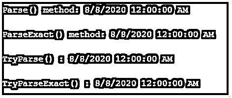

# 字符串到日期 C#

> 原文：<https://www.educba.com/string-to-date-c-sharp/>


## 迄今为止的字符串介绍 C#

在 C#中，可以使用结构 DateTime 提供的一些解析方法，将日期和时间的字符串表示形式转换为等效的 DateTime 对象。这些方法需要转换日期的字符串表示形式，除此之外，我们还可以指定特定于区域性的格式信息。

下面给出了一些方法:

<small>网页开发、编程语言、软件测试&其他</small>

*   datetime 日期时间。语法分析()
*   DateTime.ParseExact()
*   日期时间。TryParse()
*   日期时间。TryParseExact

使用这些方法时，我们必须确保传递给方法的字符串不为 null 或空，并且该字符串是预期日期和时间的有效表示。

### 每种解析方法的语法

下面给出了每种解析方法的语法:

```
public static DateTimeParse(string str);
```

这里，Parse()方法接受一个字符串参数，它是要转换的日期和时间的字符串表示。它返回 DateTime 对象，相当于 str *表示的日期和时间。*

```
public static DateTimeParseExact(string str, string strFormat, IFormatProviderformatProvider);
```

这里，向方法传递了三个参数，其中 str 是要转换的日期和时间的字符串表示形式，strFormat 指定 str 所需的格式，formatProvider 为 str 提供特定于区域性的格式信息。它返回 DateTime 对象，相当于用 str 表示的日期和时间。

```
public static bool TryParse(string str, out DateTimeresult);
```

这里，str 是要转换的日期和时间的字符串表示，结果值将存储在变量 result 中。如果转换成功，此方法将返回 true，否则将返回 false。

```
public static bool TryParseExact(string str, string[] strFormats, IFormatProviderformatProvider,
DateTimeStylesstyle, out DateTimeresult);
```

这里，str 是要转换的日期和时间的字符串表示形式，strFormats 是 str 的指定格式的数组，formatProvider 提供有关 str 的特定于区域性的格式信息，style 用于指定格式选项，结果值将存储在变量 result 中。如果转换成功，此方法将返回 true，否则将返回 false。

### C#中如何将字符串转换成日期？

在 C#中，有许多方法可以将字符串转换为日期。要转换的字符串必须是日期和时间的有效表示形式，并且不能为 null 或空。成功转换后，这些方法返回一个 DateTime 对象。

迄今为止用于解析字符串的方法如下:

*   日期时间。Parse(字符串)；
    日期时间。Parse(string，iformat provider)；
    日期时间。Parse(string，IFormatProvider，datetime styles)；

以上三种方法都是 Parse()方法的重载形式。它们都返回一个系统。成功转换时的 DateTime 对象。

**举例:**

```
CultureInfo provider = newCultureInfo("en-US");
DateTime date = DateTime.Parse("08/08/2020", provider,
DateTimeStyles.AdjustToUniversal);
```

在上面的语句中，我们首先创建了一个 CultureInfo 类的对象，它实现了 IFormatProvider。然后，我们使用 Parse()方法转换日期的字符串表示，方法是传递要转换的字符串、我们之前创建的 IFormatProvider (provider)的对象，并传递 enumDateTimeStyles 的值。

现在，此方法将使用提供的特定于区域性的格式信息并通过应用给定的 DateTimeStyles 值，将输入字符串转换为等效的 DateTime 对象。成功转换后，产生的日期时间对象将存储在变量“date”中。

*   DateTime.ParseExact(string, string, IFormatProvider);
    DateTime.ParseExact(string, string, IFormatProvider, DateTimeStyles);
    DateTime.ParseExact(string, string[], IFormatProvider, DateTimeStyles);

以上三种方法都是 ParseExact()方法的重载形式。它们都返回一个系统。成功转换时的 DateTime 对象。

**举例:**

```
string[] dateFormats = new[] { "yyyy/MM/dd", "MM/dd/yyyy",
"MM/dd/yyyyHH:mm:ss"};
CultureInfo provider = newCultureInfo("en-US");
DateTime date = DateTime.ParseExact("08/08/2020", dateFormats, provider,
DateTimeStyles.AdjustToUniversal);
```

在上面的语句中，我们首先创建了一个定义一些日期格式的字符串数组，然后创建了一个 CultureInfo 类的对象，最后调用了 ParseExact()方法，方法是传递要转换为 date 的字符串、用于检查可用日期格式的字符串数组、我们之前创建的 CultureInfo 类的对象以及来自 DateTimeStylesenum 的值。

传递给此方法的日期的字符串表示形式应该与字符串数组中包含的任何指定格式完全匹配。

*   DateTimeTryParse(string, out DateTime);
    DateTime.TryParse(string, IFormatProvider, DateTimeStyles, out DateTime);

该方法中的参数类型与我们之前看到的相同。此方法使用特定于区域性的格式信息和传递给它的样式将输入字符串转换为其等效的 DateTime 对象，如果转换成功，则返回 true，否则返回 false。产生的日期时间值将存储在此方法的“out”参数中。

*   DateTime.TryParseExact(string, string[], IFormatProvider, DateTimeStyles, out DateTime);
    DateTime.TryParseExact(string, string, IFormatProvider, DateTimeStyles, out DateTime);

该方法中的第二个参数用于指定日期格式。要转换的输入字符串应该与这个日期格式完全匹配。此方法使用提供的特定于区域性的格式信息和样式将输入字符串转换为日期。此方法在成功转换时返回 true，否则返回 false。此方法的结果日期时间值存储在“out”参数中。

### 迄今为止的字符串示例 C#

下面是提到的例子:

**代码:**

```
using System;
usingSystem.Globalization;
publicclassProgram
{
publicstaticvoidMain()
{
DateTime date;
string[] dateFormats = new[] { "yyyy/MM/dd", "MM/dd/yyyy",
"MM/dd/yyyyHH:mm:ss"};
CultureInfo provider = newCultureInfo("en-US");
try
{
//Parse()
date = DateTime.Parse("08/08/2020");
Console.WriteLine("\nParse() method: " + date);
//ParseExact()
date = DateTime.ParseExact("08/08/2020", dateFormats, provider,
DateTimeStyles.AdjustToUniversal);
Console.WriteLine("\nParseExact() method: " + date);
}
catch (Exception ex)
{
Console.Write(ex.Message);
Console.ReadLine();
}
//TryParse()
if (DateTime.TryParse("08/08/2020", out date))
{
Console.WriteLine("\nTryParse() : " + date);
}
else
{
Console.WriteLine("Conversion failed");
}
//TryParseExact()
if (DateTime.TryParseExact("08/08/2020", dateFormats, provider,
DateTimeStyles.AdjustToUniversal, out date))
{
Console.WriteLine("\nTryParseExact() : " + date);
}
else
{
Console.WriteLine("Conversion failed");
}
Console.ReadLine();
}
}
```

**输出:**




### 结论

在 C#中，可以使用 DateTime struct 提供的解析方法将字符串转换为 DateTime 对象。除了这些方法，我们还可以使用 convert 将字符串转换为日期。To DateTime()方法，该方法将日期的字符串表示形式作为输入，并返回其等效的 DateTime 对象。

### 推荐文章

这是一个指导字符串到日期的 C#。这里我们结合编程实例讨论如何在 C#中将字符串转换为日期。您也可以看看以下文章，了解更多信息–

1.  [C#流写入器](https://www.educba.com/c-sharp-streamwriter/)
2.  [DataReader C#](https://www.educba.com/datareader-c-sharp/)
3.  [IEnumerable C#](https://www.educba.com/ienumerable-c-sharp/)
4.  [C#系统。IO](https://www.educba.com/c-sharp-system-dot-io/)


