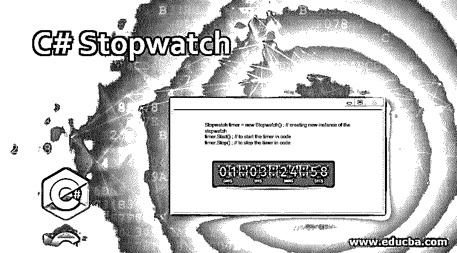

# C#秒表

> 原文：<https://www.educba.com/c-sharp-stopwatch/>




## C#秒表简介

C#中的秒表类用于计算一个函数执行所花费的时间，或者我们可以说是测量经过的时间。这是 C#最重要的特性之一。通过在代码中添加小书签，秒表在代码优化中非常有用，而在 C#中使用秒表，我们需要添加 System。诊断库。此外，用户可以对代码性能进行持续监控。在秒表的帮助下，如果计算机的操作系统支持高分辨率计数器的性能，用户可以获得准确的时间测量。

让我们看看在 C#中使用秒表的语法:

<small>网页开发、编程语言、软件测试&其他</small>

```
Stopwatch timer = new Stopwatch() ; // creating new instance of the stopwatch
timer.Start() ; // to start the timer in code
timer.Stop() ; // to stop the timer in code
```

以上三个步骤是实现秒表所必需的。

### C#秒表示例

现在我们将通过编程示例来看看秒表在 C#中是如何工作的。

#### 示例#1

**代码:**

```
using System ;
using System.Diagnostics ; // to use Stopwatch feature
using System.Threading ; // to perform multiple operations
class Demo_Stopwatch // Demo class for implementing the Stopwatch functionality
{
static void Main()
{
Stopwatch stopw = new Stopwatch() ;
stopw.Start() ;
for ( int i = 0 ; i < 100 ; i++ )
{
Thread.Sleep(2) ;
}
stopw.Stop() ;
Console.WriteLine( " Time elapsed: {0} " , stopw.Elapsed ) ;
}
}
```

**输出:**


正如你在上面的代码中看到的，我们正在使用 System。诊断库，以便我们可以在程序中实现秒表功能。最初，我们创建了一个名为“Demo_Stopwatch”的类。在这个类中，我们创建了一个名为“stopw”的新秒表。为了启动秒表计时器，我们使用 start()函数。现在，对于它将运行多长时间，我们通过在线程中给出一个睡眠持续时间来使用一个循环。之后，为了停止计时，我们使用了 stop()特性。为了显示结果，我们使用控制台。WriteLine 函数在用户屏幕上显示输出时间。

#### 实施例 2

**代码:**

```
using System ;
using System.Diagnostics ; // to use Stopwatch feature
using System.Threading ; // to perform multiple operations
class Demo // Demo Class for Stopwatch demonstration
{
static void Main(string[] args)
{
Stopwatch stopW = new Stopwatch() ;
stopW.Start() ;
Thread.Sleep( 1000 ) ;
stopW.Stop() ;
TimeSpan tspan = stopW.Elapsed ;
string elapsedTime = String.Format ( " {0:00}:{1:00}:{2:00}.{3:00} " ,
tspan.Hours , tspan.Minutes , tspan.Seconds ,  tspan.Milliseconds / 10 ) ;
Console.WriteLine( " RunTime " + elapsedTime ) ;
}
}
```

**输出:**


正如你在上面的代码中看到的，我们正在使用 System。诊断库，以便我们可以在程序中实现秒表功能。最初，我们创建了一个名为“Demo”的类。在这个类中，我们创建了一个名为“stopW”的新秒表。为了启动秒表计时器，我们使用 start()函数。现在，对于它将运行多长时间，我们使用一个名为“tspan”的 TimeSpan 值，在线程中给出一个休眠持续时间。这样我们就可以得到经过的时间。之后，为了停止计时，我们使用了 stop()特性。此外，我们使用 string 来格式化并显示 tspan 值。在时间格式中，您可以看到我们使用了小时、分钟、秒和毫秒值。为了显示结果，我们使用控制台。WriteLine 函数在用户屏幕上显示输出时间。

#### 实施例 3

**代码:**

```
using System ;
using System.Diagnostics ; // to use Stopwatch feature
using System.Threading.Tasks ; // for multiple task using threads
class MeasureTimeDemo  // demo class for measuring the runtime
{
static void Main()
{
var time = StopwatchHelper.MeasureRunTime(() =>
{
for( var x = 0 ; x < 2 ; x++ )
{
using ( var task = Task.Delay( 100 ) )
{
task.Wait() ;
}
}
}) ;
Console.WriteLine( " Here is the elapsed time : " + time ) ;
}
static class StopwatchHelper
{
public static TimeSpan MeasureRunTime( Action codeToRun )
{
var watch = Stopwatch.StartNew() ;
codeToRun() ;
watch.Stop() ;
return watch.Elapsed ;
}
}
}
```

**输出:**


正如你在上面的代码中看到的，我们正在使用 System。诊断库，以便我们可以在程序中实现秒表功能。最初，我们创建了一个名为“MeasureTimeDemo”的类。在这个类中，我们用 StopWatchHelper 创建了一个 var time 来测量时间。我们在 var 时间内实现了一个 for 循环，这样我们就可以计算时间延迟。为了显示结果，我们使用控制台。WriteLine 函数在用户屏幕上显示经过的时间。之后，我们创建了一个名为“StopWatchHelper”的静态类。在这个类中，我们声明了一个名为“Time Span MeasureRunTime”的函数，其中我们传递的参数名为 Action CodeToRun。因此，在该函数中，我们调用 StartNew()函数，在调用 CodeToRun 之后启动观察计时器，最后，我们调用 Stop()函数，以便我们可以计算事件之间经过的时间。在代码结束时，我们将归还手表。将通过控制台打印在用户屏幕上的经过时间。WriteLine 命令。

### 结论

借助 C#中的秒表，用户可以轻松测量任何特定事件的时间间隔，包括多个时间间隔。我们所要做的就是调用 start 和 stop 方法，然后使用 elapsed 特性计算时间间隔。

### 推荐文章

这是一个 C#秒表指南。为了更好地理解，这里我们通过编程例子来讨论秒表在 C#中是如何工作的。您也可以看看以下文章，了解更多信息–

1.  [c#中的冒泡排序](https://www.educba.com/bubble-sort-in-c-sharp/)
2.  [c#中的反序列化](https://www.educba.com/deserialization-in-c-sharp/)
3.  [c#中的静态关键字](https://www.educba.com/static-keyword-in-c-sharp/)
4.  [c#中的 Goto 语句](https://www.educba.com/goto-statement-in-c-sharp/)


