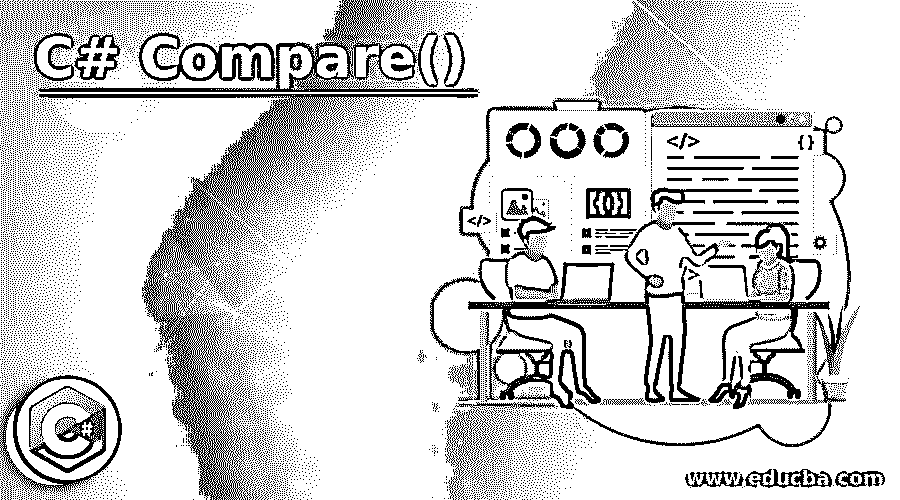
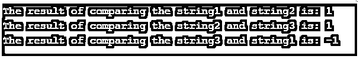
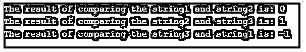

# C#比较()

> 原文：<https://www.educba.com/c-sharp-compare/>




## C# Compare()简介

在 C#中，可以使用名为 Compare()的方法比较两个字符串，该方法根据比较结果返回一个整数值。该整数值可以是小于零的值，或者是等于零的值，或者是大于零的值。如果在给定的两个字符串中，第一个字符串在排序顺序中位于第二个字符串之前，并且返回值等于零，则返回值小于零。如果在给定的两个字符串中，两个字符串的值相等，并且返回值大于零，如果在给定的两个字符串中，第二个字符串的排序顺序是第一个字符串的排序顺序。

**语法:**

<small>网页开发、编程语言、软件测试&其他</small>

C# Compare()方法的语法如下:

```
String.Compare(string1, string2);
```

其中 string1 是需要与第二个字符串 string2 进行比较的第一个字符串。

### C# Compare()的工作原理

*   每当需要比较两个字符串的排序顺序，并确定第一个字符串在排序顺序中是否在第二个字符串之前，或者第一个字符串在排序顺序中是否在第二个字符串之后，或者两个字符串的值是否相等时，我们使用 C#中的 compare()方法。
*   如果给定的两个字符串的值相等，Compare()方法返回零。
*   如果在给定的两个字符串中，第一个字符串在排序顺序中位于第二个字符串之前，则 Compare()方法返回一个小于零的值。
*   如果在给定的两个字符串中，按照排序顺序，第一个字符串后跟第二个字符串，则 Compare()方法返回一个大于零的值。

### C# Compare()的示例

下面是提到的例子:

#### 示例#1

C#程序演示了使用 Compare()方法来比较给定的两个字符串。

**代码:**

```
using System;
//a class called check is defined
public class check
{
//main method is called within which three string variables are defined to store three different strings
public static void Main(string[] args)
{
string string1 = "Welcome";
string string2 = "to";
string string3 = "C#";
//compare() method is used to compare two strings at a given time which returns an integer value less than zero if the first string precedes the second string in the sorting order or returns an integer value equal to zero if the first string is equal to the second string or returns an integer value greater than zero if the first string is followed by the second string in the sorting order
Console.WriteLine("The result of comparing the string1 and string2 is: {0}",string.Compare(string1,string2));
Console.WriteLine("The result of comparing the string2 and string3 is: {0}",string.Compare(string2,string3));
Console.WriteLine("The result of comparing the string3 and string1 is: {0}",string.Compare(string3,string1));
}
}
```

**输出:**




**说明:**

*   在上面的程序中，定义了一个名为 check 的类。然后调用 main 方法，其中定义了三个字符串变量来存储三个不同的字符串。
*   然后使用 Compare()方法在给定时间比较两个字符串，如果第一个字符串在排序顺序中位于第二个字符串之前，则返回小于零的整数值；如果第一个字符串与第二个字符串相等，则返回等于零的整数值；如果排序顺序中第二个字符串在第一个字符串之后，则返回大于零的整数值。

#### 实施例 2

C#程序演示了使用 Compare()方法来比较给定的两个字符串。

**代码:**

```
using System;
//a class called check is defined
public class check
{
//main method is called within which three string variables are defined to store three different strings
public static void Main(string[] args)
{
string string1 = "Learning is fun";
string string2 = "Learning is fun";
string string3 = "fun";
//compare() method is used to compare two strings at a given time which returns an integer value less than zero if the first string precedes the second string in the sorting order or returns an integer value equal to zero if the first string is equal to the second string or returns an integer value greater than zero if the first string is followed by the second string in the sorting order
Console.WriteLine("The result of comparing the string1 and string2 is: {0}",string.Compare(string1,string2));
Console.WriteLine("The result of comparing the string2 and string3 is: {0}",string.Compare(string2,string3));
Console.WriteLine("The result of comparing the string3 and string1 is: {0}",string.Compare(string3,string1));
}
}
```

**输出:**




**说明:**

*   在上面的程序中，定义了一个名为 check 的类。然后调用 main 方法，其中定义了三个字符串变量来存储三个不同的字符串。
*   然后使用 Compare()方法在给定时间比较两个字符串，如果第一个字符串在排序顺序中位于第二个字符串之前，则返回小于零的整数值；如果第一个字符串与第二个字符串相等，则返回等于零的整数值；如果排序顺序中第二个字符串在第一个字符串之后，则返回大于零的整数值。

### C# Compare()的优势

下面给出了一些优点:

*   利用 C#中的 Compare()方法可以确定字符串在排序顺序中的相对位置。
*   如果给定的操作数是字符串，并且如果我们想知道在排序顺序中一个字符串是在另一个字符串之前还是在另一个字符串之后，Compare()方法是 C#中可用的最佳选项之一。

### 结论

在本教程中，我们通过编程示例及其输出看到了 C#中 Compare()方法的定义、语法和工作原理，以及在程序中处理字符串时使用 Compare()方法的优势。

### 推荐文章

这是一个 C#比较()的指南。在这里，我们讨论 C# Compare()的介绍以及工作原理、优点和相应的例子。您也可以看看以下文章，了解更多信息–

1.  [C#排序列表](https://www.educba.com/c-sharp-sortedlist/)
2.  [C#字典](https://www.educba.com/c-sharp-dictionary/)
3.  [c#中的类型转换](https://www.educba.com/type-casting-in-c-sharp/)
4.  [C#数据网格视图](https://www.educba.com/c-sharp-data-grid-view/)


