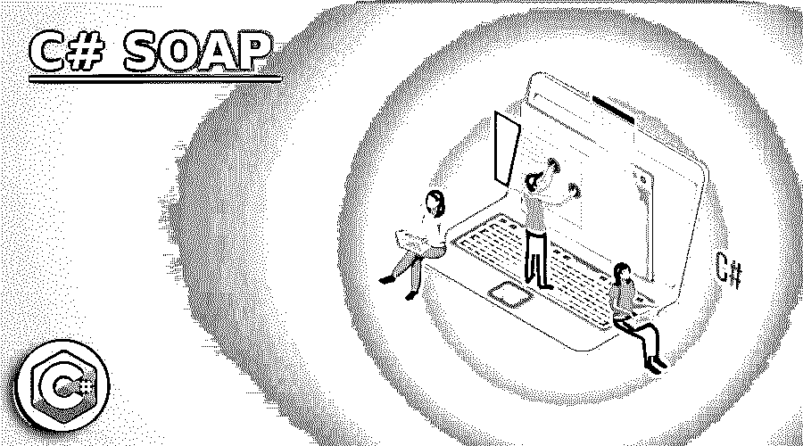
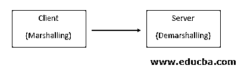
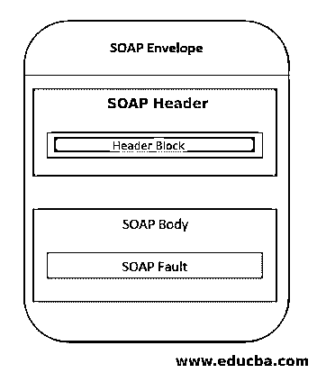
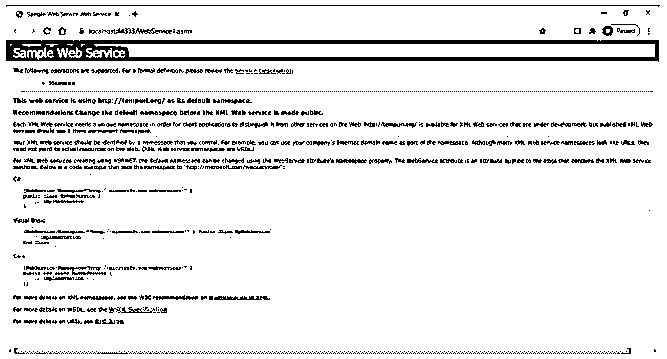
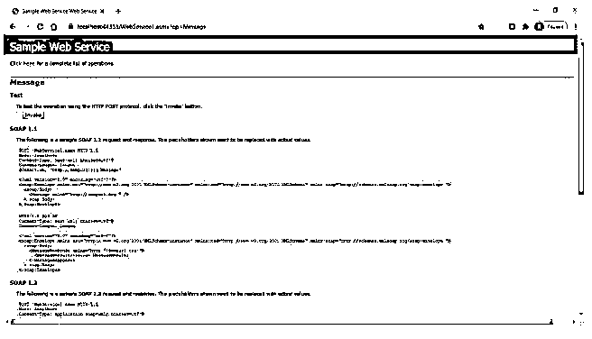
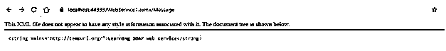

# C#肥皂

> 原文：<https://www.educba.com/c-sharp-soap/>




## C# SOAP 简介

SOAP(简单访问对象协议)是一种基于 XML 的协议，它为用不同语言编写并在不同平台上运行的应用程序提供了相互交互的便利。它通过 HTTP 工作。SOAP 是一种轻量级协议，因为它基于 XML，而 XML 是一种轻量级语言。C# SOAP 独立于它工作的平台和操作系统，这使得它更容易在不同平台上工作的不同应用程序之间交换数据。它是一个松散耦合的协议，因为它不要求通信应用程序使用同一种语言。

**语法**

<small>网页开发、编程语言、软件测试&其他</small>

定义 SOAP 消息的语法如下:

```
<SOAP : Envelope xmlns : SOAP = "https://www.educba.com/">
<SOAP : Header>
</SOAP : Header>
<SOAP : Body>
<SOAP : Fault>
</SOAP : Fault>
</SOAP : Body>
</SOAP : Envelope>
```

定义 SOAP 消息的语法规则如下:

SOAP 消息的编码应该使用 XML 语言来完成。它应该使用 SOAP 信封名称空间。它不应该由 DTD 引用和 XML 处理指令组成。

### SOAP 在 C#中是如何工作的？

SOAP 的工作原理是编组和解编组机制。它使用 HTTP 协议将基于 XML 的消息(称为 SOAP 消息)发送到服务器进行处理。这些 SOAP 消息包含用于处理的信息。我们可以称之为 HTTP 请求，这种将信息包装到 SOAP 消息中的方法称为编组。

现在，服务器接受来自客户机的请求，并解开客户机发送的 SOAP 消息。然后，服务器处理请求，并以 SOAP 消息的形式向客户机发送适当的响应。这种解包信息的方法称为解包。




#### SOAP 消息的元素

Soap 消息由以下元素组成:

**1。SOAP 信封元素:**这个元素是 SOAP 消息的根元素。它表明特定的 XML 文档是一个 SOAP 消息。它包含了 SOAP 消息的细节。Header 元素:SOAP header 元素是 SOAP 消息的可选元素。但是如果 SOAP 消息包含这个元素，那么它应该是根 Envelope 元素的第一个子元素，并且 Header 的子元素应该由名称空间限定。该元素包含支付信息、认证凭证等信息。SOAP Body 元素:该元素包含要在两个端点之间交换的实际信息。它包含请求和响应信息。

请在下面找到一个 SOAP Body 元素的示例，该元素来自包含员工详细信息的 SOAP 响应消息:

**代码:**

```
<soap : Body>
<GetEmployeeDetails>
<EmployeeName>John Duffel</EmployeeName>
<EmployeeCode>EI66</EmployeeCode>
</GetEmployeeDetails>
</soap: Body>
```

**2。SOAP Fault 元素:**当 SOAP 消息被发送到服务器时，服务器返回的响应可以包含请求中成功处理请求所需的信息，也可以包含错误消息。因此，该元素包含与错误相关的信息。如果 SOAP 消息包含这个元素，那么它应该是 Body 元素的子元素。

故障元素的子元素如下:

*   <faultcode>:该元素包含潜在故障的代码，帮助我们识别故障。</faultcode>
*   <faultstring>:该元素包含一个文本消息，提供故障的详细解释。</faultstring>
*   这是一个可选的元素，告诉我们谁应该对故障负责。
*   <detail>:这也是一个可选元素，包含特定于应用程序的错误消息。</detail>

请在下面找到显示 SOAP 消息结构的图表:




带有彩色背景的元素是 SOAP 消息的可选元素。

现在，让我们看看用 C#创建 SOAP web 服务所需的步骤。步骤如下:

*   在 visual studio 中，转到“文件”->“新建”->“项目”，为 web 服务创建一个新项目。
*   在选择 ASP.NET Web 应用程序下，选择 C#和 Web 模板。
*   给出解决方案的名称和位置。
*   现在，该项目将出现在解决方案资源管理器中。
*   在解决方案资源管理器中右键单击项目，然后选择添加-> Web 服务(ASMX)

在这个服务文件中，您可以为服务添加代码，并可以执行它，如示例部分下的示例所示。

### 实现 C# SOAP 的示例

下面是提到的例子:

#### 示例#1

**代码:**

```
using System;
using System.Collections.Generic;
using System.Linq;
using System.Web;
using System.Web.Services;
namespace WebApplication4
{
[WebService(Name ="Sample Web Service")]
public class WebService1 : System.Web.Services.WebService
{
[WebMethod]
public string Message()
{
return "Learning SOAP web service";
}
}
}
```

**输出:**




单击“消息”(Web 方法)后，我们将获得以下输出:




#### 实施例 2

上面快照中的 SOAP 请求和响应如下:

**代码:**

```
POST /WebService1.asmx HTTP/1.1
Host: localhost
Content-Type: text/xml; charset=utf-8
Content-Length: length
SOAPAction: "http://tempuri.org/Message"
<?xml version="1.0" encoding="utf-8"?>
<soap:Envelope xmlns:xsi="http://www.w3.org/2001/XMLSchema-instance" xmlns:xsd="http://www.w3.org/2001/XMLSchema" xmlns:soap="http://schemas.xmlsoap.org/soap/envelope/">
<soap:Body>
<Message  />
</soap:Body>
</soap:Envelope>
```

在上面的消息中，第一个元素是信封元素。那么这个消息包含提供 SOAP 消息细节的 Body 元素。在 Body 元素中，我们可以看到我们的 Web 方法的名称，即“Message ”,它是执行结果所必需的。

**代码:**

```
HTTP/1.1 200 OKContent-Type: text/xml; charset=utf-8Content-Length: length 
<?xml version="1.0" encoding="utf-8"?>
<soap:Envelope xmlns:xsi="http://www.w3.org/2001/XMLSchema-instance" xmlns:xsd="http://www.w3.org/2001/XMLSchema" xmlns:soap="http://schemas.xmlsoap.org/soap/envelope/">  
<soap:Body>    
<MessageResponse >      
<MessageResult>string</MessageResult>    
</MessageResponse>  
</soap:Body>
</soap:Envelope>
```

该消息的第一行包含代码“200 ”,表示服务器成功响应。此消息包含信封元素，然后是包含服务器响应细节的正文元素。我们可以看到一个标记“MessageResult ”,其中有一个值字符串，表明我们的 Web 方法(消息)的结果将是字符串类型。

在第二个快照中单击“Invoke”按钮后，我们将得到如下所示的最终结果:

**输出:**




### 结论

SOAP，即简单对象访问协议，是一种轻量级和松散耦合的协议，它可以在用不同编程语言编写并在不同平台上工作的应用程序之间交换数据。它以 XML 语言的 SOAP 消息的形式交换数据，并通过 HTTP 协议工作。

### 推荐文章

这是一个 C# SOAP 的指南。在这里，我们讨论 C# SOAP 的介绍，语法，它是如何工作的，并通过查询示例来更好地理解。您也可以浏览我们的其他相关文章，了解更多信息——

1.  [什么是肥皂？](https://www.educba.com/what-is-soap/)
2.  [C#序列化](https://www.educba.com/c-serialization/)
3.  [C#最后](https://www.educba.com/c-sharp-finally/)
4.  [C#堆栈](https://www.educba.com/c-sharp-stack/)


