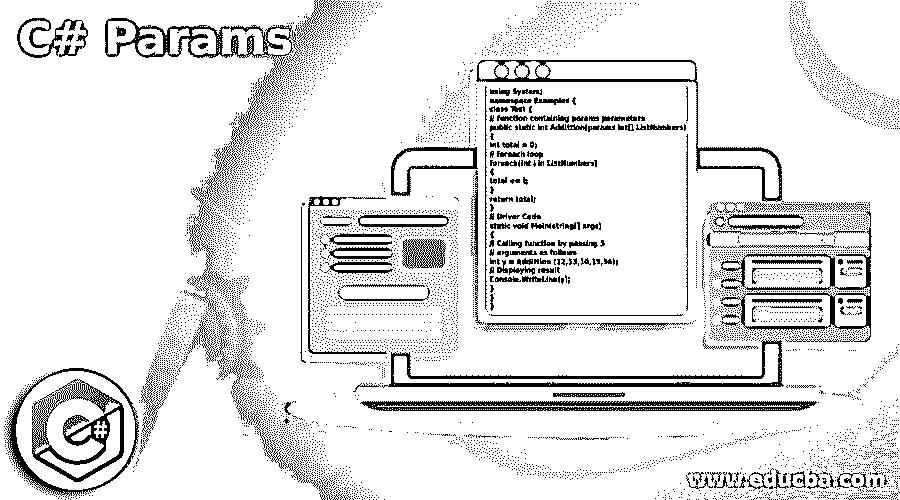
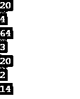
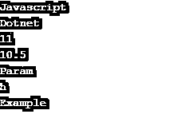

# C#参数

> 原文：<https://www.educba.com/c-sharp-params/>




## C#参数简介

Params 是 C# 中一个非常[重要的关键字。当我们想要给定变量的数目时，我们使用 param。因此，当开发人员不知道将要使用的参数数量时，就使用它。在 C# Params 关键字之后，函数中不允许有其他参数。如果我们不传递任何参数，那么参数的长度将保持为零。我们可以发送逗号分隔的值或数组。](https://www.educba.com/c-sharp-keywords/)

**关键字:参数**

<small>网页开发、编程语言、软件测试&其他</small>

```
using System;
namespace Examples {
class Test {
// function containing params parameters
public static int Addittion(params int[] ListNumbers)
{
int total = 0;
// foreach loop
foreach(int i in ListNumbers)
{
total += i;
}
return total;
}
// Driver Code
static void Main(string[] args)
{
// Calling function by passing 5
// arguments as follows
int y = Addittion (12,13,10,15,56);
// Displaying result
Console.WriteLine(y);
}
}
}
```

**输出:**


**带 params 关键字:**

```
static public int add(params int[] args)
{
int add1 = 0;
foreach (var item in args)
add1= add1+item + 2;
return add1;
}
```

**不带 params 关键字:**

```
static public int add(int[] args)
{
int add = 0;
foreach (var item in args)
add1 = add1+item + 2;
return add1;
}
```

有了 param，我们可以调用 add(1，4，5)这样的方法，但是没有 param，我们就不能。

### C#参数的示例

下面的例子展示了如何在 c#中使用 lemons params。

#### 示例#1

```
using System;
using System.Collections.Generic;
using System.Linq;
using System.Text;
using System.Threading.Tasks;
namespace Params
{
class Demo
{
public void Show(params int[] num) // Params Paramater
{
for (int a = 0; a < num.Length; a++)
{
Console.WriteLine(num[a]);
}
}
static void Main(string[] args) // main function
{
Demo program = new Demo();  // Creating Object
program.Show(20, 4, 64, 3, 20, 2, 14);  // Passing arguments of variable length
Console.ReadLine();
}
}
}
```

在上面的例子中，使用了 param 关键字，允许任何类型和数量的类型。然后，在创建对象之后，我们传递几个参数来显示。

**输出:**




#### 实施例 2

```
using System;
using System.Collections.Generic;
using System.Linq;
using System.Text;
using System.Threading.Tasks;
namespace Params
{
class Demo
{
public void Show(params object[] val) // Params Paramater
{
for (int a = 0; a < val.Length; a++)
{
Console.WriteLine(val[a]);
}
}
static void Main(string[] args) // main method
{
Demo program = new Demo(); // Creating Object
program.Show("Javascript", "Dotnet", 11, 10.50, "Param", 'h',"Example"); // Passing arguments of variable length
Console.ReadLine();
}
}
}
```

在上面的例子中，使用了 param 关键字，允许任何类型和数量的类型。创建一个对象后，我们传递几个参数来显示。这里您可以看到不同数据类型的参数。

**输出:**




#### 实施例 3

```
using System;
using System.Collections.Generic;
using System.Linq;
using System.Text;
using System.Threading.Tasks;
namespace Params
{
class Demo
{
public static int Addition(params int[] num) // params parameter
{
int add = 0;
// foreach loop
foreach (int a in num)
{
add += a;
}
return add;
}
static void Main(string[] args)
{
int x = Addition(23, 45, 2, 36, 76);  // call function
// Displaying result
Console.WriteLine(x);
Console.ReadLine();
}
}
}
```

在上面的例子中，使用了一个数组，并且由于使用了 param 关键字，所以不需要提及数组的大小，这将允许任何类型和数量的参数。这些数字将采用以下格式。

[0] 25
[1] 45
[2]  2
[3]  36
[4]  76

**输出:**


#### 实施例 4

```
using System;
using System.Collections.Generic;
using System.Linq;
using System.Text;
using System.Threading.Tasks;
namespace Params
{
class Demo
{
static void Main()
{
// Call params method with five integer type arguments
int cal1 = calParameters(7);
int cal2 = calParameters(11, 23);
int cal3 = calParameters(46, 8, 45);
int cal4 = calParameters(23, 31, 21, 45);
int cal5 = calParameters(12, 12, 54, 76);
// display result of each calculations
Console.WriteLine(cal1);
Console.WriteLine(cal2);
Console.WriteLine(cal3);
Console.WriteLine(cal4);
Console.WriteLine(cal5);
Console.ReadLine();
}
static int calParameters(params int[] values)
{
int sum = 0;
foreach (int value in values)    // foreach loop and sum of integers
{
sum += value;
}
return sum;
}
}
}
```

在上面的示例中，有五个参数使用了 param 关键字。所有参数都是整数类型。foreach 循环用于显示每个参数的总和。

**输出:**


### 它和数组有什么不同？

```
public void test(params int[] args) { }
test(); // no compile-time error, args will be empty
```

但是如果你使用一个数组:

```
public void test(int[] args) { }
test(); // error: No overload for 'Foo' takes 0 arguments
```

因此，如果我们不传递任何参数，那么参数的长度将保持为零。Param 关键字必须是参数列表中的最后一个；否则，它会给出一个错误。

示例:

```
public void test(params int[] args,int value) { }
```

不允许此声明。

### 推荐文章

这是一个 C#参数指南。这里我们讨论 C#参数的介绍以及使用和不使用 Params 关键字的代码实现。你也可以看看下面的文章来了解更多-

1.  [c#中的前 3 种数据类型及示例](https://www.educba.com/c-sharp-data-types/)
2.  [如何在 C#中创建对象](https://www.educba.com/objects-in-c-sharp/)
3.  [在 C#中处理虚拟关键字](https://www.educba.com/virtual-keyword-in-c-sharp/)
4.  [c#中阶乘的各种例子](https://www.educba.com/factorial-in-c-sharp/)


