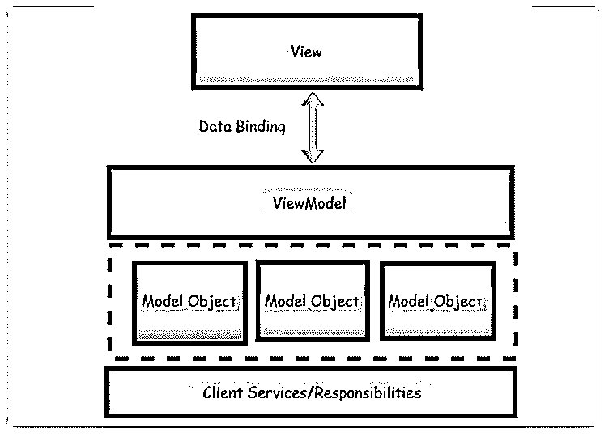
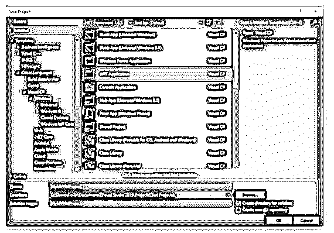
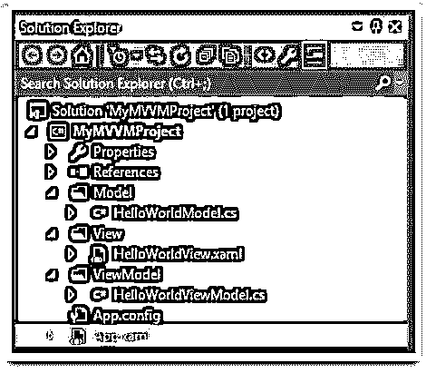
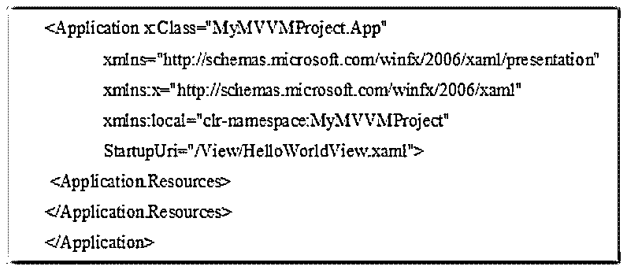
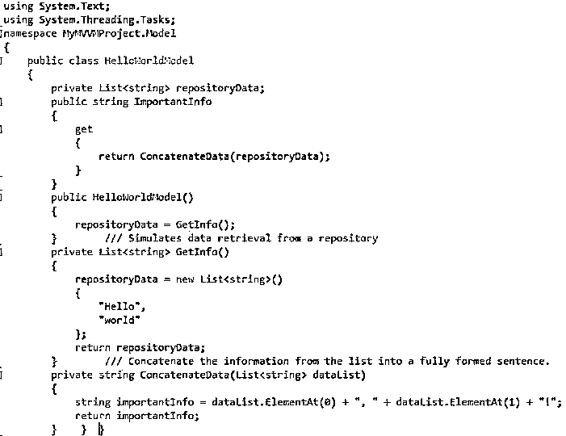
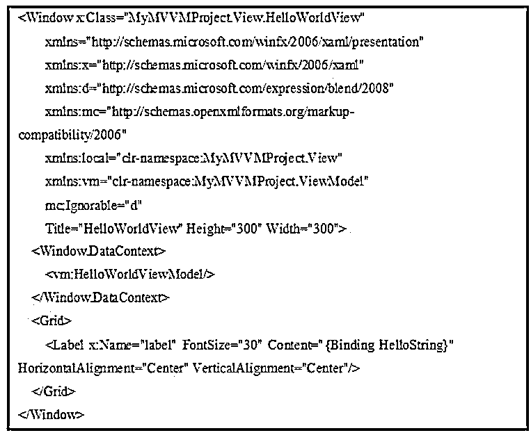

# MVVM C#

> 原文：<https://www.educba.com/mvvm-c-sharp/>


## MVVM C#简介

MVVM(模型-视图-视图模型)C#是一种生成客户端应用程序的技术，它控制 WPF 平台的核心功能，使应用程序功能的单元测试变得容易。MVVM(模型-视图-视图模型)是一种架构模式，表示三个不同的组件。正是软件的设计模式将用户界面控制和程序逻辑分开。

### 什么是 MVVM C#？

MVVM(模型-视图-视图模型)是软件设计模式，它象征着三个独立的组件，它们是模型、视图和视图模型。

<small>网页开发、编程语言、软件测试&其他</small>

为了理解这三个组件，我们来看看它们是如何协同工作的，如下所示:

*   **模型:**模型层是包含业务逻辑的层，它从数据源获取并保存细节，供视图模型使用。
*   **ViewModel:** 视图层是模型和视图之间的中间层，它不会将来自模型的原始信息转换成适合视图查看的结构。让我们看一个转换的例子，比如从模型到视图的 true 或 false 字符串的布尔标志。
*   **视图:**是表示软件界面的层，像图形用户界面(GUI)。它将向客户机显示来自 ViewModel 的信息，并将细节的变化反馈给 ViewModel。

### 如何使用 MVVM C#？

模型-视图-视图模型(MVVM)的用法是将用户界面控件和程序逻辑分离的架构软件设计模式。它也被称为模型-视图-活页夹，由微软架构师开发。




这三个组件作为一个团队，以如下模式相互引用:

*   视图指出了视图模型
*   ViewModel 指出模型

最重要的是视图模型和视图能够通过两种叫做数据绑定的方法进行通信。最重要的通信组件是名为 INotifyPropertyChanged 的接口。

为了使用这种方法，视图必须通过客户机输入改变视图模型中的信息，视图模型必须用通过模型中的过程更新的信息或来自存储库的更新信息来更新视图。MVVM(模型视图视图模型)架构高度重视每一层关注点的分离。通过分离层，有更多的好处。下面我们来看看。

*   **模块化:**模块化支持在各层内部实现过程中，在不干扰他人的情况下，对其进行更改或交换。
*   **增加可测试性:**在这种情况下，每一个组件都必须用错误信息进行单元测试，如果 ViewModel 程序是用代码隐藏的方式编写的，这是不可能的。

### 示例中的 MVVM C#视图模型

让我们看看 ViewModel 的职责如下:

*   视图模型是 MVVM(模型-视图-视图模型)应用程序中必不可少的东西。ViewModel 最重要的任务是将信息呈现给视图，以便视图将所需的数据显示在屏幕上。
*   ViewModel 使用户能够处理信息并修改数据。
*   ViewModel 封装了视图的关系逻辑，但并不表示应用程序的逻辑需要进入 ViewModel。
*   ViewModel 处理一系列适当的调用，以根据客户机和视图上的任何更改来构建要发生的准确项目。
*   ViewModel 管理导航的逻辑，比如选择何时导航各种视图。

创建新的 WPF 应用程序项目，以便更好地理解 ViewModel。




接下来，为 Model、View 和 ViewModel 创建三个文件夹，并删除现有的 ManiWindow.xaml。


接下来，构建新的项目和每个独立组件的对应项。

*   最初，单击 Model 文件夹以包含类项，并将其命名为 HelloWorldModel.cs。
*   接下来，右键单击 ViewModel 文件夹，包含类项目，并将其命名为 HelloWorldViewModel.cs。
*   接下来，右键单击视图文件夹，包含 WPF(窗口)项，并将其命名为 HellowWorldView.xaml




在视图文件中，修改 App.xaml 以指向新视图，如下所示。

**代码:**




**ViewModel:**

在 ViewModel 中，最初从构建 ViewModel 开始，该类应包含名为 INotifyPropertyChanged 的接口，以声明 PropertyChangedEventHandler 事件并构建引发该事件的方法。接下来，声明该字段和相关属性，以确保调用属性中的 OnPropertyChanged()方法作为 set access。让我们以编程的方式来看看这个例子，在这个例子中，构造函数用于显示模型，并向 ViewModel 提供数据。

**代码:**

```
using System;
using System.Collections.Generic;
using System.ComponentModel;
using System.Linq;
using System.Runtime.CompilerServices;
using System.Text;
using System.Threading.Tasks;
using MyMVVMProject.Model;
namespace MyMVVMProject.ViewModel
 {
 // the interface INotifyPropertyChanged implements for supporting the binding purpose
 public class HelloWorldViewModel : INotifyPropertyChanged
  {
  private string _helloString;
  public event PropertyChangedEventHandler PropertyChanged;
  public string HelloString
  {
   get
   {
    return _helloString;
   }
  set
  {
   helloString = value;
   OnPropertyChanged();
 }
}
/// <summary>
/// when the Property modifies it Raises OnPropertychangedEvent
/// </summary>
/// <param name="name">Property name represented by String</param>
protected void OnPropertyChanged([CallerMemberName] string name = null)
{
 PropertyChanged?.Invoke(this, new PropertyChangedEventArgs(name));
}
public HelloWorldViewModel()
  {
   HelloWorldModel hwModel1 = new HelloWorldModel();
   _helloString = hwModel1.ImportantInfo;
  }
 }
}
```

**型号:**

然后是模型的创建，它通过从存储库中拖动数据来为 ViewModel 提供数据，并且它还会返回到存储库中进行存储。这里用 GetInfo()方法解释该程序，它返回简单的列表<string>，业务逻辑也应用于此，并且将有 ConcatenateData()方法。这用于从存储库返回的列表<string>中创建消息“Hello World”。</string></string>

**代码:**

```
private List<string> GetInfo ()
 {
  repositoryData = new List<string>()
  {
   "Hello",
   "world"
 };
 return repositoryData;
}
```

让我们看看下面的代码:

**代码:**




**视图:**

最后，我们需要创建一个视图；这是什么，但必须包括一些代码到 XAML；该窗口需要对 ViewModel 名称空间的引用。然后它被映射到 XAML。主要的事情是确保绑定显示标签内容的 ViewModel 的属性。

**代码:**




### 结论

在本文中，我们看到了 MVVM C#以最小的技术复杂性方便了设计人员和开发人员一起工作。

### 推荐文章

这是 MVVM C#的指南。在这里我们分别讨论 C# ViewModel 的介绍、使用和 MVVM 的例子。您也可以看看以下文章，了解更多信息–

1.  [MVVM 设计图案](https://www.educba.com/mvvm-design-pattern/)
2.  [MVVM 建筑](https://www.educba.com/mvvm-architecture/)
3.  [什么是 MVVM](https://www.educba.com/what-is-mvvm/)
4.  [MVVM 面试问题](https://www.educba.com/mvvm-interview-questions/)


