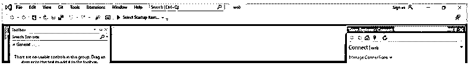
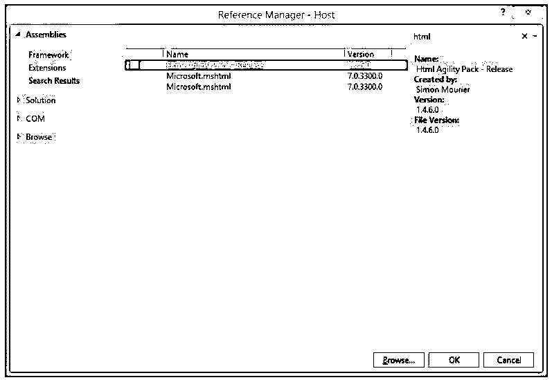

# C#中的程序集引用

> 原文：<https://www.educba.com/assembly-reference-in-c-sharp/>

## C#中的汇编引用介绍

在 C#中，我们有引用程序集，它包含表示 API 表面所需的最少量的元数据。因此，引用程序集包括所有有用成员的声明，但它们将排除所有私有 me 实现和声明，这些实现和声明不会对 APsurface 产生任何影响，因为它基本上提供了表示 APsurface 协定的元数据。因此，我们有两种类型的程序集，一种是实现程序集，另一种是引用程序集，但我们不能使用引用程序集来加载执行，这些类型的程序集基本上是随 SDK 一起分发的，SDK 代表库或平台的软件开发工具包。

**c#中汇编引用的语法**

<small>网页开发、编程语言、软件测试&其他</small>

我们知道，它是一种将我们的代码组装成程序集的机制；对于这一点，我们没有特定的语法，但是我们可以按照一些步骤在 C#中定义程序集。为此，我们可以使用“参照管理器”对话框来管理和添加对元件的参照。但是如果我们想添加一个对自定义组件的引用，那就必须手动完成。

引用代码需要遵循的步骤:

*   首先，我们必须为每个程序集创建一个单独的文件夹；然后，我们可以将脚本移动到属于相关文件夹的那些文件夹中。
*   然后我们让 Unity 负责获取所有包含程序集定义的脚本；之后，它将编译它们，并通过使用资产定义添加必要的信息。
*   Unity 将为我们编译所有的程序集，并确定它们的依赖关系。所以这让我们的工作变少了。

在 C#中使用引用程序集时，需要记住以下几点；它更多地由我们的工具来管理。

### C#中汇编引用是如何工作的？

正如我们已经知道的，引用组装通过提供关于它的元数据来表示 API 表面。我们知道了引用和实现程序集，但在这里我们将看到它如何在引用程序集上工作以及它的使用目的。

1.通过使用引用汇编，我们可以很容易地指向一个库的引用，而不需要该版本的完整实现。简而言之，它使开发人员能够引用特定库的特定版本。

2.让我们通过一个简单的例子来理解，假设我们在一台机器上有一个特定库的最新版本。但是在当前程序中，我们希望使用一个比我们现有的最新版本更低的特定版本，所以在这种情况下，我们可以使用引用汇编，它将指向该库的以前版本，但是我们也可以得到编译时错误。

现在让我们看看 C#中引用程序集的结构:

引用程序集也称为仅元数据程序集；它们包括除私有和匿名类型之外的所有成员。此外，它们的方法体被替换为 throw null 使用它的原因是为了验证和运行。我们已经知道，它从元数据中移除了私有 mems，这对于引用 API 表面很有用。

它存储的表示 API 的元数据信息如下:

*   它包含一个结构的所有字段。
*   它还包括所有的虚拟方法。
*   它还包括所有类型、嵌套类型和私有类型。
*   它还包括关于实现的属性和事件的元数据，因为它们的访问器是虚拟的，如果我们可以看到的话。
*   此外，它还包括关于属性的详细信息。

现在我们可以看到如何通过使用一些工具或 id 来生成引用程序集。

我们生成引用库，因为我们可能有不同的场景，在这些场景中，该库的使用者希望为特定程序使用一些不同的版本，所以引用程序集帮助我们实现对程序的这种处理，因为它们的大小非常小，而且它们仅作为软件开发工具包的一部分进行分发，这还帮助我们减少下载大小，并帮助我们节省磁盘空间。

通过使用以下要点，我们可以在 C#中生成引用程序集:

*   我们可以利用 ProduceReferenceAssembly 来生成引用程序集。
*   我们可以利用 EmitMetadataOnly 和 IncludePrivateMembers 属性来设置该值并为其启用元数据。它们接受布尔值 true 或 false。在这种情况下，为了生成引用程序集，我们必须分别将它们设置为 True 和 False。
*   在 C#中，当我们试图通过使用命令行来编译程序以生成引用程序集时，我们可以使用-refonly 或者我们可以使用-refout 作为编译器选项，这样它将为我们生成引用程序集。

我们可以按照下面的步骤添加它:

1.转到 visual studio 并选择您的项目根目录。

2.Reference 选项卡，您将在屏幕上看到下面的对话框，选择您想要添加的依赖项，然后单击 ok。

### 结论

通过使用引用库，我们可以处理最新版本和以前版本或特定的库，而不需要它们来加载填充实现。这可以在几个方面帮助我们，比如节省磁盘空间，提高性能等等。此外，通过设置一些变量值和通过命令行传递参数，它很容易使用和构建。

### 推荐文章

这是一个 C#汇编参考指南。这里我们讨论一下 C#中汇编引用的介绍和工作原理？分别是。您也可以看看以下文章，了解更多信息–

1.  [C#引用](https://www.educba.com/c-sharp-references/)
2.  [C#等待异步](https://www.educba.com/c-sharp-await-async/)
3.  [C#异步](https://www.educba.com/c-sharp-asynchronous/)
4.  [C#只读](https://www.educba.com/c-sharp-readonly/)

